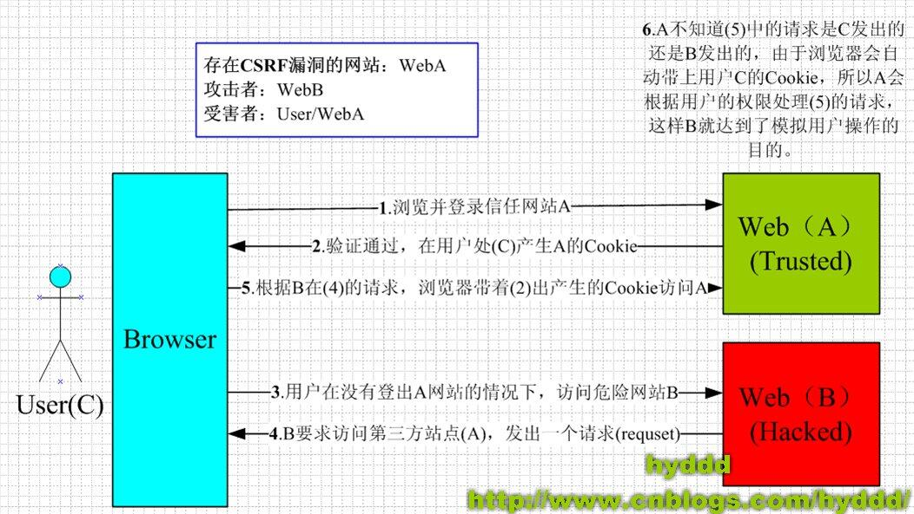
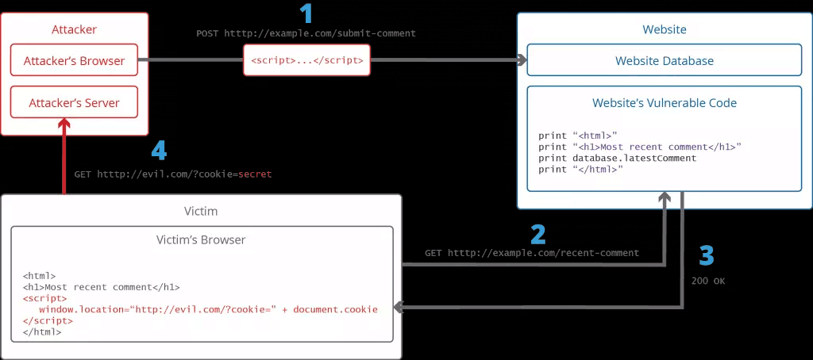

如果你被前面的跨域折腾了很久，一定很痛恨他，但浏览器同源限制是有原因的，最典型的就是CSRF

# CSRF
Cross Site Request Forgery 跨站请求伪造

1. 用户c访问A，输入账号密码验证成功了，A返回一个cookie储存sessionid，代表他的登录状态
2. 用户又去访问B，B网站内部嵌有脚本，向网站A的api发起请求，由于访问网站A浏览器会自动带上相应的cookie，即网站B盗取了用户的登录状态，可以为所欲为了

所以浏览器要限制同源政策，但是又要跨域访问，使用JSONP或者CORS仍旧会有一些服务器设置所有域名都可访问，而且万一用户使用了不支持同源限制的浏览器，所以必须在服务端有限制CSRF的手段

# XSS

Cross Site Script跨站脚本攻击，他的思路非常简单，页面中可能通过js插入值的地方，比如留言版等，插入自己的script脚本，有点像sql注入

简单的会搞破坏，恶意的会拿到cookie并发送给其他网站用

现在的前端框架例如Vue等，都会对从后台获取的值自动做编码转义，防止了XSS攻击

