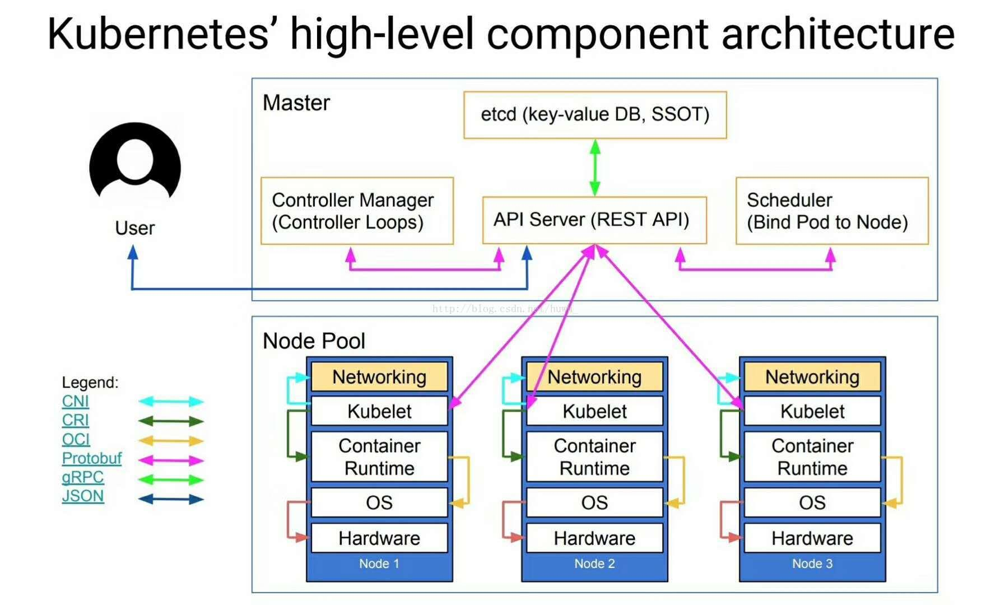

# devops
- DevOps：Development和Operations的组合詞，开发人员自己可以承担运维活动
- CI：continues integration，持续集成，自动build、测试
- CD：continue delivery，持续交付，自动打包并发送到类似dockerhub的平台等待部署
- CD：continue deployment，持续部署，自动部署

你写完代码，提交到 github 的某个分支上，触发了 commit 事件，被 dockerhub 拉取代码，在某个编译环境下运行指定的测试脚本，没问题后使用 dockerfile 编译为镜像，自动推送到你服务器上，并且被 docker 滚动更新发布 CI-CD-CD

k8s 用来实现多机器的分布式容器管理，简化了运维操作和配置，并提供了监控、负载均衡等功能，可以看作一站式运维解决方案

1. 自动装箱、自我修复、水平扩展、服务发现和负载均衡、自动发布和回滚
2. 密钥和配置管理、存储编排、批量处理执行

等等等等，k8s最终要实现的目的是将多台主机看做一台主机，以单主机管理方式管理集群

# k8s架构

k8s从整体上分为master和node节点，它采用master控制node的方式，避免节点故障，master通常会部署在三个节点以上，用冗余避免故障

## master
- API Server 作为最核心的部分，拥有最终管理功能，一些可自动化的管理被 Controller 和 Scheduler(或许以后会有更多的组件将常用管理功能自动化)，其他管理功能由用户与其通讯实现。同时API Server 也容易成为系统的瓶颈
- Controller：维持期望容器的数量，根据配置文件创建或销毁容器，监听容器心跳，处理fail node，即处理分布式可用性问题
- Scheduler：调度器，将任务分配给合适的 Node 节点
- etcd：分布式key-val数据库，保存 k8s 的配置信息。API Server并不直接和节点通讯，而是写入 etcd 将管理持久化，避免节点死亡任务丢失
- User通过 kubectl 和 API Server 通讯，实现其他的节点管理功能
- kubelet：master通过API server调用节点，而kubelet就是接收调用并做出回复的节点，用来创建调度pod，回复心跳包等等

## Pod
node作为物理主机，可运行多个pod

pod是个逻辑划分，由多个相互作用的containerk组成，8s并不直接调度容器运行，而是调度pod，即pod是k8s中最小管理单位

- pause container：依靠 pause 做 pod 的逻辑划分，即共享同一个 pause 的网络栈、主机名和存储卷的 container 看作在一个 pod 中
- pod需要有一个标签 label 作为它的唯一标识，他是一个key=val键值对，val中存储了其他信息，这样就可以用 label selector 对 pod 做筛选

pod通过操作划分有两种创建方式

### 自主式pod
由用户自己创建，然后交给kubelet管理，kubelet访问scheduler请求调度

如果有pod故障，由kubelet重启pod，但是有node故障，则pod就消失了

### 控制器管理的pod
ReplicationController 在这里面定义运行的pod，自动调度，维持pod的数量和运行

并支持滚动更新，先创建新服务，再停掉旧服务，保持服务不中断

还有各种各样的用于管理不同pod声明周期的控制器

- ReplicationController & ReplicatSet & Deployment

# 安装
## kubeadm
kubuadm 命令行用于快速搭建 k8s 集群，当然也可以自己手动构建

# 运行模式
## 独立组件
系统各组件直接以守护进程方式运行于节点之上，好是好，就是配置繁琐且易错

## 静态pod
除了 kubelet 和 Docker 之外的所有组件都以静态 pod 对象运行 Master 主机之上

kubeadm 部署时默认为静态 pod 模式

## 自托管
类似第二种，但将其他组件的 pod 对象运行在 DaemonSet 类型的控制器，自己托管这些 pod 对象
