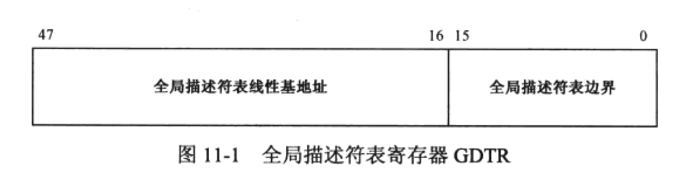

Intel 32位处理器架构，简称IA-32，是基于8086，自之后所有的架构都会兼容8086，并做扩展

# 保护模式
在原来8个通用寄存器基础上扩展为32位，标志位也新增16位，变为32位

无论如何他都兼容了原来的16位架构，原来8086总线20位，所以有分段机制，但32位处理器中总线也是32位，就不存在理论上但分段，即使不加保护但访问是非常不合理的

32位的保护模式和8086的实模式有较大差异，其中最重要的就是引入段描述符来限制内存访问

## GDT
在进入保护模式之前，必须创建全局描述符表(GDT)，他是所有软硬件通用的，同时CPU内部有一个48位的全局描述符表寄存器，用于跟踪 GDT 内存范围

32位