人类最擅长制定规则了，人类社会依靠规则运转，这些都是想象力的产物


计算机执行机器代码，用字节编码低级的操作。虽然位只有 0 1 两种可能，但是足够多的位就能组合成无数的可能，用来处理数据、管理内存、读写存储设备上的数据。将他们按字节编码，就成了人类易于阅读的汇编语言。

# 程序编码
## 机器级代码
计算机最大的特点就是抽象，抽象封装细节，只留下简单的抽象模型。对于机器级编程，也有两大抽象。

指令集体系结构就是对机器指令的抽象，用指令集代替常用的一系列指令操作。对于处理器而言，指令并不是一条条执行的，而是并行的执行多条，但是通过其他方法保证整体行为与指定的执行顺序相同

第二大抽象是，机器级使用的内存地址是虚拟地址，存储器系统提供的内存模型像是一个非常大的字节数组，通过数组下标访问地址。

再理解机器代码前，我们首先要了解一点 cpu 的内部硬件

- 程序计数器，简称 pc，给出要执行的下一条指令在内存中的地址
- 整数寄存器文件包含  16 个命名的位置，分别存储 64 位的值，这些寄存器可以存储地址或整数数据，有的寄存器保存重要的状态，有的寄存器保存临时数据，比如过程参数和局部变量，以及函数返回值
- 条件码计数器保存着最近执行的算术或逻辑指令的状态信息，他们用来实现控制或数据流中的条件变化，比如 if 和 while
- 一组向量寄存器可以放置一个或多个整数或浮点数

再了解一点内存：

- 在编程语言中无论是何种数据结构，内存中都是用连续的或不连续的内存单元中的字节表示
- 程序的内存包含：程序的可执行机器代码、操作系统需要的信息、用来管理过程调用和返回的运行时栈，以及用户分配的内存块

一条机器指令只能实现一个非常基本的操作，例如将两个数字相加，编译器必须产生这些指令序列，从而实现程序结构

**这里以 ATT 格式介绍汇编代码（汇编也有多种标准，这里用的ATT标准）**

# 数据构式
由于 x86 是从16位体系结构发展来的，所以称 16位 为字，因此 32位 是“双字”，64位，“四字”，x86 包含了对不同字长度的指令


**指针的长度和字长相同**

同一个指令对这几种不同的数据格式有四个变种，例如：数据传送指令 movb(传送字节)、movw(传送字)、movl(传送双字)、movq(传送四字)

# 访问数据
            
            inc di

一个 cpu 通常包括一组 16 个通用目的寄存器，他们的名字都以 %r 开头


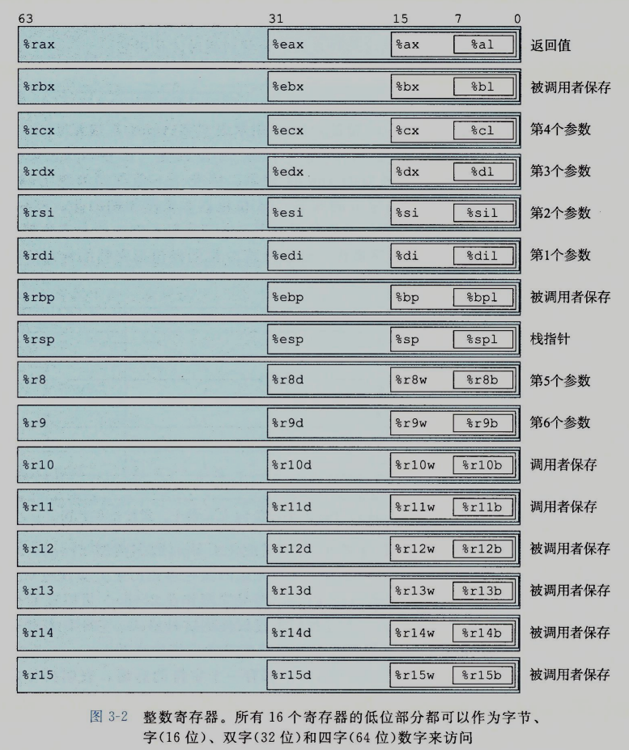

根据操作指令不同的级别（前面说的指令后缀），可以操作不同的字节数，这里有些操作规则，对于操作 1、2 字节的指令，会保持剩下的字节不变，对于操作 4 字节及其以上的指令，会把其他字节变为 0 

这些寄存器通常都有自己的作用，有一套编程规范控制着他们应该怎样使用这些寄存器

            inc di

## 操作数指示符
**所有以 . 开头的都是指导汇编器和链接器工作的伪指令**

大多数指令需要一个或多个操作数，指示出执行一个操作中要使用的源数据和放置的位置。源数据可以以常数的形式给出，或者从寄存器或内存中读出，结果可以放在内存或者寄存器中。因此，操作数可以分为三种

- 立即数，用来表示常数值，以 $ + 常数值形式表示
- 寄存器，它表示某个寄存器中的内容，可以是寄存器的前 1，2，4 或 8字节作为一个操作数，我们用 ra 表示寄存器 a，用引用 R[ra] 表示它的值，这是将寄存器看作数组，用下标索引它的值
- 内存引用，它会根据计算出来的地址访问某个内存位置。因为将内存看作一个巨大的字节数组，我们用符号 Mb[Addr] 表示对存储在内存中的地址 Addr 开始的 b 字节值的引用。为了简便，我们通常省去下标 b。有多种不同的寻址模式，常用的是 Imm(rb,ri,s)，Imm 立即偏移数，rb 基址寄存器，ri 变址寄存器，s 比例因子，这里 s 必须是 1 2 4 8，基址或变址寄存器必须是 64 位寄存器，有效地址是  Imm + R[rb] + R[ri] * s。引用数组元素时，会用到这种通用形式，其他形式都是这种通用形式的特殊情况。

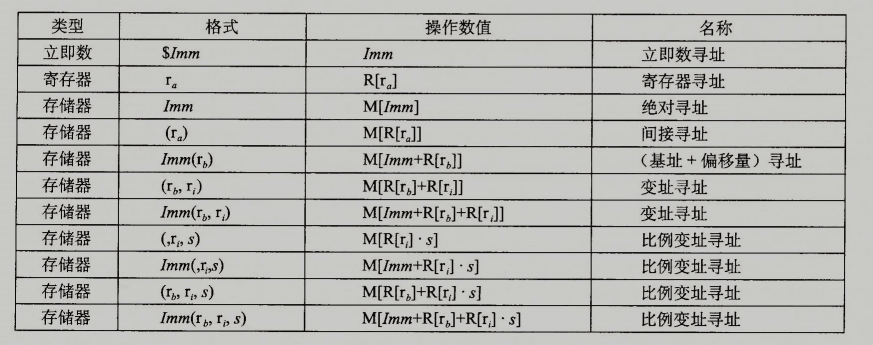

## 数据传输指令
最常用的指令是，将数据将一个位置复制到另一个位置的指令。这里介绍最简单的数据传输指令，MOV类(一类指令由针对相同操作，但不同数据类型的指令组成)

MOV 类由四条指令构成：movb、movw、movl、movq 这些指令执行相同的操作，但是复制不同大小的数据，MOV S,D 将 S 复制到 D

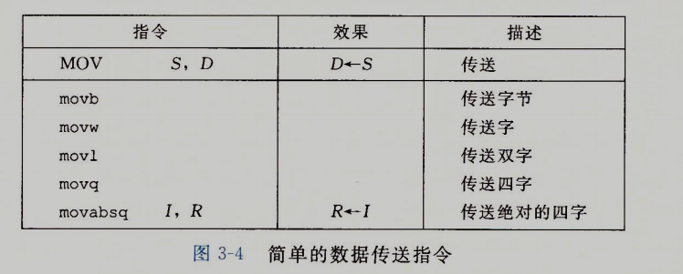

x86-64加了一条限制，传送指令的两个操作数不能同时指向内存地址，将内存中值移到另一个位置需要两条指令，一条将它放在寄存器中，一条将寄存器的值放在内存中

对数据扩展的指令
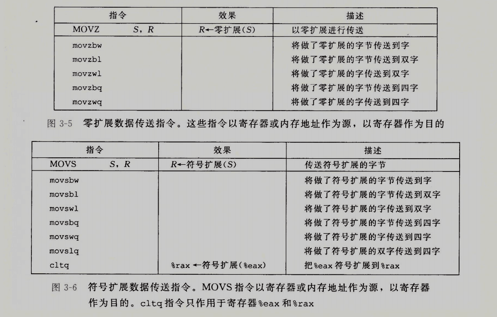

## 压入和弹出栈数据
在 x86-64 中，程序栈放在内存中的某个区域，栈向下增长，这样在栈顶的就是栈中所有元素地址最低的那个


调用 pushq 默认使用栈指针寄存器 %rsp 作为栈的指针
pushq %rbp 等同于 subq $8 %rsp , movq %rbp (%rsp)

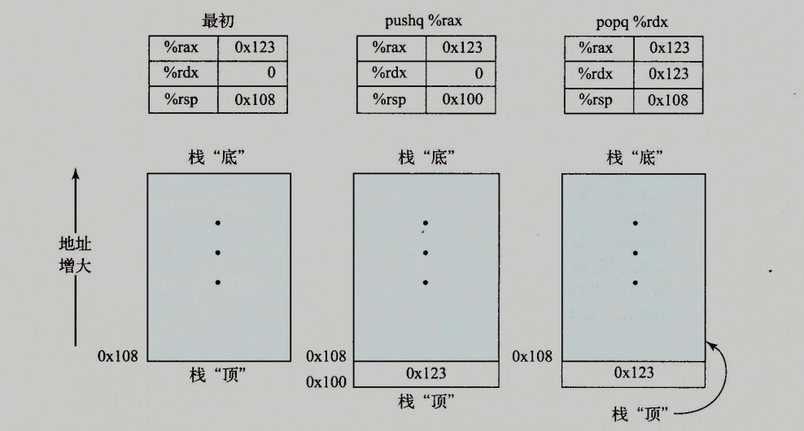

popq %rax 等同于 movq (%rsp) %rax , addq $8 %srp

因为栈的数据也放在内存当中，因此可以用标准内存访问的形式访问栈中任意的数据

函数中产生的临时变量就存储在栈中，调用结束后弹出栈，使用时就按地址空间直接访问

# 算数和逻辑操作
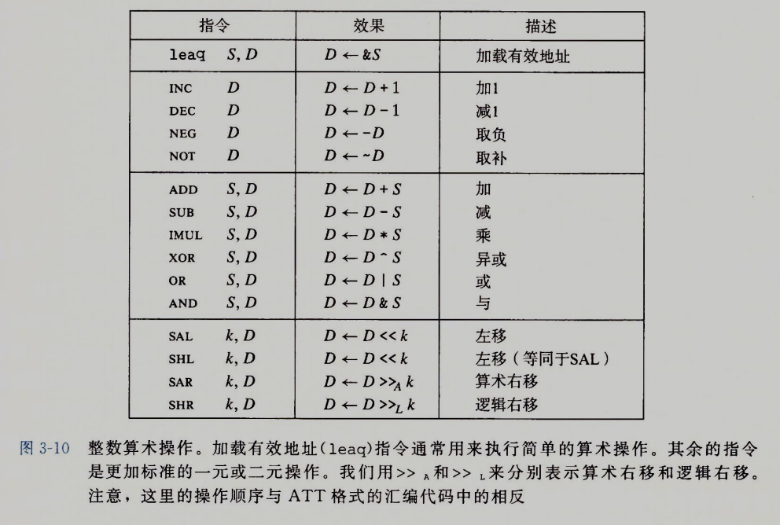

这里面大多的指令都可以同时用于无符号和有符号运算，也可以用于补码运算

## 加载有效地址
leaq实际上是movq的变形，将从内存读取数据写入到寄存器中，它的目标一定是寄存器，但也可以将寄存器值写到寄存器中，所以也可以用作寄存器加法，例如：leaq 7(%rdx,%rdx,4) %rax，将寄存器%rax值写为 5x+7

## 特殊的算数操作
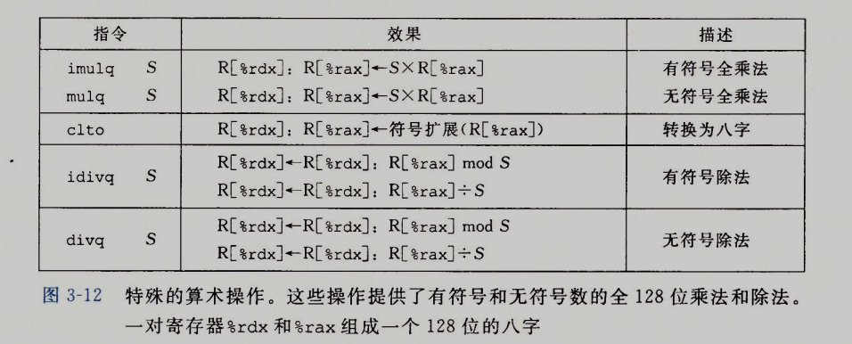

# 控制
控制语句就是根据数据的结构改变操作执行的顺序

## 条件码
除了整数寄存器，cpu还维护着一组单个位的条件码寄存器,他们描述了最近算数和逻辑的属性,可以检查这些寄存器来执行条件分支指令,


除了leap外，算数和逻辑运算中的所有指令都会设置条件码

除此之外，下面的这两个指令也会设置操作码
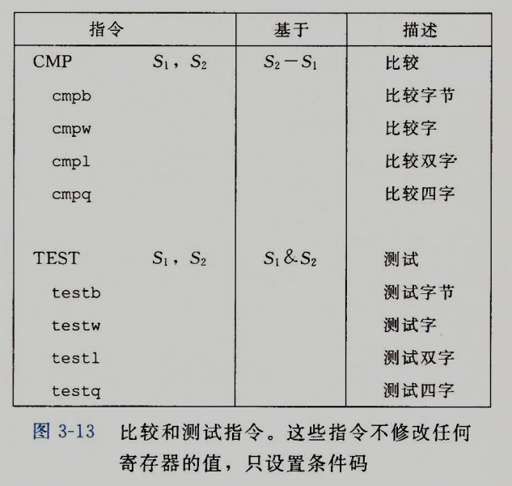

## 访问条件码
条件码通常不会被直接读取，下面三种常用的条件码使用方法：
1. 可以根据条件码的组合，将某个字节设置为 0 或 1
2. 可以条件转跳到程序的某个地方
3. 可以有条件的传送数据

将一个字节设为0或1为set指令，一条set指令的目的操作数是低位单字节寄存器之一，或是一个字节的内存位置

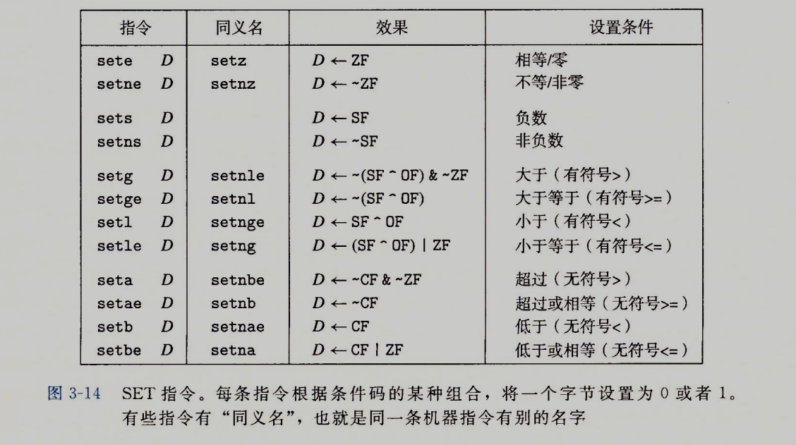

## 跳转指令
跳转指令会导致程序执行跳转到一个全新的位置,在汇编代码中，这些跳转的位置通常用一个标志（label）表示

跳转指令
- 无条件转跳:
    - 他可以是直接转跳，即转跳目标是指令一部分编码，通过标号作为转跳地址，如：.L1
    - 也可以间接转跳，即转跳地址是通过寄存器或内存中读出来的，写法是 * 后面跟着操作数指示符，如：jmp *%rax 或 jmp *(%rax)

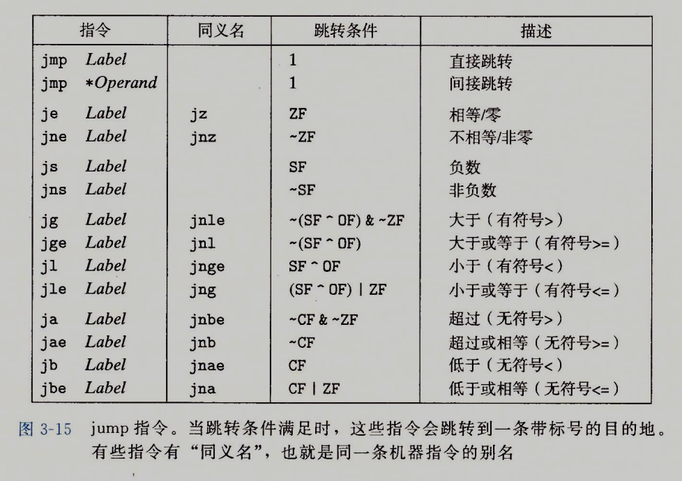

表中除了 jmp 都是有条件转跳，根据条件码的组合，选择跳转或者继续执行

## 跳转指令的编码
跳转目标有几种不同的编码，汇编器和链接器会选择适当的跳转目的编码

- 常用的是 pc相对的，他们将目标指令的地址与紧跟在跳转指令后面的那条指令的地址之间的差作为编码，这些地址偏移量可以编码为 1、2、4 字节
- 绝对地址，用4字节直接指定目标

## 条件控制实现条件分支

```
long adbdiff_se(long x,long y){
    long result;
    if(x < y){
        result = y - x;
    }else{
        result = x - y;
    }
    return result
}

//汇编如下
absdiff_se:
    cmpq    %rsi, %rdi
    jge     .L2
    movq    %rsi, %rax
    subq    %rdi, %rax
    ret
.L2:
    movq    %rdi, %rax
    subq    %rsi, %rax
    ret
```

## 条件传送实现条件分支

cpu 通过流水线实现高性能，一条指令的处理要经过一系列阶段，每一阶段执行所需操作的一小部分（例如：从内存取指令，确定指令类型，从内存读数据，执行算数运算，向内存写数据，更新程序计数器）。

这种方法通重叠连续指令的步骤来获取高性能，例如：在取一条指令的同时，正在执行它前面一条指令的算数运算。

当机器遇到分支时，只有条件判断完成后才知道分支往哪走。为了不让流水线断掉，处理器采用精密的分支预测逻辑猜测每条跳转指令是否会执行。只要它猜的还算可靠，指令流水线就会充满指令。但是，错误预测一个跳转，要求处理器丢掉它为该指令跳转指令后已做的工作，然后再重新回到正确的位置填充流水线，这样会浪费 15~30 个时钟周期，导致程序性能严重下降

```
long adbdiff_se(long x,long y){
    long result;
    if(x < y){
        result = y - x;
    }else{
        result = x - y;
    }
    return result
}

//汇编如下
// x in %rdi , y in %rsi
absdiff_se:
   movq    %rsi, %rax
   subq    %rdi, %rax   rval = y-x
   movq    %rdi, %rdx
   subq    %rsi, %rdx   eval = x-y
   cmpq    %rsi, %rdi   compare x:y
   cmovge  %rdx, %rax   if >=, rval = eval
   ret                  return tval
```
使用这种方式，则避免了条件分支

虽然避免了条件分支，但它并不一定是最好的方式，如果分支下语句需要更多的计算周期，那还不如条件分支，所以，应当尽量避免条件语句

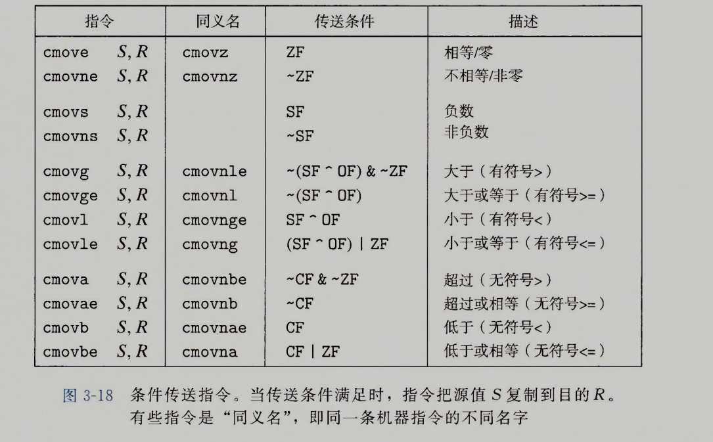

## 循环
高级语言中都存在循环的语法，但汇编用并没有对应的语句，可以用条件和转跳实现循环

# 过程
过程是一种高级的抽象，最常见的是函数，假设 p调用Q，Q执行后返回到p，这个过程包含下面一个或多个机制

- 传递控制：进入Q时，程序计数器要设置为 Q 代码的起始地址，返回时，要把程序计数器设置为P调用Q后面那条指令的地址
- 传递数据：P必须能够向Q提供一个或多个参数，Q必须能向P返回一个值（go能返回多个值，利用了内存中的栈）
- 分配和释放内存：开始时，Q可能要为局部变量分配空间，返回前，又要释放这些存储空间，如果参数和局部变量不能全部放在寄存器中，则还要为调用分配运行时栈

x86-64 过程实现包括了一组特殊的指令，和机器资源（寄存器和程序内存）使用的约定规则

## 运行时栈
堆与栈是个很有意思的话题，进程运行后，除了代码本身所占用的内存，还有堆内存和栈内存

C语言过程调用的一个关键特性（其他语言也大多如此）在于使用了栈数据结构提供的后进先出的内存管理原则。在过程 P 调用 Q 的过程中，在Q执行中，P以及向上追溯的调用链，都是暂时被挂起的。

当 Q 运行时，只需要为局部变量分配新的存储空间，或者设置到另一个过程的调用，当 Q 返回时，任何它所分配的局部存储空间都会被释放

当 x86-64 过程过程需要的存储空间超出寄存器能够存放的大小时，就会在栈上分配空间，这个部分称为过程的栈帧，大多数栈帧是定长的，有些过程需要边长的栈帧，在 x86-64 中，有 6 个参数寄存器，所以很多过程调用只使用寄存器就足够了

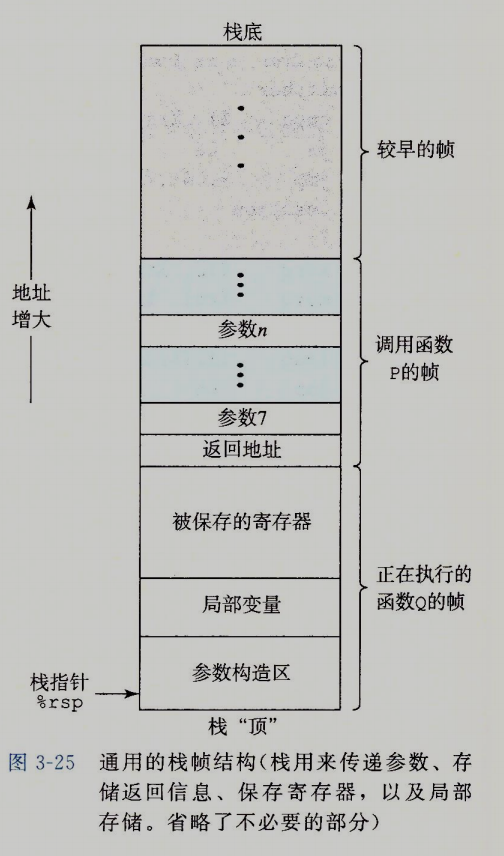

堆内存和栈内存并不客观存在，对于程序来说它只是被分配到一片内存，我们主观的将不同的内存区域分为堆和栈，同时他们也具有不同特点

## 堆内存
堆内存也分两种

一种是程序运行前，已经编码在程序中分配的内存，如，全局变量（局部作用域使用全局变量，编译器会根据情况复制该变量或用指针引用）、静态变量（java 类中的 static 属性）

第二种是程序运行过程中动态分配的堆内存，如 java 中 new obj()，创建对象后，只有一个指针返回给局部变量，保存在运行时栈中，GC 也是通过遍历运行时栈，发现哪个堆内存中的数据没有被栈中引用，就可以作为游离对象清除了


## 控制转移
控制函数从 P 转移到 Q 只需要简单的把 pc 设置为 Q 代码的起始位置，当 Q 返回后，继续执行 P，这个过程是用指令 call Q 调用过程 Q 来记录的

该指令会把地址A压入栈中，并设置pc为Q的起始地址，当 ret 后，会从栈中弹出 A，并将 pc 设置为 A

## 数据传输
当调用一个函数时，除了要把控制权转移，还要传递参数，而过程返回还可能包含一个值（go 可能包含多个值）。x86-64 中，大部分过程间的数据传输时通过寄存器实现的。

当过程 P 调用过程 Q 时，P 的代码必须先把参数复制到适合的寄存器中，类似的，当 Q 返回时，p 可以到寄存器 %rax 获取返回值

寄存器组提供了6个寄存器用于参数传递，如果仍不够用，则存在栈空间里（参数构造器区域），通过栈指针寄存器+位移量找到

## 栈上的局部存储
有的时候局部变量必须放在内存中
- 寄存器不够存放所有本地数据
- 对某个局部变量使用 & ，因此必须为它产生某个地址（它放在寄存器中则没有地址）
- 一些局部变量是数组或者结构

## 寄存器的局部存储空间
**寄存器组是唯一被所有过程共享的资源**

虽然在给定时刻只有一个过程是活动的，我们仍然必须确保当一个过程调用另一个过程时，被调用者不会覆盖调用者稍后会使用的寄存器值。因此，x86-64 采用了一组统一的寄存器使用惯例，所有的过程都必须遵循

寄存器 %rbx、%rbp 和 %r12 ~ %r15 都是被调用者保存寄存器，当 P 调用 Q 时，Q 必须保存这些寄存器的值。

Q 保存一个寄存器的值不变，要么就是根本不去改变它，要么就是把原始值压入栈中，改变寄存器的值，然后在返回前从栈中弹出旧值

# 高级数据类型的分配和访问
## 数组分配

数组分配只需要分配足够的空间，并记录数组起始的位置，然后使用偏移量就能访问到数组各个元素，所以数组基本上算是最高效的高级数据结构了

要注意的是，c语言并不会检查数组的越界访问，这就可能造成缓冲区溢出攻击

当程序越界使用数组，则可能会访问到非数组的栈空间，如果溢出访问，刚好重写了 ret 前的返回地址，就可以将该地址重写为一个恶意程序的开始地址，该子程序执行完返回时就会跳转到恶意程序，使得电脑被攻击

为了防止溢出攻击，linux 在在一个程序运行时，为它的栈随机分配一个 0~n 子空间，这样后面的数据地址就是随机的，这样就算溢出重写子程序返回地址，也无法预料到恶意程序被分配的地址

GCC在后期的版本中增加了一个栈保护着机制，在任何局部缓冲区与栈状态之间存储一个特殊的（金丝雀/哨兵）值，它是程序随机产生的，因此攻击者没法知道它是啥，在恢复寄存器和从函数返回之前，程序检测这个金丝雀值是否被该函数的某个操作或者函数调用的某个操作改变了，如果是的，那么程序异常终止

## 结构

c 语言中的 struct 是一个复合结构体，对其中每种类型的操作，类似于数组的实现，结构体内数据也放在连续的内存中，记下结构体的指针，并按不同的数据类型，使用不同的偏移量去访问

尤其要注意的是**数据对齐**

## 数据对齐

许多计算机系统对基本数据类型的合法地址做出了一些限制，要求某种类型对象的地址必须是某个K（通常是 2、4、8）值的倍数。这种对齐限制简化了形成处理器和内存系统之间接口的硬件设计

例如：假设处理器从内存中取 8 个字节，则地址必须为 8 的倍数，如果我们能保证将所有的 double 类型数据的地址对齐成 8 的倍数，那么就可以用一个内存操作来读或者写，否则，可能需要两次内存操作，因为对象被放在两个 8 字节内存块中。

无论对齐与否，硬件都能工作，但是可能会多次内存操作。**对齐原则是任何K字节的基本对象的地址必须是K的倍数**

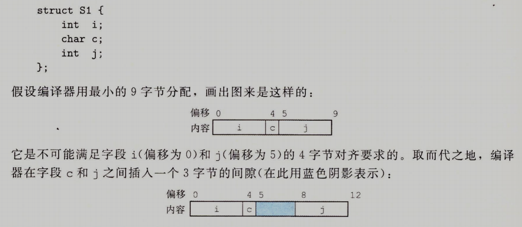

# 总结
别看各种指令花里胡哨的，本质就围绕几个主题

- 存取数据
- 计算数据
- 执行流程

像中断这样的操作本质也是执行流程的改变，计算机本身做的工作只有这些，现在的高级语言以及mvc等模式，也是围绕这些来做

- 各种数据结构、数据库、消息队列 => 存取数据
- 算法、很多库函数、自己写的处理逻辑 => 计算数据
- 代码分层、子函数、oop等等 => 执行流程

这些高级语言范式或框架、组织等根据不同的场景特点抽象封装出不同的模型，本质逃不出三大特丹

所以学习这些编程范式、框架、架构等，尤其要理解的是业务场景、痛点、综合考量等，理解这些才知道为什么这样封装设计，才能更好理解框架
