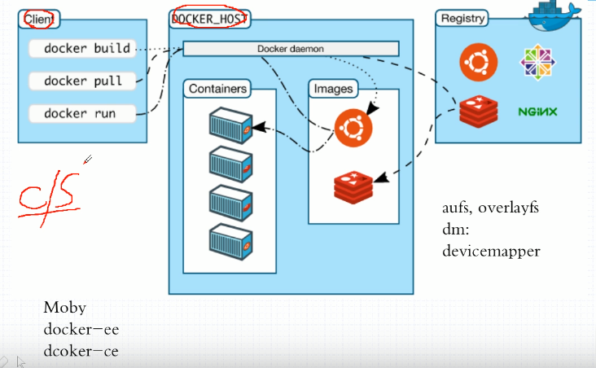
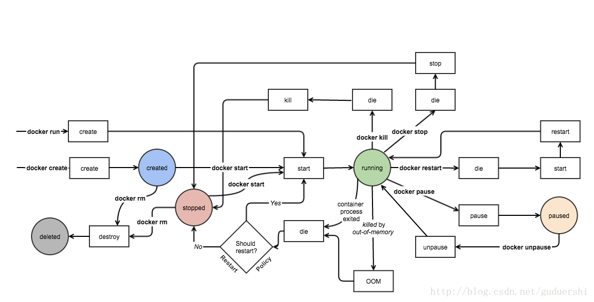

# 简介
Docker使用Go开发，基于 Linux 内核的 cgroup，namespace，以及 AUFS 类的 Union FS 等技术，是对进程做封装隔离，外面包裹了go程序，去和真正要运行的进程和外界交互，属于 **操作系统层面** 的虚拟化技术。由于**隔离的进程独立于宿主和其它的隔离的进程**，因此也称其为容器。最初实现是基于 LXC，从 0.7 版本以后开始去除 LXC，转而使用自行开发的 libcontainer，从 1.11 开始，则进一步演进为使用 runC 和 containerd。

- lxc是linux的一种虚拟化技术，主要利用了cgroup和namespace

Docker 在容器的基础上，进行了进一步的封装，从文件系统、网络互联到进程隔离等等，极大的简化了容器的创建和维护。使得 Docker 技术比虚拟机技术更为轻便、快捷。

与虚拟技术相比，docker没有模拟os层，直接和系统交互，性能大为提升

## OCI
随着容器概念的火爆，OCI组织开始制定容器标准。主要分为两大标准，runtime spec容器运行时标准、image spec容器镜像标准，两者通过OCI runtime filesytem bundle 的标准格式连接在一起，OCI 镜像可以通过工具转换成 bundle，然后 OCI 容器引擎能够识别这个 bundle 来运行容器。

- runc 是 docker 捐赠给 OCI 的一个符合标准的 runtime 实现，目前 docker 引擎内部也是基于 runc 构建的

# 基本概念

## 镜像
镜像是容器技术的扩展，将应用程序打包成镜像标准，同时打包开发依赖和开发环境，避免了迁移到新环境后各种问题。容器工具可将镜像看做源码运行多个容器，真正的实现了一次编写到处运行

### 分层存储
镜像只是一个虚拟的概念，并不是一个文件组成，而是采用linux联合挂载系统union FS，由多层文件共同组成

镜像构建时，会一层层构建，前一层是后一层的基础，每一层构建完就不会再发生改变,后一层上的任何改变只发生在自己这一层。比如,删除前一层文件的操作,实际不是真的删除前一层的文件,而是仅在当前层标记为该文件已删除。在最终容器运行的时候,虽然不看到这个文件,但是实际上该文件会一直跟随镜像。因此,在构建镜像的时候,需要额外小心,每一层尽量只包含该层需要添加的东西,任何额外的东西应该在该层构建结束前清理掉。

分层存储的特征还使得镜像的复用、定制变的更为容易。甚至可以用之前构建好的镜像作为基础层,然后进一步添加新的层,以定制自己所需的内容,构建新的镜像。多个镜像可以使用一个公共基础镜像，也可以有效减小镜像的体积。

## 容器
镜像和容器的关系就像类和实例，就像程序代码和将程序运行后的进程，容器可以被创建、启动、停止、删除、暂停等。

容器的实质是进程,但与直接在宿主执行的进程不同,容器进程运行于属于自己的独立的命名空间。因此容器可以拥有自己的 root 文件系统、自己的网络配置、自己的进程空间,甚至自己的用户 ID 空间。容器内的进程是运行在一个隔离的环境里,使用起来,就好像是在一个独立于宿主的系统下操作一样。这种特性使得容器封装的应用比直接在宿主运行更加安全。

基于cgroup技术，还可以对容器做运行资源限制、监控等，所以非常适用与云计算

前面讲过镜像使用的是分层存储,容器也是如此。每一个容器运行时,是以镜像为基础层,在**其上创建一个当前容器的存储层,我们可以称这个为容器运行时读写而准备的存储层为容器存储层**。容器存储层的生存周期和容器一样,容器消亡时,容器存储层也随之消亡。因此,任何保存于容器存储层的信息都会随容器删除而丢失。

按照 Docker 最佳实践的要求,容器不应该向其存储层内写入任何数据,容器存储层要保持无状态化。所有的文件写入操作,都应该使用 数据卷(Volume)、或者绑定宿主目录,在这些位置的读写会跳过容器存储层,直接对宿主(或网络存储)发生读写,其性能和稳定性更高。数据卷的生存周期独立于容器,容器消亡,数据卷不会消亡。因此,使用数据卷后,容器删除或者重新运行之后,数据却不会丢失。

## Docker Registry 仓库
docker镜像仓库类似于github，我们可以向上面拉取或推送镜像，一般在开发环境推送镜像，生产环境拉取镜像

最常使用的 Registry 公开服务是官方的 Docker Hub，这也是默认的 Registry，并拥有大量的高质量的官方镜像，但是国内没法访问，可以使用阿里云的加速镜像

# 架构

整体来说，docker分为Client、daemon、Register三大部分，其中Register是远程仓库，默认使用DockerHub，除非有特殊私密要求搭建自己的私有仓库

client为操作命令行工具，docker daemon才是真正管理镜像运行容器的内核，两者使用socket通讯，支持ipv4、ipv6、unix socket三种方式，C/S架构风格使得我们可以远程调用服务器Docker

# 安装
Docker 分为 CE 和 EE 两大版本。CE 即社区版（免费，支持周期 7 个月），EE 即企业版，强调安全，付费使用，支持周期 24 个月。

Docker CE 分为 stable, test, 和 nightly 三个更新频道。每六个月发布一个 stable 版本 (18.09, 19.03, 19.09...)。