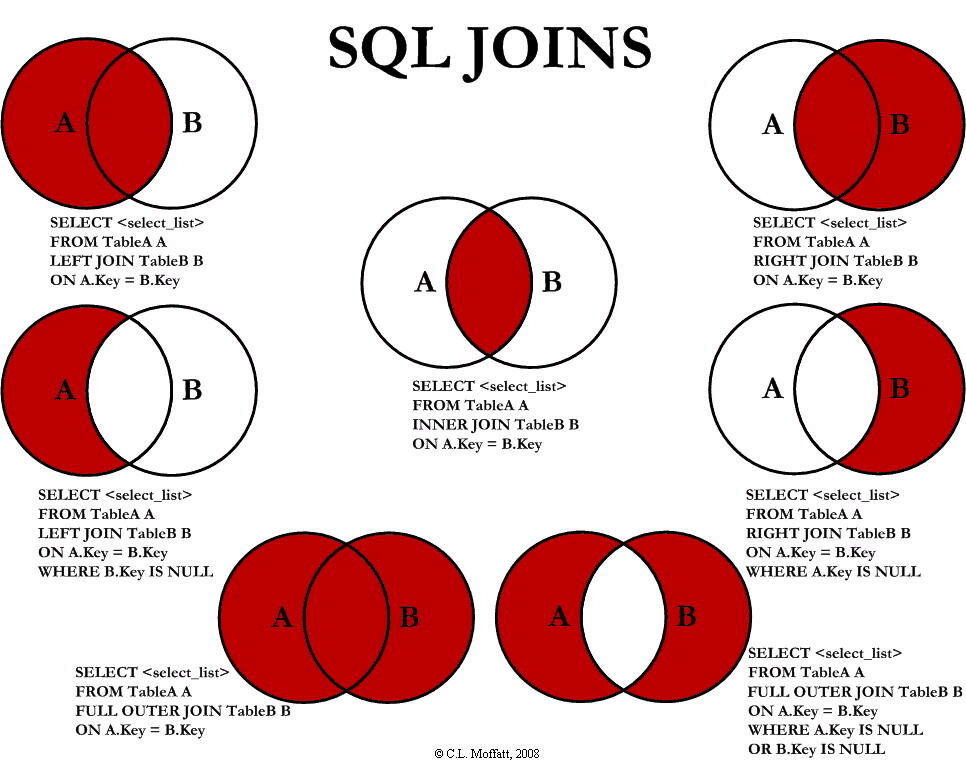

- 命令在 /usr/bin/mysql  
- 数据 /var/lib/mysql 
- 启停脚本 /etc/init.d/mysql
- 使用 mysql --help | grep my.cnf 可以查看配置文件加载顺序 /etc/my.cnf /etc/mysql/my.cnf ~/.my.cnf 

一般情况下没有特殊需求，可以修改 /etc/mysql/my.cnf，需要覆盖时再创建新文件在 /etc/my.cnf

# 配置文件

# 基本语句
- SELECT col cname FROM table WHERE col='val'  ORDER BY asc|desc
- INSERT INTO table(col,col) VALUES(val1,val2) WHERE
- UPDATE table SET col=val
- DELETE FROM table WHERE

## SELECT

- LIMIT
SELECT * FROM table LIMIT 10

- LIKE
SELECT * FROM table WHERE name LIKE '%G' => % 0到多个字符， _ 单个字符

- IN、BETWEEN
SELECT * FROM table WHERE name IN( val,val | 另一个查询字句 )

NOT IN 其相反的意义

BETWEEN AND 具有类似作用

- JOIN

SELECT * FROM table [LEFT] [OUTER] JOIN table ON a=b WHERE other

LEFT将FROM后表看做左表，理论上RIGHT JOIN都可以转化成LEFT JOIN

OUTER也是默认的行为，左右两表中只要能匹配到一个，就显示这一行，INNER必须匹配到两个

- ORDER BY、LIMIT、OFFSET
查询第二高工资，一定要有一条结果，要避免只有一条记录情况

    SELECT(
        SELECT DISTINCT
            salary
        FROM
            employee
        ORDER BY salary DESC
        LIMIT 1 OFFSET 1
    ) AS value

LIMIT也可以直接带上OFFSET作用，例如 LIMIT 10,1 == LIMIT 1 OFFSET 10，但是这种写法后面不能带运算式，LIMIT n-1 是错误的

- UNION
将多个查询结果组织在一起，选取所有不同的结果，不保留重复项

    select name from table1
    union
    select name from table2

如果想保留重复项，可以用UNION ALL，注意多条查询语句的查询列是一致的，且列位置要对应

- NULL
IS NULL、NOT NULL

## INSERT
    insert table(col1,col2) values(val1,null),(val2,val3) # 支持多行插入
    insert table(col1,col2) select c1,c2 from table # 支持查询值插入

    insert table set col1=val1,col2=val2 # 单个插入
## UPDATE、DELETE
这两个都支持联结更新或删除
