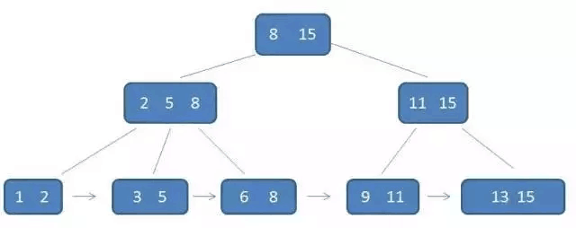

# 事务
事务是数据库必不可少的一部分，事务要保证一下特性（ACID）：

1. 原子性：要么不执行，要么全部执行
2. 一致性：必须是从一个状态到另一个状态的转换，不存在转换一半
3. 隔离性：在一个事务完全执行（提交）之前，对其他事务是不可见的
4. 持久性：一旦事务完成，则是永久存在的

其他的容易理解，但是隔离性根据不同的需求，有不同的隔离级别

mysql中的事务采用自动提交机制，如果不是显式开启事务，则每个语句都会作为一个事务提交

注意，mysql的事务是由下层引擎实现的，所以在一个事务中采用多个引擎是错误的，而MyISAM不支持事务

## 隔离级别

### 未提交读 read uncommitted
在事务中的修改，即使没有提交，对其他事务也是可见的。

事务A：v1=v2=v3=2

事务可以读取未提交的数据，也被称为**脏读**

### 提交读 read committed
大多数据库默认的隔离级别都是READ COMMITTED（但是Mysql不是。。。）

一个事务在提交前，所做的修改是其他事务不可见的，又被称为不可重复读

事务A：V1=1，V2=V3=2

Oracle默认隔离级别

### 可重复读 readable read
该级别保证了在同一个事务中多次读取同样的记录结果是一样的

V1=V2=1，V3=2

可重复读是事务A将自己读到的数据加锁，这样其他事务B就无法修改锁住的记录了，但是B可能会插入新记录，这样A在第二次读时，多读取到一条新纪录，这就是**幻读**

**可重复读是Mysql的默认隔离级别**

### 可串行化
他是最高的隔离级别，要求所有事务必须串行执行，这对数据一致性要求很高且并发不高的情况下适用

# 实现
InnerDB事务的实现是通过多版本并发控制MVCC实现的

在最早时候，只有读读不用加锁，读写、写读、写写都需要加锁，现在通过多版本控制，可以实现只有写写加锁，大大提高了并发性

以可重复读为例

不同时刻启动的事务有不同的read-view(记录副本)，每个事务都在自己的read-view上执行，emmm，具体实现方式还挺复杂的，借助了很多日志

这些回滚日志只有在不被需要的时候才自动删除

## 不建议使用长事务
长事务意味着里面会存在很老的事务视图，由于这些事务随时可能访问数据库里的任何数据，所以在这个事务提交前，可能用到的回滚记录都会保存，这将导致占用大量存储空间

并且长事务会占据锁资源，拖累性能

