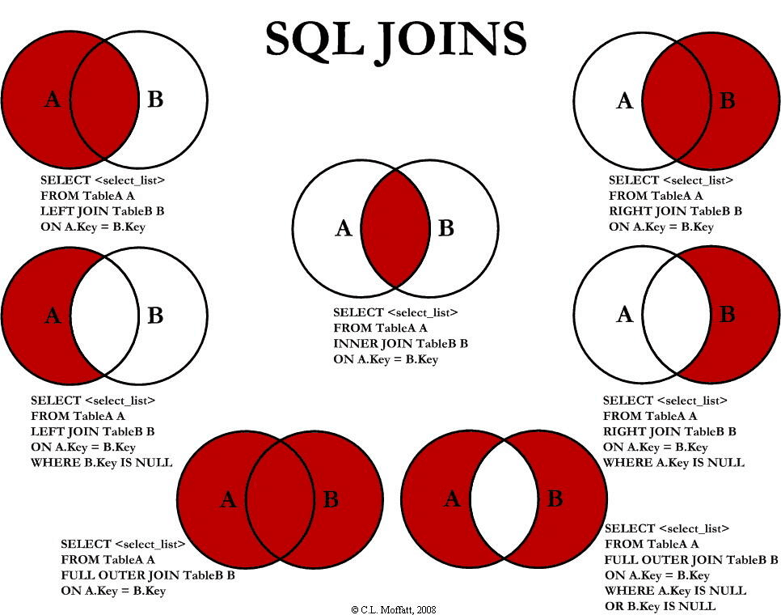

基本语句
- SELECT col cname FROM table WHERE col='val'  ORDER BY asc|desc
- INSERT INTO table(col,col) VALUES(val1,val2) WHERE
- UPDATE table SET col=val
- DELETE FROM table WHERE

## SELECT

### LIMIT
SELECT * FROM table LIMIT 10

### LIKE
SELECT * FROM table WHERE name LIKE '%G' => % 0到多个字符， _ 单个字符

### IN
SELECT * FROM table WHERE name IN( val,val | 另一个查询字句 )

NOT IN 其相反的意义

BETWEEN AND 具有类似作用

### JOIN

SELECT * FROM table [LEFT] [OUTER] JOIN table ON a=b WHERE other

LEFT将FROM后表看做左表，理论上RIGHT JOIN都可以转化成LEFT JOIN

OUTER也是默认的行为，左右两表中只要能匹配到一个，就显示这一行，INNER必须匹配到两个

### ORDER BY、LIMIT、OFFSET
查询第二高工资，一定要有一条结果，要避免只有一条记录情况

    SELECT(
        SELECT DISTINCT
            salary
        FROM
            employee
        ORDER BY salary DESC
        LIMIT 1 OFFSET 1
    ) AS value

