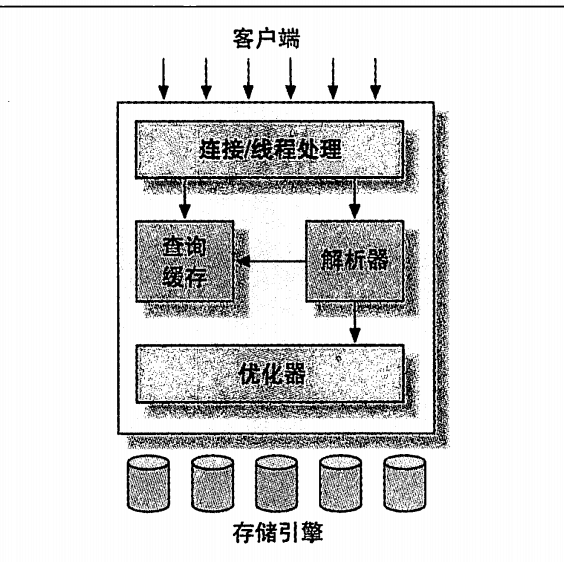

# MySQL整体架构

## 逻辑架构

1.  线程/连接处理器：连接处理、授权认证、安全等等
2.  解析器/缓存/优化器：查询解析、优化、缓存、内置函数等，以及其他的跨存储引擎的功能，都在此处实现
3.  引擎：负责数据的存储和提取，事务，服务器通过固定的API和引擎通信

## 锁
用锁实现对并发访问的控制，主要分为读锁和写锁，多个线程可以共享读锁，但是一旦上了写锁，就会阻塞其他所有的读写锁

锁的粒度又分为：表锁、行锁，锁定的粒度越小，并发程度越高，但锁的机制越复杂，总的来说，还是行锁更合适

## 事务
事务要保证一下特性：
1. 原子性：要么不执行，要么全部执行
2. 一致性：必须是从一个状态到另一个状态的转换，不存在转换一半
3. 隔离性：在一个事务完全执行（提交）之前，对其他事务是不可见的
4. 持久性：一旦事务完成，则是永久存在的

### 隔离级别
隔离性远远比定描述的复杂
