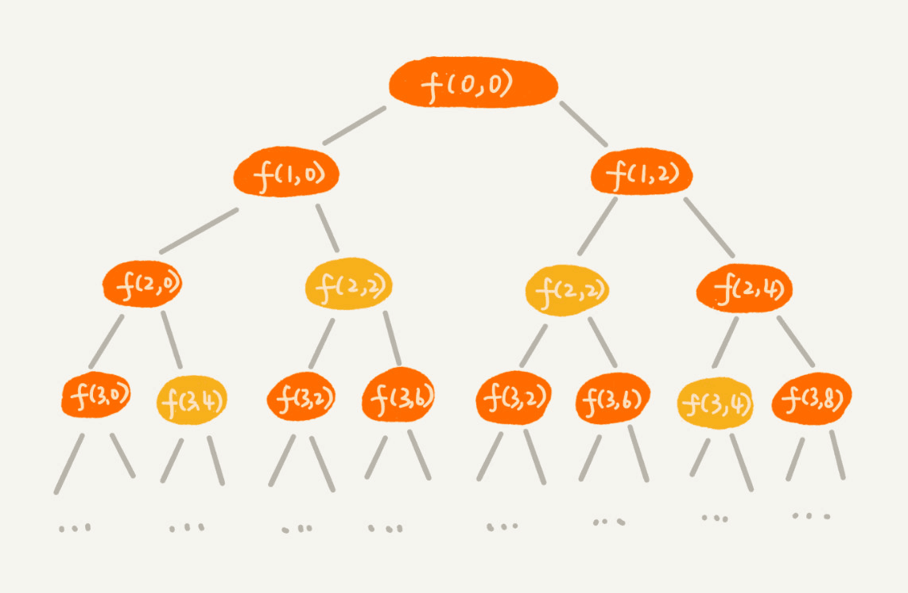
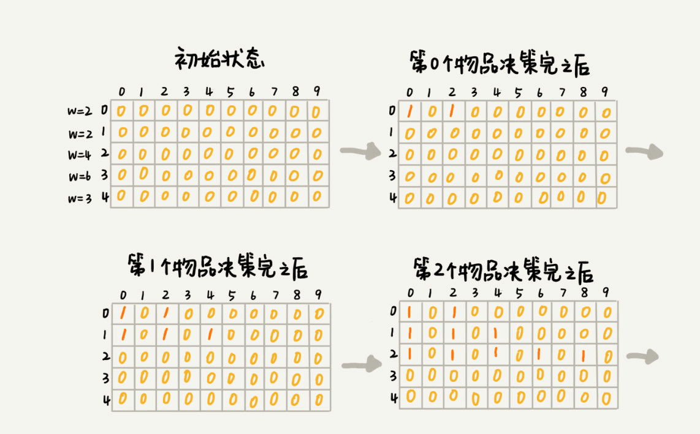

前面比如排序、递归等算法我们都有意无意的用到了很多分治思想，除了分治还有三大思想，也是相比较更难理解的，这里一次讲清楚

# 贪心
贪心算法总是选择当前最优解，一旦确定前面的选择则不回退，再次找下一个选择的最优解

但是当前最优的并不一定是全局最优的，但是在有些情况下比较适合，比如分配会议室问题，区间长度匹配问题，注意贪心解决的并不是全局最优解，而是当前最好的选择

# 回溯
如果你的人生可以无限重来，让你回到每一个选择点将所有选择全部尝试一遍，你一定能得到最好的路，这就是回溯，将出发到目标之间的所有选择全部列举一次，变成一个树状结构，全部试一遍就能得到最好的选择，

回溯的本质就是枚举所有情况，一般通过递归实现，可以缓存递归值优化性能，或剪枝，减掉确定走错的路，优化性能

# 动态规划
回溯中的剪枝就是预先将肯定超出预期情况的分支提前结束，就可以减少很多分支的递归演进，动态规划的本质就是回溯+剪枝

例如背包问题

将预期最大情况限定为数组最大长度，将每层的结果表现在数组中，如果超出了数组的最大长度就可以任务超出最大情况，被看做剪去的分支