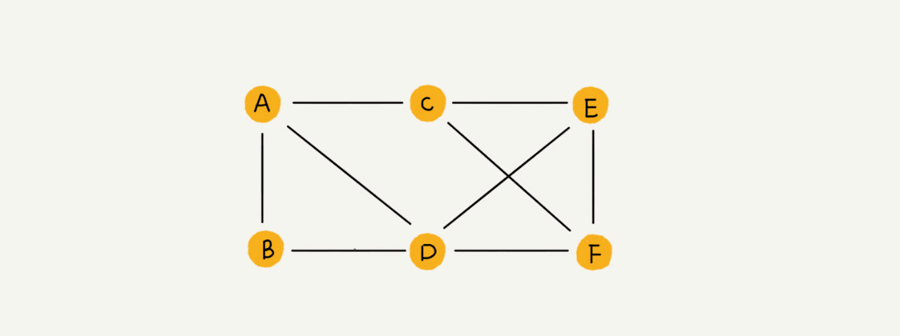
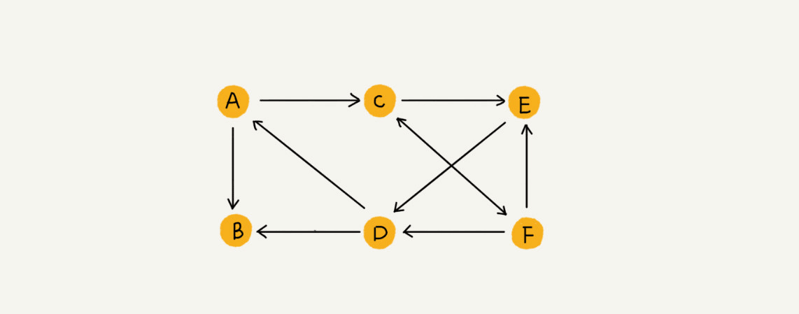
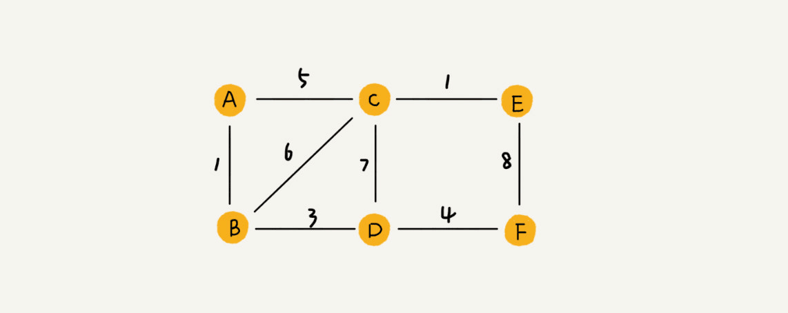
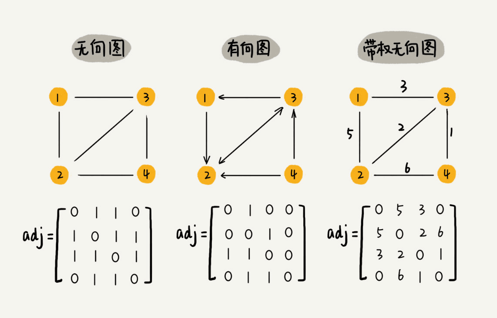
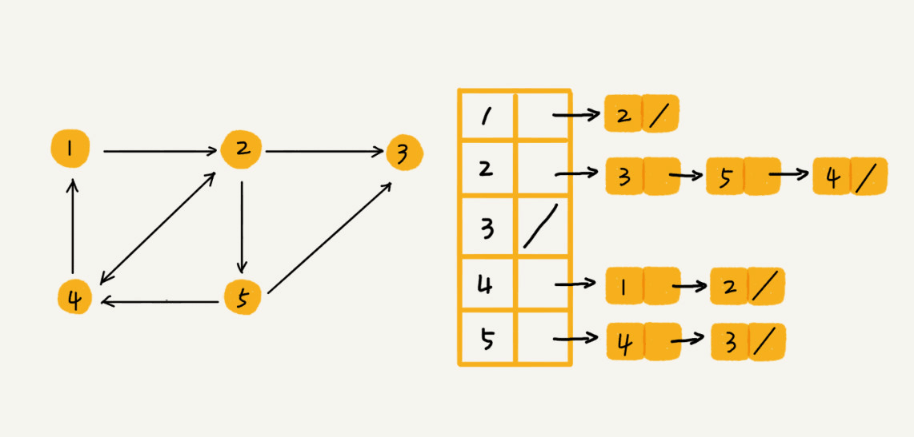

# 定义
图的本质是点的关系，把每个人看做一个点，点和点之间存在错综复杂的关系组成了图，最基本的是**无向图**

和定点相连的边的条数叫做**度**

如果定点之间存在方向，例如微博上A关注了B，但是B没有关注A，就可以记录下A到B的方向，这就是**有向图**

有多少条边指向该定点，叫做**入度**，该定点有多少条边指向其他定点，叫做**出度**

如果顶点之间的关联还有权重，就像QQ的好友亲密度一样，就是**带权图**

# 表示
图的定义很容器理解，但是向用数据结构表示图就有难度了

## 邻接矩阵

用下标表示节点，下标对应的数组值表示节点间的关系，如果是无向图只需要一半矩阵就可以表示

用数组表示比较直观，且访问速度很快，如果是稀疏图，很容器造成数组空间的浪费，在节点很多的情况下，不一定能分配到这么大的连续的数组

## 邻接表

更节约空间的是用链表存储，但是查找性能不如矩阵(我觉得可以用跳表或者红黑树)

# 应用
图往往和BFS、DFS联系在一起，因为图这种结构实在太适合这两种算法了，常见问题有最短路径，岛屿问题等