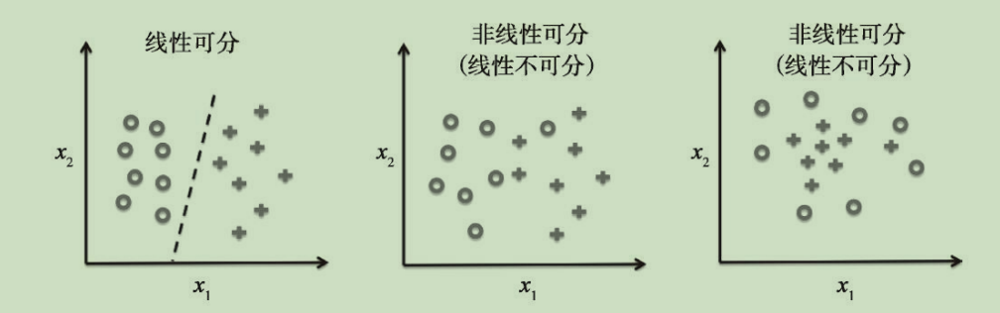
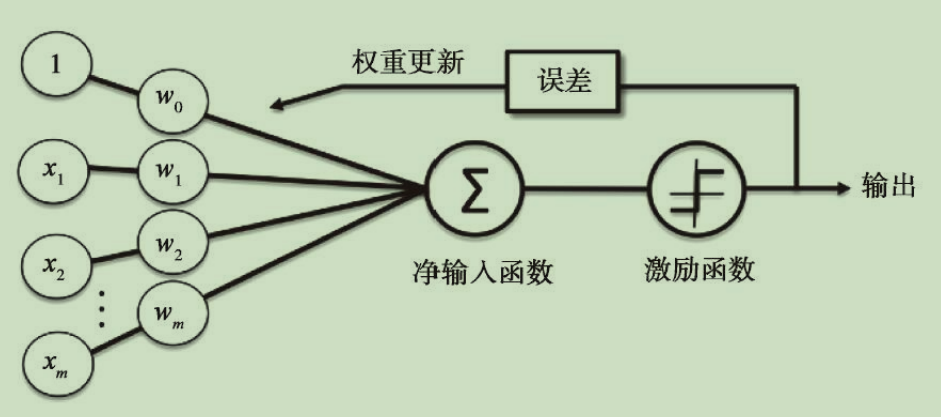

# 人造神经元

## 感知器学习法则

将神经细胞看作一个具备二进制输出的逻辑门，树突（一个神经元有多个树突）接收信号，如果累加的信号超过一个阈值，经细胞体的整合就会生成一个输出信号，并通过轴突进行传递，即，mcp神经元模型

将神经细胞模型化，则提出的第一个感知器学习法则，它的理念就是 “通过模拟的方式还原大脑中单个神经元的工作方式：它是否被激活”

阈值感知器

自学习算法，此算法可以自动通过优化得到权重系数

f(z) = { if z > 0 return 1 else return -1 }  激励函数，变量 z 如果大于 0，则输出 1，小于 0 ，输出 -1，用来做二元分类

z = w_1\*x_1 + w_2\*x_2 + ... + w_n*x_n  z才是要计算的重点，w就像是树突上的权重，x是每个树突上的输入

重点是：对于已有的给定的数据，我们在每次数据训练后修复权重，使得在一定量的训练后，性能达到分类的标准

 w_j=w_i + ∆w ， ∆w = 学习速率 * （预期输出 - 实际输出）* x_i

 我们举例看它的修复效果，
  
∆w = 学习速率 * ( 1 - ( -1 ) ) * x_i 如果预期输出1，实际输出-1，则 1 - （-1） = 2，加快修复

需要注意的是，感知器收敛的前提是两个类别必须线性可分的，如果他们掺杂在一起，那么训练出来的模型也没什么意义，并且根据学习样本数量制定学习速率，如果学习速率太大，那么单次训练对模型影响太大，很有可能模型最终形态只受最后一次训练的影响

代码

