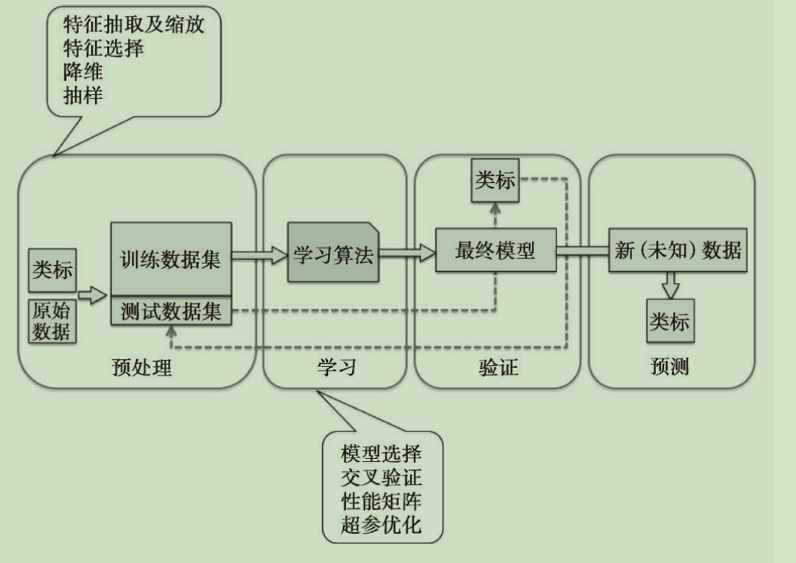

# 机器学习简介

A computer program is said to learn from experience E with respect to some class of tasks T and performance measure P, if its performance at tasks in T, as measured by P, improves with experience E.

机器已经有了经验e，我们实用例子t去训练它，使得它的预测性能p不断提升，从而改善它的经验e（e也可以说是算法模型吧）

## 监督学习

通过一堆已标记的数据训练一个机器模型，使模型达到要求的性能（预测的准确率），从而对未来数据进行预测

1. 回归问题：模拟出给定变量从而预测输出变量
2. 分类问题：模拟给定变量的分类，这类变量一般是离散、无序但有类别的

### 强化学习

强化学习算是监督学习中的一种，先构建一个系统，在与环境交互的过程中，通过环境返回的信息提高系统的性能

## 无监督学习

也称为聚类算法

无需训练下，机器可以对一堆无标记的数据按照一定相似度，进行标记分类

### 数据压缩中的降维

通常我们采集到的数据是高维度的（每次采取大量样本值），无监督数据降维是将数据中的噪音（重要性低的数据）清除，例如一个音频中同时有说话声音和唱歌背景音，说话声音更大更重要，那么就将唱歌的背景音清除。

# 构建机器学习的流程
## 数据预处理

## 选择模型并训练
每个模型都有自己局限性，由于内部复杂的理论，我们很难预测到哪个模型会工作的更好。因此必不可免的要训练多个模型，并选择最优的那个

## 验证模型
注意不要用训练的数据去验证模型

