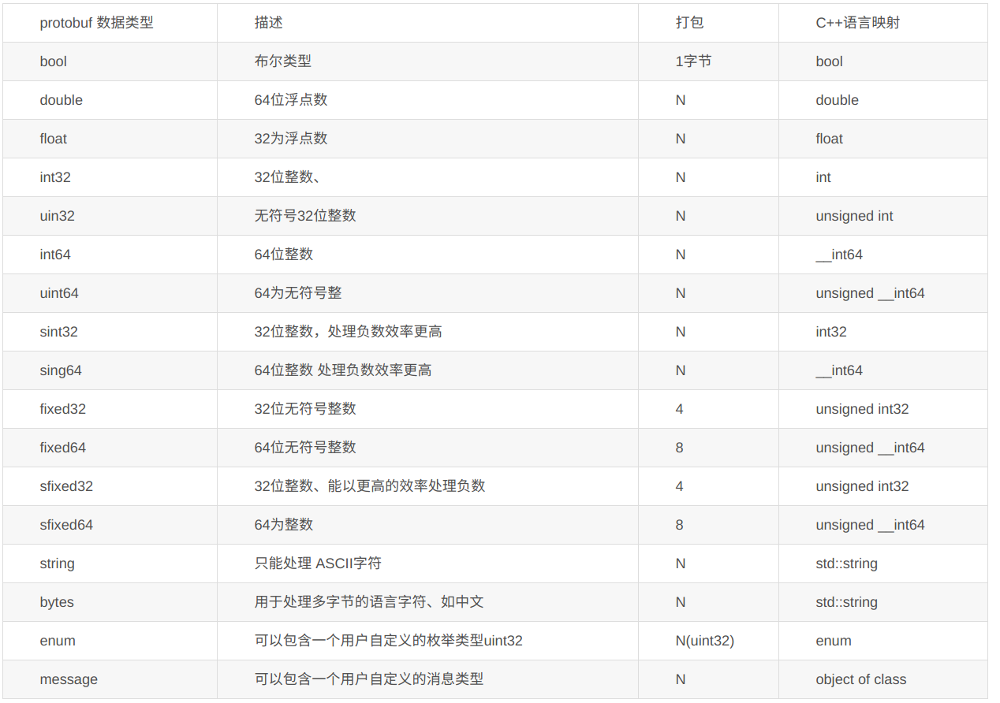

rpc 远程服务调用，本质和http协议类似，封装格式传输数据并反射调用，单语言中rpc容易实现，而多语言中首选要解决传参和接收值类型一致问题，最简单的做法是将多种语言抽象出公共类型模板配置文件，使用配置文件作为类型的载体

rpc本质就是一个网络协议，主要分两大块

1. 网络数据传输协议，即数据编码解码方式，下面要讲的protobuf就是一种
2. 服务接口协议，将不同语言的可调用接口，和请求、响应数据类型封装跨语言的格式

rpc编程里有三个身份

- 接口制定者：制定了向外暴露接口的规则，无论细节怎么更改，客户端都会遵循这个接口调用
- 实现服务：根据接口实现具体细节
- 调用服务：根据接口调用服务

将多语言抽离出公共类型格式并不难，但为了性能，要保证该配置文件编码解码简单，压缩紧凑

抽离出语言无关、平台无关的类型格式后，再为每个语言提供一个翻译器，能将配置文件自动生成数据代码，爽翻了

# 安装
下面讲的是语法，首先要有一个编译器将.proto文件编译成目标语言文件，即protoc，由于它不支持go编译，所以要安装 protoc-gen-go插件

# message
消息是一个对象，一个结构体，最少由一个字段构成

字段格式：限定修饰符① | 数据类型② | 字段名称③ | = | 字段编码值④ | [字段默认值⑤]

  optional int64 result_num = 1 [default=10]

## 限定修饰符
- Required: 表示是一个必须字段，必须相对于发送方，在发送消息之前必须设置该字段的值，对于接收方，必须能够识别该字段的意思。发送之前没有设置required字段或者无法识别required字段都会引发编解码异常，导致消息被丢弃。

- Optional：表示是一个可选字段，可选对于发送方，在发送消息时，可以有选择性的设置或者不设置该字段的值。对于接收方，如果能够识别可选字段就进行相应的处理，如果无法识别，则忽略该字段，消息中的其它字段正常处理。
  - 因为optional字段的特性，很多接口在升级版本中都把后来添加的字段都统一的设置为optional字段，这样老的版本无需升级程序也可以正常的与新的软件进行通信，只不过新的字段无法识别而已，因为并不是每个节点都需要新的功能，因此可以做到按需升级和平滑过渡。

- Repeated：表示该字段可以包含0~N个元素。其特性和optional一样，但是每一次可以包含多个值。可以看作是在传递一个数组的值。

建议尽量多使用optional，这样新接口升级不会影响其他旧系统调用

## 数据类型


N 表示打包的字节并不是固定，而是根据数据的大小或者长度。

例如：int32，如果数值比较小，在0~127时，使用一个字节打包。

关于枚举的打包方式和uint32相同。

关于message，类似于C语言中的结构包含另外一个结构作为数据成员一样。

关于 fixed32 和int32的区别：fixed32的打包效率比int32的效率高，但是使用的空间一般比int32多。因此一个属于时间效率高，一个属于空间效率高。根据项目的实际情况，一般选择fixed32，如果遇到对传输数据量要求比较苛刻的环境，可以选择int32.

## enum
使用分号(;)分隔枚举变量，例如：

```
  enum PhoneType{
    option allow_alias = true; //开启别名，多个枚举可重复值
    HOME = 0; //第一个枚举值必须是0，枚举值不能重复，除非使用 option allow_alias = true 选项来开启别名
    WORK = 1;
    ALISE = 1;
  }
  PhoneType pt = 0;
```

```
  message SearchRequest {
    required string query = 1;
    optional int32 page_number = 2;
    optional int32 result_per_page = 3 [default = 10];
    enum Corpus {
      UNIVERSAL = 0;
      WEB = 1;
      IMAGES = 2;
      LOCAL = 3;
      NEWS = 4;
      PRODUCTS = 5;
      VIDEO = 6;
    }
    optional Corpus corpus = 4 [default = UNIVERSAL];
  }
```

枚举常量必须在32位整型值的范围内。因为enum值是使用可变编码方式的，对负数不够高效，因此不推荐在enum中使用负数。如上例所示，可以在 一个消息定义的内部或外部定义枚举——这些枚举可以在.proto文件中的任何消息定义里重用。当然也可以在一个消息中声明一个枚举类型，而在另一个不同 的消息中使用它——采用MessageType.EnumType的语法格式。


## 字段属性
### 字段命名

protobuf建议字段的命名采用以下划线分割的驼峰式。例如 first_name 而不是firstName.

### 字段编码值
proto在传输数据时并不是傻傻的以key-val传递，而是利用字段编码值找对应关系，字段编码值-val

如果当前字段的值和proto的零值相同，就不需要传递这个值，直接解码时将其设为零值

综上，应当将频繁使用的值设置为较小的编码，最好0~15范围内，这样传输起来更小(其实差距不大)

编码值的取值范围为 1 - 2^32（4294967296)，1900-2000编码值为Google protobuf 系统内部保留值，建议不要在自己的项目中使用。

消息中的字段的编码值无需连续，只要是合法的，并且不能在同一个消息中有字段包含相同的编码值。


# 接口


# 其他
import，就是你想的那个意思

package，也是你想的那个意思

