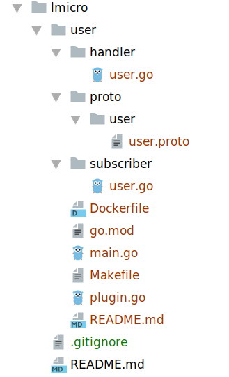

首先，你需要安装扯淡的脚手架工具，一共需要以下几个工具(包含gRpc)

1. protoc 不支持go编译
2. protoc-gen-go 给protoc加上go编译
3. micro 下载后自己将 main.go 编译成 micro 工具，然后配置路径(可以放在$GOPATH/bin下)
4. protoc-gen-micro 给protoc加上micro编译

micro是一个cli工具，帮助快速创建、启动、调试微服务，下面介绍一下常用命令

# 创建服务

- new：创建一个微服务，有两个常用选项，--type=srv 创建微服务类型 default src，--gopath=true 以 $GOPATH/src 为根目录创建文件夹 default true，建议设置为 false，在

在非$GOPATH路径下创建了 lmicro 目录， micro --type=src --gopath=false user 创建 user 服务，cli工具自动生成了以下文件



- handler 被调用函数
- proto 变量和接口契约
- subscriber 订阅服务
- main.go 主函数
- plugin.go 插件
- 其他：docker和依赖管理

```
    micro new --type=web --gopath=false web 再创建一个web服务
```

# 编译proto

    protoc --go_out=. --micro_out=.  proto/user/user.proto

要指定输出的目录和 micro 输出目录， . 代表了proto文件所在目录

