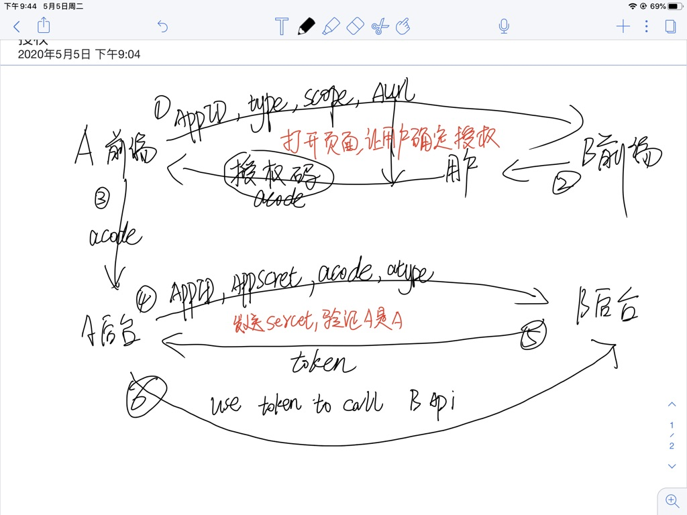

登陆需要解决的根本问题是确定用户身份

你需要证明你是你，为了避免伪造你的证据必须是我给你的，而你需要通过某种渠道获取证据

# 认证令牌
1. 确保令牌无法伪造
2. 确保令牌不会被窃取
3. 确保令牌发放者对令牌有完全的掌控
4. 通过令牌识别用户信息

## cookie-session方案
解决方案

1. 登陆完成后在cookie中添加特定sessionid值，只有服务器可以发放，通过构造sessionid的复杂度使其伪造过高
2. 通过设置httpOnly，任何网站不能窃取其他网站的cookie，但是可以自己手动获取
3. cookie提供了众多设置，足以掌控
4. 将cookie和session对应，存储用户信息

存在问题

1. cookie的设置具有强制性，受限同源政策，多个网站间无法共享用户状态信息

## JWT
如果session中的存的信息不多，只要加密做得好，就可以把信息放在客户端存储，外加localStorage，可以很好的实现多个网站间共享登陆状态，即单点登陆

JWT分为 头部、数据、签名

- 头部包含元信息，加密方式等
- 数据是被服务端加密过的，用户端无法解破
- 签名验证头部和数据是否被破坏

# 授权
如果把认证令牌看作进入小区的门禁卡，登陆是找物业获取门禁卡（门禁卡可能会过期，需重新办理）

那么授权则是点了外卖，让外卖员可以临时进入小区的解决方案

主体包含三方，用户、资源、第三方应用

过程是，第三方想要使用用户的资源，需要经过用户的授权

具体经历以下四个步骤

## 请求授权码
A网站给个链接跳转到B网站，B网站弹出授权，授权成功后返回A网站且url中携带授权码

请求授权主要包含 请求者身份证明、请求资源ID、请求资源权限、请求成功或失败后返回的地址

    https://b.com/oauth/authorize?
        client_id=CLIENT_ID&
        response_type=code&
        scope=read&
        redirect_uri=CALLBACK_URL

B网站必须知道A网站情况并做审查，所以A网站必须先在B网站开放平台注册并拿到可以证明身份的APPID和APPsecret

    https://a.com/callback?code=AUTHORIZATION_CODE

在后端

    https://b.com/oauth/token?
        client_id=CLIENT_ID&
        client_secret=CLIENT_SECRET&
        grant_type=authorization_code&
        code=AUTHORIZATION_CODE&
        redirect_uri=CALLBACK_URL

为什么授权码和令牌要分两次请求得到，授权要求用户必须看得见，但 client_secret 要保密

