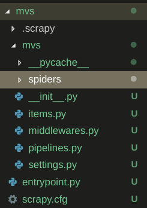

# 创建项目
scrapy startproject mvs

会自动生成一些目录



- scrapy.cfg: 项目的配置文件
- mvs/items.py: 定义要爬取的数据结构
- mvs/spiders/: 定义爬取规则
- mvs/pipelines.py: 定义数据持久层
- mvs/settings.py: 项目的设置文件

entrypoint.py文件是我自己创建的，自动化运行，少敲一些命名，可以没有

    from scrapy.cmdline import execute
    execute(['scrapy', 'crawl', '你定义的爬虫'])

# 爬取规则


由命令行启动后，scheduler调度器负责整个项目的解析和调度


整个过程是异步的

# 爬虫
## items.py
在items.py中定义自己要爬取的数据结构

    # 爬取项要继承scrapy.Item
    class FilmItem(scrapy.Item):
        cname = scrapy.Field()
        name = scrapy.Field()
        time = scrapy.Field()
        ftype = scrapy.Field()
        link = scrapy.Field()
        douban = scrapy.Field()
        imdb = scrapy.Field()
        long = scrapy.Field()
        detail = scrapy.Field()


## spider
然后编写自己的spider，在spiders文件夹下创建文件，用于编写自己的爬取规则

spider循环

1. schduler通过调用 start_requests() 来获取request

2. start_requests() 惰性读取 start_urls 中的URL生成Request对象，Request(url,self.parse)，会在url请求完成后自己调用parse

3. 请求获取response的信息后，调用parse并传入response

由上面过程可以得出两个结论：

1. 我们可以将要爬取的url动态加入start_urls中，或重写start_requests()函数，制定url生成规则，惰性生成Request(url,self.parse)

2. parse用来处理爬取到的信息

```
class HomeSpider(scrapy.Spider):
    # 必填，用于唯一标识这个爬虫
    # 这个很重要，我们启动时就是根据name启动某个爬虫
    name = 'home'

    # 可选，只会访问该域名下的url
    allowed_domains = ['dytt8.net']
    
    # 必填，要爬取的url，或者重写start_requests()
    start_urls = ['https://www.dytt8.net/']

    # scrapy会根据配置的信息爬取，得到的结果放在r中等待解析
    def parse(self,r):
        print(r.text)
```


Python爬虫（实战篇）：妹子图爬虫，上车吧！ - yonggege的文章 - 知乎
https://zhuanlan.zhihu.com/p/26304528