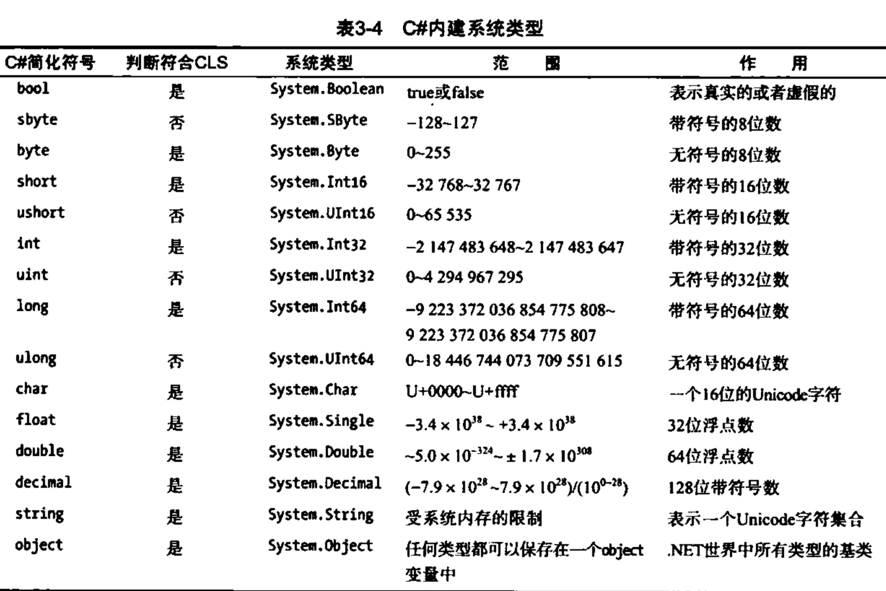

# 值类型


## simple type
这些基本类型都是对应结构体别名，都派生于 System.Object，并有自己的静态方法

- Signed integral: sbyte, short, int, long，nullvalue：0
- Unsigned integral: byte, ushort, uint, ulong，nullvalue：0
- Unicode characters: char，nullvalue：''
- IEEE binary floating-point: float, double，nullvalue：0
- High-precision decimal floating-point: decimal
- Boolean: bool，nullvalue：false
- String: string，nullvalue：""

```
    Console.WriteLine(6.ToString());
    Console.WriteLine(int.MaxValue());
    bool b = new bool();
    char c = new Char();
    Console.WriteLine("left"+c+"right"); //leftright
```

即保持了值类型，又有oop用法，nb

### 其他操作
```
// 检查溢出
try
{
    string str = Console.ReadLine();
    int i = int.Parse(str);
    byte sum = checked((byte)i);
    Console.WriteLine(sum);
}
catch (Exception ex)
{
    Console.WriteLine(ex.Message);
}
```

## Enum types
- User-defined types of the form enum E {...}
```
public class EnumTest
{
    enum Day { Sun, Mon, Tue, Wed, Thu, Fri, Sat };
    // enum Day :byte { Sun, Mon, Tue, Wed, Thu, Fri, Sat };
    static void Main()
    {
        int x = (int)Day.Sun;
        int y = (int)Day.Fri;
        Console.WriteLine("Sun = {0}", x);
        Console.WriteLine("Fri = {0}", y);
    }
}

- 枚举类型只支持 byte、int、uint、long 整数类型，默认从 0 递增

命名空间下不支持直接声明变量、常量，虽然可以在类内定义常量，我还是不能理解为什么要把枚举限制在数值

```
## Struct types
- User-defined types of the form struct S {...}

similar class，可以实现接口但无法继承，因为 field 无法使用 protected，一般情况下都可以用 class 代替

```
    public struct Book
    {
        public decimal price;
        public string title;
        public string author;
    }

    public class Hello
    {
        static void Main()
        {
            Book book = new Book();
            Console.WriteLine(book);
        }
    }
```

# Nullable value types
- Extensions of all other value types with a null value

# Reference types
## string

- "双引号定义字符串可转义\n"
- @"这样就不做任何转义且保留换行"
- 与java不同的是，== 对 string 做了适配，可以直接比较指向的值，等同于调用 Equals
- 最后，字符串是不可变的，减少GC可以用


## Class types
- Ultimate base class of all other types: object
- Unicode strings: string
  - Character and string processing in C# uses Unicode encoding. The char type represents a UTF-16 code unit, and the string type represents a sequence of UTF-16 code units.
- User-defined types of the form class C {...}

## Interface types
- User-defined types of the form interface I {...}

## Array types
- Single- and multi-dimensional, for example, int[] and int[,]

## Delegate types
- User-defined types of the form delegate int D(...)