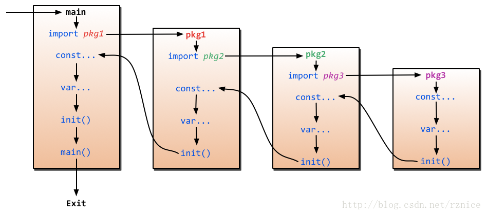

# 包和文件
- 一个目录下的所有文件必须声明同一个包名
- 目录下的目录可以使用其他的包
- 通过目录路径导入目录，但实际使用仍旧以目录下命名的包名使用
- 最佳实践：目录下的包名和目录名保持一致
- 可能会有不同导入路径，但包名却相同的包，可以为包绑定别名

```
  _ "strconv"
  f "fmt"
```
包的初始化从包级别的变量开始，在依赖解析之后按照依赖的顺序进行初始化

任何文件都可以包含任意多个 init 初始化函数，当程序启动时，初始化顺序如下
- 初始化 import 的包，无论该包是否被使用
- 查找依赖关系，初始化包内全局变量和 init 函数



# 流程控制
## if
```

    //花括号必须和 if 或 else 一行
    if 1 == 1 {
        ...
    } else if 2 == 2 {
        ...
    } else {
        ...
    }

    //在有返回值的函数中，不允许将最终的 return 写在 if else 中
    if 1 == 1 {
        return ...
    } else {
        return ... //这样是编译失败的，必须有最终的 return
    }
    return ...

```

## switch
```
    // s 支持任何类型，在一个条件下可以执行多个语句，且默认执行break，加上 fallthrough 后，会继续执行下一句
    s := "kanggege"
	switch s {
	case "kanggege":
		fmt.Println("yes")
		fmt.Println("yes!")
        fallthrough
	case "luci":
		fmt.Println("no!")
    case "shala"
        fmt.Println("yyyyyes")
	}

    //更牛逼的是 switch 还可以没有条件，等同于一群 if else
    switch {
	case 1 > 2:
		fmt.Println("1>2")
	case 2 > 1:
		fmt.Println("2>1")

	}

```

## for
```

    Loop:
	for i := 0; i<10 ; i++ {
		Loop2:
		for j :=0; j<10;j++  {
			if j == 2 {
				break Loop
			}
			if j == 3 {
				break Loop2
			}
		}
	}

    for {
        .... //等同于 while(true)
    }

```

## goto
```
    //令人惊讶的是 go 竟然也支持 goto
    for i := 0; i<10 ; i++ {
		for j :=0; j<10;j++  {
			if j == 2 {
				goto Loop
                //最好小范围的使用 goto，不要随便乱跳
			}
		}
	}
	Loop:

```