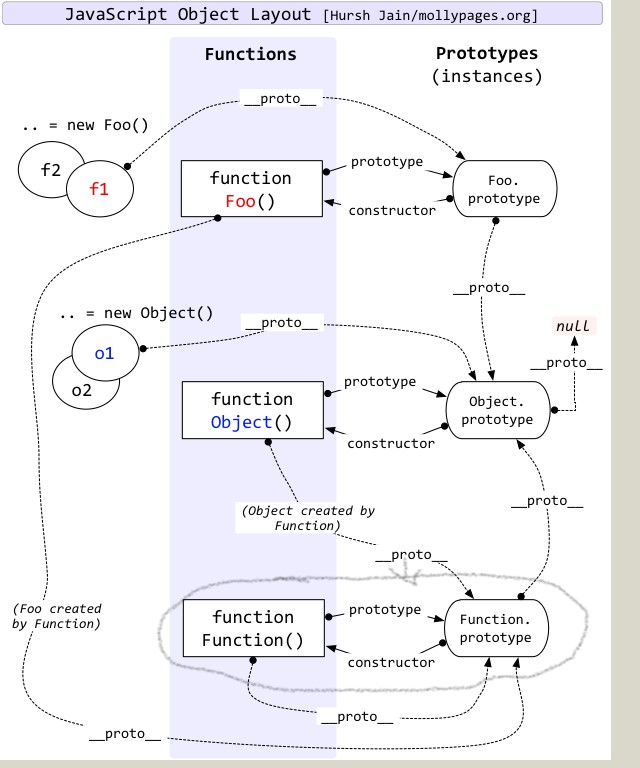

js没有采用通用意义上的类继承，而是采用原型链，ES6引入了class语法糖，一般使用class

# 原型链
js中类的概念基于函数实现

```
//正常调用就是一个函数，用new调用就是类
function Myclass() {
    this.a = 1
    this.b = function() {}
}

let obj = new Myclass() //创建一个对象
```

只是一个函数，当使用 new 调用这个函数，会返回一个对象，函数中的this都指向返回的对象

Myclass除了作为函数拥有的属性，还有一些用于类继承的属性

- prototype：是一个对象，即原型链
- \_proto\_：ES中未规定，浏览器提供的属性，指向他的父类的prototype

先理解下怎样实现类继承，再考虑上面两个属性的意义

```
function SuperType() {
    this.a = 1
}
SuperType.prototype.a = 1
SuperType.prototype.b = 2

var o = new SuperType()
o.a //1
o.b //2
```

可以看出基于SuperType类创建的对象查找值的顺序 this => prototype

可以利用这个特点实现继承
```

function SubType() {
    this.b = 'sub b'
}

// 这里是关键，创建SuperType的实例，并将该实例赋值给SubType.prototype
SubType.prototype = new SuperType()

var o = new SubType()
o.a //1
o.b //"sub b"
```

o.a查找顺序 SubType函数内this(未找到) => SubType.prototype

而SubType.prototype是SuperType类的一个对象，所以接着查找就是

SuperType函数内的this(找到)，如果未找到还会继续查找 SuperType.prototype,就像一个链条一样层层向上查找

还有其他的继承实现，但其根本原理都是借助 this 和 prototype，如下面组合继承

```
function SuperType(name){
  this.name = name;
  this.colors = ["red", "blue", "green"];
}
SuperType.prototype.sayName = function(){
  alert(this.name);
};

function SubType(name, age){
  // 继承this，把SuperType换做其他类就能继承其this上的属性
  SuperType.call(this, name); 
  this.age = age;
}

// 构建原型链
SubType.prototype = new SuperType(); 
```

至于其他 \_proto_  或 constructor 都是作为辅助，后面先说js内置类的继承关系


# 内置继承关系
输出最前面的 obj.\__proto__  得到创建对象的类的prototype

    {
        constructor: ƒ Myclass()
        \_\_proto\_\_: Object
    }

我们创建的类是没有名字的，只有构造器即函数有名，干脆把他看做类和构造器同名，叫做Myclass

看下面这个图




Brendan Eich说，要有类，于是就有了Object类，包含Object构造器和Object.prototype

由于Object.prototype是一个对象，如果由Object类创建，则Object.prototype 继承了 Object.prototype 的属性，自己继承自己？所以让Object.prototype.\_\_proto__ === null，这样看做 Object.prototype 是凭空诞生的对象


Object的构造器是个函数，干脆搞个Function继承一下，于是就有

Object.constructor.\_\_proto__ === Function.prototype

而 Function.prototype 是一个对象，所以有必要让 Function.prototype.\_\_proto__ === Object.prototype

这种设计可以说是非常傻吊了 Object.constructor 有了Function和Object所有属性，至于Function.\_\proto__ === Function.prototype 就当是个笑话吧

# class
前面说了那么多，这个才是重点，class是原型链的语法糖，受原型链的限制，注定很多功能不能像其他语言类一样完美，但基本满足需求

用js要切记一条，道路千千万，选择正确的走就可以了，没必要搞清楚所有道路

```
//本质是函数,Rectangle是个函数
//必须先声明，不存在提升
class Rectangle {
  height = 0; //public属性
  #width; //private属性

  constructor(height, width) {
    this.height = height;
    this.width = width;
  }

  // Getter
  get area() {
    return this.calcArea();
  }
  // Method
  calcArea() {
    return this.height * this.width;
  }

  //只能借助类使用的静态方法
  static distance(a, b) {
    const dx = a.x - b.x;
    const dy = a.y - b.y;

    return Math.hypot(dx, dy);
  }
}

```

## 继承
```
class Animal { 
  constructor(name) {
    this.name = name;
  }
  
  speak() {
    console.log(`${this.name} makes a noise.`);
  }
}

class Dog extends Animal {
  constructor(name) {
    super(name); // call the super class constructor and pass in the name parameter
  }

  speak() {
    console.log(`${this.name} barks.`);
  }

  fspeak() {
    super.speak() //super调用父类
  }
}
```

# module
以前的es是多个文件合并为一个全局作用域，现在可以使用模块化

import有很多语法，我只推荐使用 import 'bg' from './bg'

导出推荐用

```
export default {

}
```

一旦使用import或export，都代表你的代码运行在 'use strict' 模式下
