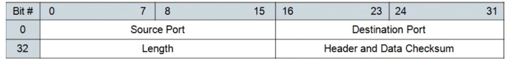

# 特点
upd协议最显著的几个特点

- 面向数据报，无需建立连接，直接发送数据，与tcp相比提升了性能
- 无拥塞控制机制，将数据划分为数据报后，直接全部发送，提升了性能，也提升了丢包概率，并可能造成网络堵塞
- 不保证数据传输完整性，不可靠，数据发出后就不保留数据备份了，可能中途丢包，可能性很大
- 可以广播，这是tcp不具有的功能

# 报文结构
##　头部

- 第一行是发送和接受方的端口号，计算机网络端口号占用两字节，表示65536中可能，即0~65535
- length表示整个报文长度（包括头部）
- 头部检验用于检验头部信息是否错误

## 报文体
头部长度字段是两字节，可以记录最大的长度是65535，而头部占用了64字节，所以报文体最大长度只能是65507，有时可能根据链路层而切出更小的报文体

## 使用场景
一般是需要资源少，网络情况好的内网，因为丢包较少，自己再制定一个可靠传输协议，性能较好

或者不需要可靠传输的，对时延要求较高的，比如说直播

1. QUIC
2. 流媒体，不需要可靠传输，但是需要时延低
3. 实时游戏，需要时间反应特别快，采取自定义的可靠UDP协议，不管网络会不会阻塞，要反应快！
4. 物联网，嵌入式设备内存和运算资源较弱，使用udp比较简单

# 广播
只能使用udp广播，发出广播后，你并不知道谁接受到了信息

广播地址的计算方式：
1. IP地址与子网掩码进行 & 运算，得到网络地址
2. 子网掩码后有几个0（假设为n），代表主机位有多少，将网络地址后n位设置为1，就是广播地址

即：当前网关下可分配的最大IP值，就是广播地址

举例：
    # ifconfig -a 得到
    inet 192.168.1.108(IP地址)  netmask 255.255.255.0(子网掩码)  broadcast 192.168.1.255(广播地址)

255.255.255.255是受限广播地址，只有局域网内部节点接收到广播

192.168.1.1是预留地址，用于连接自己节点接入的路由器(只是能用这个地址访问到路由器，并不代表路由器的地址是这个)，所以192.168.1.255可以用于自己路由器下所有节点的广播，等同255.255.255.255

