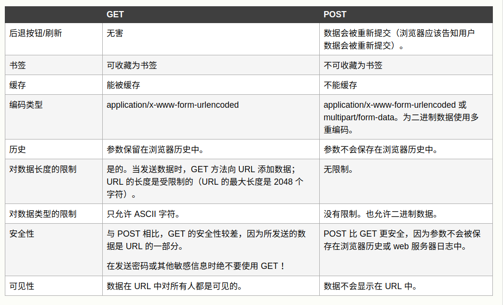

# 请求报文
报文是HTTP请求中真正要传输的东西，其实就是一个按照一定语法的文本，我们要学习的就是它的语法格式，以及其中内容代表的意义

报文分为请求报文和响应报文，他们的总体格式相同，但是语法又不同

## 方法

### GET

**通常用于请求服务器发送某个资源**

get方法没有请求体，所以我们写入的参数都会被程序重写到URL中，不同的浏览器对URL的长度会有不同的限制

在浏览器中会对get方法有些特殊的处理
- GET 请求可被缓存
- GET 请求保留在浏览器历史记录中
- GET 请求可被收藏为书签
- GET 请求不应在处理敏感数据时使用
- GET 请求有长度限制
- GET 请求只应当用于取回数据

每个浏览器对get请求的url限制长度不同，最短的可能是IE的 2K+53 个字符，chrome可以达到8k+字符

### POST

**向服务器输入数据**
post方法的参数会被写在请求体中，即使你写到URL中，程序一般都会把他重写在请求体中

### HEAD

HEAD 方法与 GET 方法的行为很类似,但服务器在响应中只返回首部。不会返回实体的主体部分。这就允许客户端在未获取实际资源的情况下,对资源的首部进行检查

### PUT

**向服务器写入文档，如果文档已经存在，更新文档**

### DELETE
从服务器中删除命名资源

### PATCH
put一般用于全局更新，patch语义是部分更新资源

### TRACE

**追踪中间代理对请求的更改**

客户端发起一个请求时,这个请求可能要穿过防火墙、代理、网关或其他一些应用程序。每个中间节点都可能会修改原始的 HTTP 请求。TRACE 方法允许客户端在最终将请求发送给服务器时,看看它变成了什么样子。

### CONNECT
connect是用于连接代理服务器的，就是我们通常说的vpn，代理服务器会将一部分用于代理的信息做处理并转发

### OPTIONS
返回服务器支持的方法

# 响应报文

## 状态码
### 1xx
请求正在处理

### 2xx　请求成功
- 200 OK：请求没问题,实体的主体部分包含了所请求的资源
- 201 Created：已经被创建
- 202 Accepted：接受了请求，但是可能还没有做任何处理

### 3xx　请求重定向
- 300 Multiple choices：当请求指向的URL有多个资源时返回，如一个服务器上HTML有中文和英文版，返回这个代码时一般带着一个选项列表，以供用户选择，服务器可以在Location首部中包含首选URL
- 301 Moved permanent：资源被永久性转移了，相应的Location首部应该包含新的URL，这意味这浏览器应该改变书签的指向，将他们指到新的URL
- 302 Found：临时性移动，将该请求指向新的URL，但是只是临时的，浏览器不应该改变书签等
- 304 自从上次请求后，资源没有改变，服务器不会返回资源内容
- 307 临时重定向：跟302差不多

## 4xx
- 400 请求报文错误
- 401 需要身份验证
- 403 服务器已经理解请求，但是拒绝处理它，一般是权限出错
- 404 未找到资源
- 406 不接受
- 408 请求超时
- 415 不支持的媒体类型

## 5xx
- 500 服务器遇到了未知错误
- 502 服务器作为网关或代理，从上游服务器收到无效响应
- 503 由于服务器维护或者过载，当前无法处理请求，只是个临时窗台
- 504 网关超时
- 505 http版本不支持