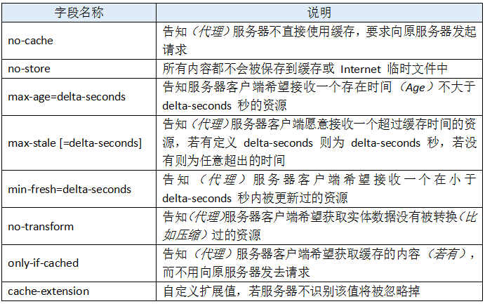
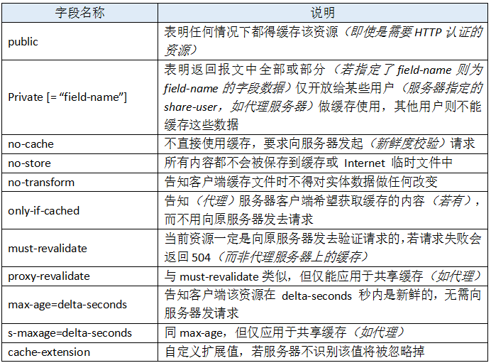
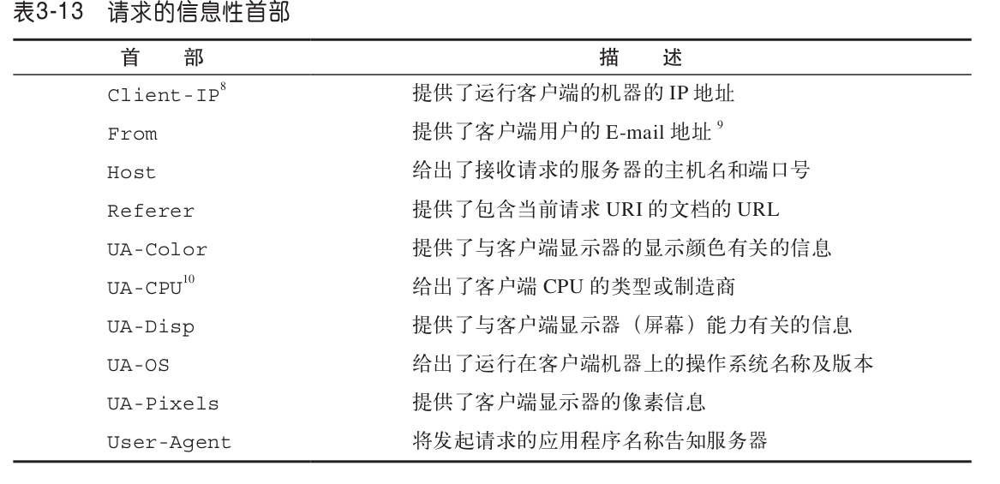

首部是报文的重要组成，配合请求方法或状态码实现了很多附加功能

首部大致分为三类，通用首部，请求首部，响应首部

# 通用

## connect
HTTP1.1 之后默认多个 http 请求可以在一个tcp连接中完成，connect 代表当前 http 请求结束后是否关闭 tcp 连接

- keep-alive：保持 tcp 存活，可能还有请求
- close：引导浏览器关闭 tcp 连接

## 缓存

### Pragma

注：Pragma是1.0旧产物，已经逐步抛弃，有些网站为了向下兼容还保留了这两个字段。如果一个报文中同时出现Pragma和Cache-Control时，以Pragma为准。同时出现Cache-Control和Expires时，以Cache-Control为准。即优先级从高到低是 Pragma -> Cache-Control -> Expires

Pragma有两个字段Pragma和Expires。Pragma的值为no-cache时，表示禁用缓存，Expires的值是一个GMT时间，表示该缓存的有效截止日期。

### Cache-control
作为请求～～～

作为相应

当服务器发送资源给客户端时，也会用一些首部让客户端缓存资源

    Last-Modified: Fri，22 ...

下次客户端请求带着这个头部，如果服务器没有修改资源就返回304，减少了传输

缓存挺复杂的,具体的以后用到了再查

# 请求 

## Accept
表示请求可以接受的内容类型，服务器应该根据该头部字段发送给客户端合适的内容

    Accept：text/html, application/xhtml+xml, application/xml;q=0.9, image/webp, image/apng, */*; q=0.8

- Accept-encoding：gzip, deflate, br
向服务器申明客户端（浏览器）接收的编码方法，通常为压缩方法

- Accept-Language: en-US,en;q=0.9,zh-CN;q=0.8,zh;q=0.7
向服务器申明客户端（浏览器）接收的语言，浏览器能够接受 en-US, en 和 zh-CN 三种语言，其中 en-US 的权重最高 ( q 最高为1，最低为 0)，服务器优先返回 en-US 语言

## content-type
content-type是请求中常见的头部，用于表述请求的类型或发送内容的类型

如果我们请求一个资源，content-type的值通常是MIME，content-type: text/html; charset=utf-8

如果是发送表单的请求，content-type用于表明发送值的编码方式，在form中通过enctype属性设置

- application/x-www-form-urlencoded

当使用form表单且没有文件上传时，这是默认的编码方式，一般用于纯键值对的上传。数据被编码成键值对，如果是get请求，会编码在url中，如果是post/put/patch等这些方法，则编码在body中，都是以 n1=v1&n2=v2&n3=v3 的形式上传的

- multipart/form-data

这是一个多媒体类型，首先生成一个boundary用于分割不同字段，在请求实体中每个参数会以------boundary开始，然后是附加信息和参数名，然后是空行，最后是参数内容。多个参数会有多个------boundary块。如果参数是文件，会有特别的文件域，最后以------boundary–结尾，一般文件上传表单则用该类型

- text/plain
一般向服务器发送json会使用这种格式

当发送数据时，Content-type往往有两个值，第一个表述发送内容类型，第二个表述编码方式

    content-type: application/json; charset=utf-8

form表单中用accept-charset设置编码，通常是utf-8

## 条件请求首部

## 安全请求首部

# 响应

## Content-Disposition
display position，响应数据的展示位置，默认 inline，即交给 js 处理在网页中展示，或作为附件下载，和 Content-Type 搭配使用

- inline：交给 js 处理
- attachment：意味数据应该交给浏览器处理，并下载到本地

    Content-Disposition: attachment; filename="filename.jpg"

