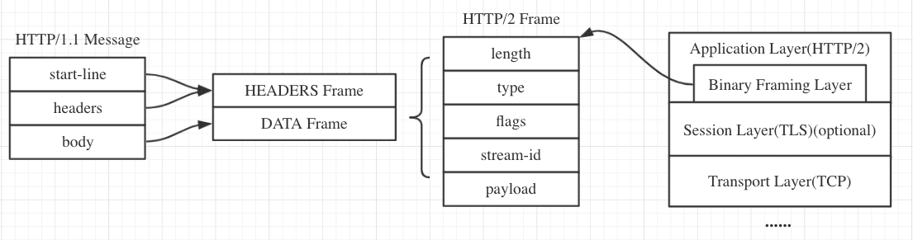

# 概述
自95年http1.1出现后，这么多年来，web页面请求的资源变得更大、更多、更零散，1.1已经不能满足现在网页的需求了，为了减少请求次数，提高页面响应速度，web开发出现了各种黑科技和工具。这些本应该是http解决的问题，却让开发者承担了他们本不应该承担的责任

http2就是在这种压力下诞生的，它不仅要兼容过去几十年积累的包袱，还兼具着提升性能，且降低开发复杂度等艰巨的任务

# 过去的糟糕处境
在1.1中，最大的改变就是 connection:keep-alive 实现了长连接，在那时一个页面要请求的资源不是很多，也没有很大，所以一个长连接足够用了

但是从今天的web开发中可以看出，页面请求的资源很轻松的就达到了几十个，请求的库也越来越多，越来越大，让我们看看1.1下web开发

## 请求资源过多

虽然1.1实现了长连接，但多个请求无法有效区分，所有在一个tcp连接下只能串行请求，web服务器会在第一个请求处理完成之后再去处理其他的请求，如果第一个请求太大或者出了些问题，很容易造成头阻塞。

为了加快资源的加载，web开发者想出了各种办法

- web开发者会将多个图拼接到一个图中，请求到客户端后再用js分解，这样就减少了请求的次数
- 将背景图之类的打包进css文件中，减少请求次数，但是有的时候可能页面不需要这些图，虽然减少了请求次数但是可能会造成流量的浪费
- 大部分浏览器会允许对同一个主机同时开4~8个tcp请求服务器，这样页面的才能实现多个资源同时下载，但是打开太多socket很耗费性能。
- 一些网站会对页面内资源分类，负载到不同的主机，这样浏览器就会开更多的tcp去加载这些资源 

上面这些做法都是为了减少请求次数，且并行请求资源。主要体现了1.1的两大弊端

1. 大部分请求都会携带类似的头部信息，这些头部信息很多是重复且无意义的(包括cookie)，只能浪费流量
2. 不能并行处理请求，头请求阻塞，导致页面容易加载阻塞

http2中在兼容过去的url和http格式的情况下，解决了上面的这些问题

# 二进制帧
过去的http报文是明文，解析凌乱的报文格式时，浪费了太多性能，在出现ssl加密后，既然我们已经不可见报文内容了，为什么不直接将报文以二进制产生，这样更容易解析报文格式，且减少了冗余字段

所有的消息被http2拆分封装成更小的消息单元帧，并进行二进制编码。其中http1.x的首部信息被封装成HEADER帧和CONTINUATION帧，请求体被封装到DATA帧

经过解析发现，http2的头部字段统一都小写了

# 流
在上面帧的字段里可以看到stream-id，它代表了流的id，必须通过流标志才能多路复用，如tcp的端口，在网络中多路复用是很常见的

我们可以在一个tcp中发出多个http2请求，每个请求都是一个流，有着自己的流id，这样服务器就可以并发处理多个http请求，浏览器根据数据报的id字段判断该报文是哪个请求的，解决了头部阻塞问题，实现了真正的并发处理多个请求

有了流，浏览器就不用开启多个tcp，节约了性能

# 流的优先级
有了多路复用还不够，资源是有优先级的，HTTP/2.0提出,使每个流都有一个权重和依赖.

- 每个流的权重都在1~256之间
- 每个流可以详细给出对其他流的依赖

流权重和依赖的结合使客户端可以构造和通信一个优先级二叉树来表达它更想得到哪种响应.然后服务端可以按权重分配硬件资源(CPU,内存).

# 服务器推送
浏览器发送一个请求，服务器主动向浏览器推送与这个请求相关的资源，这样浏览器就不用发起后续请求

Server-Push 主要是针对资源内联做出的优化，相较于 http/1.1 资源内联的优势

服务器可以推送，浏览器也可以选择是否接受，如果浏览器已经缓存该资源，会发送给服务器RST_STREAM帧来拒收。资源推送也遵循同源政策，服务器不能推送第三方资源

# 头部压缩
浏览器和客户端都会维持一个静态头部表，这个表里放着常用的头部，这样就可以将常用字符压缩为一个字符，然后再查表

像cookie这种表内没有的头部，服务器或浏览器可以明确的告诉对方，缓存这个头部，然后还是用一个字符发送，查表

# 升级
一般会将使用stl加密的http2称为h2，不使用的称为h2c

主流浏览器只支持基于stl加密的http2

目前主流的协议版本还是1.1，所以浏览器在ssl握手时会顺便询问一下服务器是否支持http2，如果服务器支持，就会返回101，双方就可以用http2通讯了

    HTTP/1.1 101 Switching Protocols
    Connection: Upgrade
    Upgrade: h2c

golang中使用https时，默认尝试开启http2，失败后退回倒http1.1

# 意义
或许http2不能带来显著性能的提升(具体我也没测)，但是他的诞生就是要解决现在开发的问题，一定会大大简化现在web开发，但是推动速度堪忧