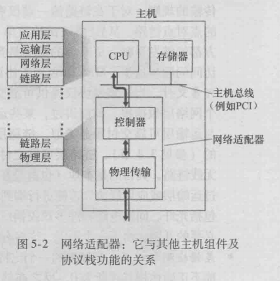

http等应用层协议提供了有意义的格式化数据，以实现对话，tcp保证了对话数据可靠交付，而数据从发送端到接收端需要经过数个节点，如果明确发送端和接收端？如何明确数据传输的路径？这就是网络层要做的事情，围绕路由器和节点定制的协议和规则

# ip


## 报文结构
- 版本：决定使用的版本号，v4或v6
- 首部长度：因为ip报文具有可选字段，所以首部长度不确定，就需要有个字段记录首部长度。实际可选字段不会使用，首部长度是20字节
- 标识、标志、片偏移：和分片有关
- 区分服务：不同服务类型给运输层更多的灵活
- 生存时间：TTL每当经过一个路由器，该值会被减1，若TTL变为0，则被丢弃。侧面说明了路由器是三层应用，需要拆解分析IP结构
- 协议：一般是tcp或udp，表明交给上层哪个应用
- 首部校验和：由于每经过一个路由器，TTL都会改变，所以校验和会随之改变

### IP数据报分片
IP数据最终要经过数据链路层传递，而不同的物理链路可承受的最大物理帧不同，例如以太网能够承载不超过1500字节数据，某些广域网帧承载不超过576字节数据，一个链路层帧能够承载最大数据量叫做**最大传输单元MTU**

IP报文无法预计到会经过哪些链路层，必要时会将一个IP报文分为更小的，即**分片**，分片会用到标识、标志、片偏移，且再交付之前会重新组装

由于分片和组装会浪费路由器性能，在ipv6中禁止了这一行为

## ipv4

最早在制定IP协议考虑较少，使用32位，每8位用 . 分隔，史称ipv4

他被分为五类，每类又分为网络号和主机号


- D类地址用于组播
- 127.x.x.x段地址空间是被保留的回环地址，主机和路由器不会转发此类地址
- 特殊广播地址：255.255.255.255，尽管他是一个全网广播的地址，但是路由器并不向全网转播，只在该路由器下广播

这个网络号一般用于路由器，主机用于路由器下每个主机，但是分配的非常扯淡，大的大小的小，所以就有新的解决方案

## ipv6


## 无类型域间选路CIDR
它打破了固定的五类，将 32 位的 IP 地址一分为二，前面是网络号，后面是主机号，以/作为分隔

    10.100.122.2/24 表示，32位中前24位是网络号，后8位是主机号

伴随CIDR的是广播地址和子网掩码

我们知道网络号是 10.100.122 那么 10.100.122.255 (即主机号的最大值)则是该网络下的广播地址，所有在该网络下的主机都能收到

子网掩码是 255.255.255.0 将ip地址和子网掩码做AND运算，可以得到网络地址

### 公有ip和私有ip
前面表格中的五类都有对应的私有ip，例如我们的路由器被分配了一个公有ip 192.6.6.6，即在c类网络中，那么路由器下的所有主机访问192.168.0.0-192.168.255.255都会被路由器拦截，作为内网ip访问，而不会向外转播

即公网ip用于全球访问或路由器访问，私网ip是路由器下局域网内的访问，只会被路由器转接到内网主机，不会被发送出去

一般192.168.0.x是最常用的局域网内访问地址，很少有家庭局域网超过255个主机，所以家庭路由器内网ip通常是192.168.0.1/24，那么广播地址就是192.168.0.255

## 配置ip地址
```

    sudo ifconfig eth1 10.0.0.1/24 //配置网卡的ip地址
    sudo ifconfig eth1 up //重启网卡

```

ip的确可以随意配置，但是配置了能否生效呢，假设我们配置完成之后ping 192.168.1.6(旁边的电脑)

首先linux会看要访问的地址和本机地址是否再一个网段，如果在一个网段下，发送ARP请求，向网关请求对方的MAC地址，然后就可以发送包了

linux默认的逻辑是：如果这是一个跨网段的传输，他就不会把包发到网络上(而且还没有MAC地址，没法发送)，而是企图交给网关处理

这时候就要在本机查询网关地址，如果没配置网关，那么包压根就发不出去，如果想要配置网关为192.168.1.6，linux根本不会让你配置成功的，因为你的ip和网关不在一个网段下

## 默认网关

ip数据报必须借助网关的路由才能发送给其他主机，每个主机都有自己的默认网关，网关也可以配置。如果该主机的TCP/IP设置中没有配置默认网关地址，或指定了错误的默认网关地址，则远端网络消息无法被送达

## DHCP动态主机配置协议

既然配置IP这么麻烦，而我们经常要换地方，每次配置一次要累死，这时就用到了DHCP

当一个机器加入网络并没有IP地址，它会使用0.0.0.0地址(因为他现在还没有IP地址)发送一个广播包，目的地址为255.255.255.255(它也不知道DHCP Server的地址)，本机端口号68，目的端口号67，并使用自己的MAC地址，目的MAC地址为FFFF.FFFF.FFFF

可以发现，区域广播有两种方式，第一种是本网段下的主机最大值，第二种是255.255.255.255，它会被发送到局域网下所有主机，但是网关不会将它发送到外部网络。广播只能用UDP包

区域网中有一个或多个主机是用来做HDCP Server，它接受到这个UDP包后，解析其MAC地址，就知道来了个新人，这时就体会到了MAC地址唯一的重要性了。HDCP会给它分配一个IP地址，并附带子网掩码、网关、IP租用信息等广播出去

幸运的话，这个机器能收到多个响应，它会选择一个HDCP offer，并回复一个广播，携带客户端的MAC和接受的HDCP服务器的地址，告诉他我接收了这个IP，并谢谢其他HDCP，HDCP回复一个ACK表示把这个IP分给他了，拢共四个报文

当租期超过50%时，主机会向HDCP服务器发一个续约的报文

有一个有意思的细节是：网络管理员不仅能自动分配IP地址，还能帮你安装操作系统！

## NAT转换技术
ipv4不够用，就有人想到用一个有公网ip的主机，代理一个局域网

该NAT主机也算是路由器，实现了多对一的转发，所有连上NAT的主机分配内网地址，为NAT下的主机连接分配端口及保存映射关系，实现代理

