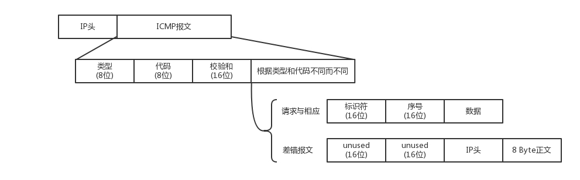

ip报文虽然有了发送点和接收点，但没有确切定义发送的路径，而是由经过的路由器临时规划路径

# 路由
路由器维护一张路由表，并不记录所有的IP转发地址(那任务量也太大了！)，而是采用最长前缀匹配，只做最近的转发，并不规划全部路由

前缀匹配后会从对应的端口转发出去，交给下一个路由器，N次转发后最终达到目标地点


由于IP地址是动态分配，且可以实时分配，所以路由器的转发表是动态更新的

路由器毕竟是个机器，当网络拥塞时内存可能不够用，就会选择丢弃包，所以说IP层提供尽力而为的交付

# ICMP
报文在互联网中传递，总不可避免的会出现问题，传递差错信息或通过一种方式获取一些非传输数据的信息，所以就有了ICMP

ICMP介于传输层和网络层之间，ICMP的报文封装在IP包中，但它的功能主要服务于传输层



ICMP的报文有很多类型，不同类型有不同的代码。常用类型有：

- 主动请求 8 
- 主动应答 0
- 终点不可达为 3
- 源抑制为 4
- 超时为 11
- 重定向为 5

## ping

ping就是主动请求的查询报文，并获取主动应答的ICMP协议。所以，ping包也是符合ICMP协议格式，但是后面增加了自己的格式

对ping的主动请求，进行网络抓包，成为ICMP ECHO REQUEST，主动请求回复成为ICMP ECHO REPLY。比起原生的ICMP多了两个字段，
一个是标识符，表示发送的第几个包，一个是发送请求的时间，用来计算往返时间

## 差错报文类型

### 终点不可达
终点不可达报文类型为3，代码又分很多种，表示各种不可达的原因

- 网络不可达代码为 0
- 主机不可达代码为 1
- 协议不可达代码为2
- 端口不可达代码为 3
- 需要进行分片但设置了不分片位代码为4


### 源站抑制
让发送方放慢发送速度，一般是路由器丢包太严重，会回复发送包的主机

### 时间超时
一般是超过了网络包的生存时间TTL，但是还没到，路由器会返回

### 路由重定向
路由器回复让主机下次发给另一个路由器，别绕路了

## 使用
ICMP的使用途径很多，通过各种技巧，你能探测到最小MTU，能探测到途径路由器的所有IP等等


# ifconfig
ifconfig 或 ip addr 用来查看本机网络地址，推荐使用ip系列命令

```
    ip addr //打印所有网络信息
    1: lo: <LOOPBACK,UP,LOWER_UP> mtu 65536 qdisc noqueue state UNKNOWN group default qlen 1000
    link/loopback 00:00:00:00:00:00 brd 00:00:00:00:00:00
    inet 127.0.0.1/8 scope host lo
       valid_lft forever preferred_lft forever
    inet6 ::1/128 scope host 
       valid_lft forever preferred_lft forever
    2: enp3s0: <NO-CARRIER,BROADCAST,MULTICAST,UP> mtu 1500 qdisc pfifo_fast state DOWN group default qlen 1000
        link/ether 8c:16:45:4a:0b:a3 brd ff:ff:ff:ff:ff:ff
    3: wlp5s0: <BROADCAST,MULTICAST,UP,LOWER_UP> mtu 1500 qdisc mq state UP group default qlen 1000
        link/ether 70:c9:4e:dd:11:c1 brd ff:ff:ff:ff:ff:ff
        inet 192.168.1.107/24 brd 192.168.1.255 scope global dynamic noprefixroute wlp5s0
        valid_lft 6522sec preferred_lft 6522sec
        inet6 fe80::413f:f12c:b7a2:a95/64 scope link noprefixroute 
        valid_lft forever preferred_lft forever
    4: docker0: <NO-CARRIER,BROADCAST,MULTICAST,UP> mtu 1500 qdisc noqueue state DOWN group default 
        link/ether 02:42:bd:17:57:17 brd ff:ff:ff:ff:ff:ff
        inet 172.17.0.1/16 brd 172.17.255.255 scope global docker0
        valid_lft forever preferred_lft forever
```

- lo/enp3s0：网络名称
- mtu：物理链路层最大传输单元
- state：网络状态,UP打开，DOWN关闭
- link/：网络类型
- sope：范围，host对内，只能在本机使用，global对外，可以接受来自任意地方的包
- link/ether：mac地址
- inet：网络地址、brd：广播地址

每个主机都有一个回环网络接口lo用来连接自身，用来测试网络程序。固定的IP地址是127.0.0.1(localhost)

严格来说127.0.0.1只是环回地址之一。所有127.x.x.x都是环回地址。从127.0.0.0 到 127.255.255.255 均予以保留。此地址块中的任何地址都将环回到本地主机中。此地址块中的任何地址都绝不会出现在任何网络中。

0.0.0.0 不能ping通。0.0.0.0就是任何地址IP_ADDR_ANY，任何地址的意思就是包括环回地址。

任何地址IP_ADDR_ANY的意思也就是，不管主机有多少个网口，多少个IP，如果监听本机的0.0.0.0上的端口，就等于监听机器上的所有IP端口。数据报的目的地址只要是机器上的一个IP地址，就能被接受

## 状态标识
```
    enp3s0: <NO-CARRIER,BROADCAST,MULTICAST,UP> mtu 1500 qdisc pfifo_fast state DOWN group default qlen 1000
            link/ether 8c:16:45:4a:0b:a3 brd ff:ff:ff:ff:ff:ff
```
<BROADCAST,MULTICAST,UP,LOWER_UP>UP 表示网卡处于启动的状态；BROADCAST 表示这个网卡有广播地址，可以发送广播包；MULTICAST 表示网卡可可以发送多播包；UP 表示它是启动的，也即连上网了

MTU表示链路层的最大传输单元，他是第二层MAC层的概念。以太网规定连带MAC头加正文最大传输数据长度不能超过1500字节。这里面有MAC头，IP头，TCP头、HTTP头、HTTP体，如果传输不下，就需要分片传输，一般tcp会提前获取MTU的最大长度，将报文段长度控制在MTU之内

qdisc pfifo_fast 是什么意思呢？qdisc 全称是queueing discipline，即排队规则。内核如果要通过某个网络接口发送数据包，他都需要按照为这个接口配置的排队规则把数据包加入队列。

最简单的qdisc是pfifo，它不对数据包做任何处理，采用先进先出的方式，pfifo_fast略复杂，它分为三个波段(band)，每个波段都是先进先出但优先级不同，band0>band1>band2。数据包按照IP报里TOS字段被分配高优先级还是低优先级