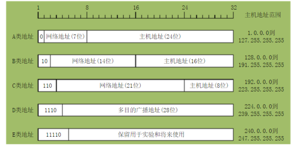

一旦数据出了局域网，就需要用路由器进行转发通讯

# 网关Gateway

前面讲交换机和路由器，都是在局域网下讲解的，如果我们连入公网，他们是怎样运作的？

我们将IP层和MAC层结合起来讲解，IP层的数据报文会被加上源MAC地址和目的MAC地址，前后各加上物理层头尾，变成物理层的帧

## ARP

在任何一个机器上，如果你想访问一个IP，都会先判断，这个目标IP是否和当前机器IP在同一网段下，如果在同一网段下，则将源和目的IP封装报文，查询缓存或者大吼一声获取到目的IP的MAC地址，并发个目的IP

**如果不是同一网段下，就需要发给默认网关**

你的电脑通常会配有默认网关的地址，Gateway 的地址一定是和源 IP 地址是一个网段的，一般不是第一个地址就是第二个地址，例如：192.168.0.1，一般都是通过私网地址访问网关

当发现目的IP不在当前网段下，主机也就无法获取到目的IP的MAC地址，它只能把源IP和目的IP封装一下，将目的MAC写为网关的MAC地址，然后将报文交给网关处理。

网关通常是一个路由器(内嵌了网关处理程序)，或者由一台主机充当。它是一个第三层设备(可以拆写IP层数据段)，
1. 接收到包之后，它发现目的MAC和自己MAC相同，就会拆包，然后查看IP数据包内目的IP地址。在IP报文中有个TTL
2. 将目的IP对照路由表，找出一个最佳路径，路由表由动态路由算法生成
3. 将第三层报文封装在帧内，并将帧发往输出端口

通常我们把网关称作路由器，其实路由器还有更精准的定义：它是一个有着五个网口或网卡的设备，每个网口都连接一个局域网

任何想被发到其他网段的包都会被路由器处理，它会使用路由算法给包加上新的MAC地址和IP地址，并发送出去

