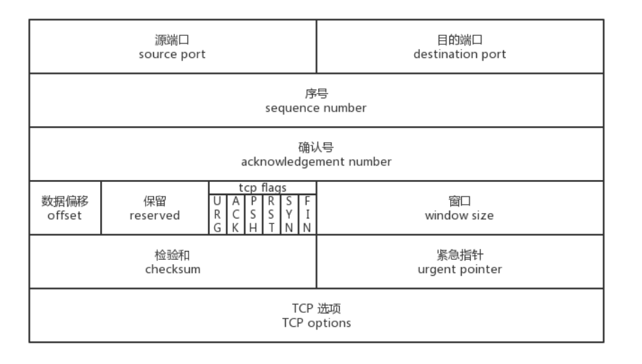
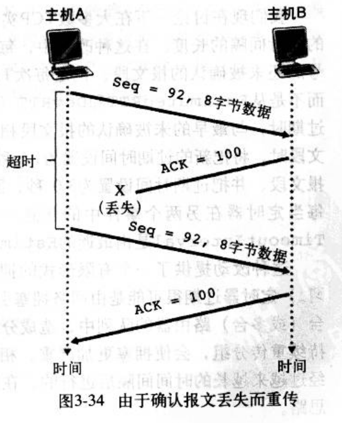
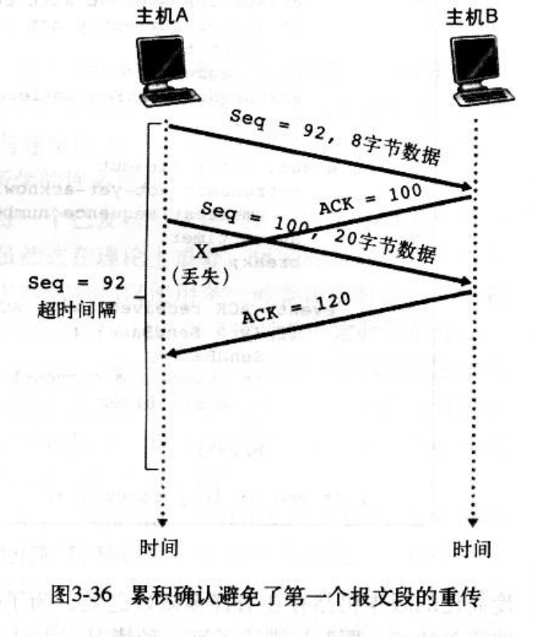

# 特点
相较于UDP，TCP提供的是可靠的数据传输，并且有其他额外的功能
1. 可靠数据传输：保证端到端的数据传输是完整可靠的
2. 双向传输：先建立连接，然后端和端之间是双向通讯的
3. 流量控制：根据接受窗口大小选择发送数据的大小，避免接收端缓存满了而丢包
4. 拥塞控制：不会一次性将所有包发送出去，而是根据网络堵塞情况滑动窗口的大小，避免网络堵塞和路由器缓存溢出

# 简述
当我们使用socket套接字进行tcp通讯时，通常会分为客户端和服务端，服务端循环被动接受来自不同主机的请求，并给予处理，一般不会主动发起连接。而客户端则发起一次连接，完整数据传输或接受后关闭连接。

发送方创建socket并传入要传输的数据，这些数据并不是一次性被全部发送出去，它会先被缓存起来，发送方会在内存中创建发送缓存区和接收缓存区，从发送区取出数据封装发送。

经过三次握手后，双方开始通讯，通讯结束后经过四次放手，服务器TIME_WAIT结束后，通讯才算完全结束

# 报文结构

1. 16字节的源端口和目的端口，用来多路分解和复用，确定进程和进程间的通讯
2. 32比特的序号和确认号，用来实现可靠数据传输
3. 16bit的窗口，用于流量控制，该字段表示接收方愿意接受的字节数量
4. 4bit的数据偏移，用来表述首部长度，通常选项字段都是空的，所以首部长度是20字节
5. 6bit的标志字段，用来实现连接的建立SYN和断开FIN、数据段的确认ACK等功能，默认值为0
    1. SYN=1，用于建立连接
    2. ACK=1，用于确认报文，RPC中规定，除了第一个SYN报文，其他所有报文都必须有ACK=1和确认号
    3. RST=1，用于重启或关闭连接，如果访问一个没有被TCP监听的服务器端口，服务器就会返回RST(reset)报文
    4. PSH=1，表示报文的数据不是0，即报文携带数据
    5. URG=1，表示紧急报文，应该跳过接受缓存，直接被处理

# 可靠数据传输
我们之前说过TCP协议相较于UDP最大特点是可靠数据传输，它采取一系列手段保证了可靠数据传输

## 超时与重传
当TCP发送一个报文段后不知道接收方是否收到，所以需要接收方发送ACK报文确认收到（ACK报文可以有报文体，双方可以同时发送数据）

在理想情况下，这样就足以保证可靠数据传输了，但是无论是发送的报文段还是ACK报文段，在路由器拥挤或链路层损坏数据的情况下都可能丢包。
如果发送方丢包，而接收方没有收到包而不能发送ACK，发送方未收到ACK也不接着发送，双方就陷入长久的僵持中，所以我们需要一个定时机制，发送一个包出去后启动定时器，如果超出时间未接收到ACK则再次发送包，直到接收到ACK为止。接收方也是如此，如果发送的ACK在一定时间内未接收到新的报文，则ACK包可能丢失，则需要重新发送。

用定时器解决丢包问题，也引入了下面的新问题：

1. 定时器该设置多长时间

如果设置时间太短则会产生多余的包，如果太长TCP性能就不行了。通常定时器的时间是根据路由器拥塞和端系统负载而动态变化的，当第一次超时后会将定时器的时间设置为双倍，再次发送。

2. 接收到多余的包

设置了定时重传后，就可能接收到多余的包，一般会丢弃这些包

# 流量控制
一条TCP连接的通讯双方都有发送缓存和接受缓存，从发送缓存中读取数据封装为TCP报文段发送，将收到的数据放在接受缓存先放在中，再转换为TCP报文段。

理论上发送数据在连接建立后就已经是固定的了，而接受数据却不知道多大，所以可能存在接受缓存的处理速度（将缓存中的数据由IP层数据变为TCP报文段）跟不上接受数据的速度，从而造成缓存溢出丢失数据

TCP为程序提供了流量控制服务，以消除发送方使接受方缓存溢出的可能性
会在每次发送报文时设置窗口大小字段（widnows size value）为缓冲区还没被使用的字节大小，代表自己还能接受多少字节

有个小问题，如果缓存满了，发送的窗口大小就是0，则发送方不再发送数据，发送方也不知道啥时候缓存数据会被处理完，就陷入无限阻塞中了。所以当窗口为0时，发送方会发送只有一个字节的报文段。

# 拥塞控制
我们这里说的拥塞控制是控制发送速率避免路由器负担太重，而流量控制是为了避免接收方缓存溢出

线性增，乘性减

## 滑动窗口
我们上面的讨论都是在发送方发送一个报文段，接收方回复一个ACK的基础上，但是这样效率就太低了，所以双方都会维护一个发送窗口，且采取累计确认

同时发送多个报文，如果31号报文被ACK，则窗口向前移动，发送新的报文，定时器也只会对31号报文进行定时，并向前滑动。

虽然发送方一次性发送多个报文，但是接受是要有序的，如果接收到了31号报文，则发送对应的ACK，在没收到31号报文情况下直接接收到34、36或其他报文，可以丢弃或者缓存

由于接收方是有序发送ACK的，那么发送方对于确认就没那么严格，只要确认号是37，则代表之前的都已经被接受，即累计确认

## rst
在某些特殊情况下，TCP连接的一端会向另一端发送复位报文段，以通知对方关闭或重新建立连接。

一般来说，有以下三种情况：

1. 访问不存在的端口。若端口不存，则直接返回RST，同时RST报文接收通告窗口大小为0.其实客户端向服务器的某个端口发起连接，如果端口被处于TIME_WAIT 状态的连接占用时，客户端也会收到RST

2. 异常终止连接。一方直接发送RST报文，表示异常终止连接。一旦发送方发送复位报文段，发送端所有排队等待发送的数据都被丢弃。应用程序可以通过socket选SO_LINGER来发送RST复位报文。

3. 处理半打开连接。一方关闭了连接，另一方却没有收到结束报文（如网络故障），此时另一方还维持着原来的连接。而一方即使重启，也没有该连接的任何信息。这种状态就叫做半打开连接。而此时另一方往处于半打开状态的连接写数据，则对方回应RST复位报文。
