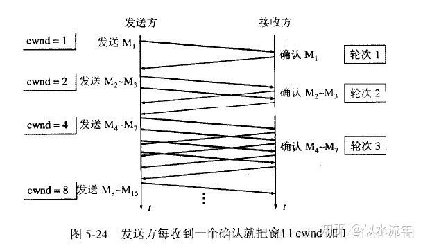
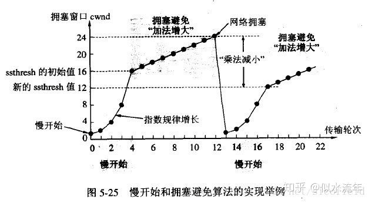

# 数据传输
握手之后，服务器为此次连接分配发送缓存和接受缓存，实际上双方都会有发送和接受缓存。发送的数据先在发送缓存里，然后取出，根据从主机获取的MTU(最大链路层帧长度)+头部长度，得到MSS最大传输单元，封装每个报文段的长度不会超过MSS，发送出去。同时也从缓存中获取数据，并拆包处理。

## ACK
RPC中规定，除了第一次客户端发送的SYN报文，其他报文必须携带ACK和确认号

因为滑动窗口和丢包，所以TCP采用的是累计确认，每个包都携带ACK和确认号，有利于提高丢包情况下确认概率的增加

如果收到的报文段没有携带数据，则确认号是在接受包的序号+1，如果携带数据，则是接受包的序号+数据长度

双方不断发送数据，并且每个数据包中也用ACK确认收到的数据

# 拥塞控制
拥塞控制是tcp的特点之一，非常重要，具体实现依赖于四个算法：慢启动、拥塞避免、快速重传、快速恢复

socket内会维护一个拥塞窗口cwnd，而滑动窗口的大小取决于 min(拥塞窗口，流量窗口)，通过改变拥塞窗口大小改善网络状况

- 慢启动：启动一个socket时并不能确定网络情况，最好的方式就是让cwnd=1，每收到一个ack，cwnd*=2。但是一直这样指数增长就太爆炸了，会有一个值ssthresh限定，当cwnd>=ssthresh时，收到ack，cwnd+=1线性增长，如下所示

- 拥塞避免：无论是在慢启动过程中，还是线性增长，只要定时器超时，cwnd/=2 乘性减少

- 快速重传：试想一下，如果收到了接连收到了三个ack，说明这么久你的报文还没过去，应当立刻取消定时器并重
- 快速恢复：接连收到三个ack也反映了网络的拥塞，那么应当把ssthresh减半，避免更挤