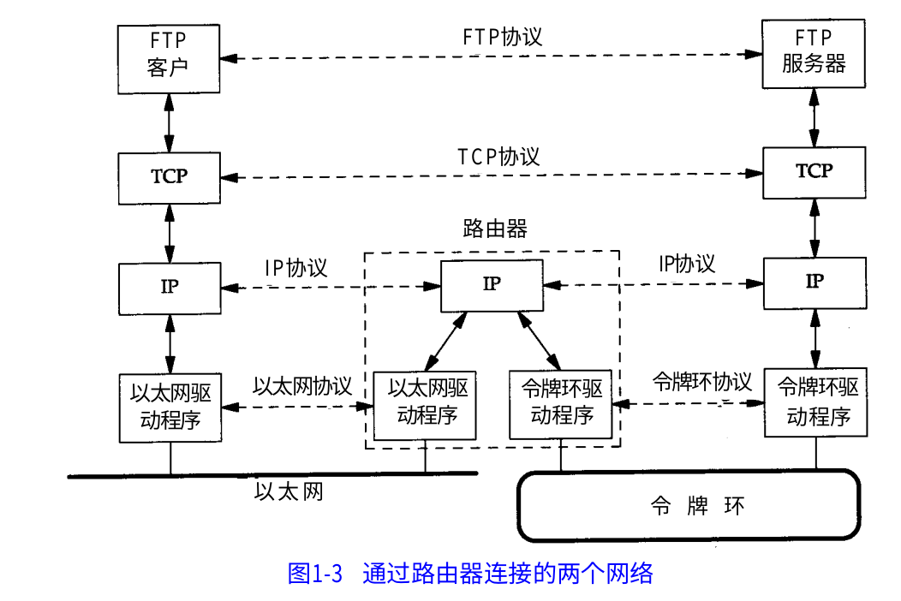
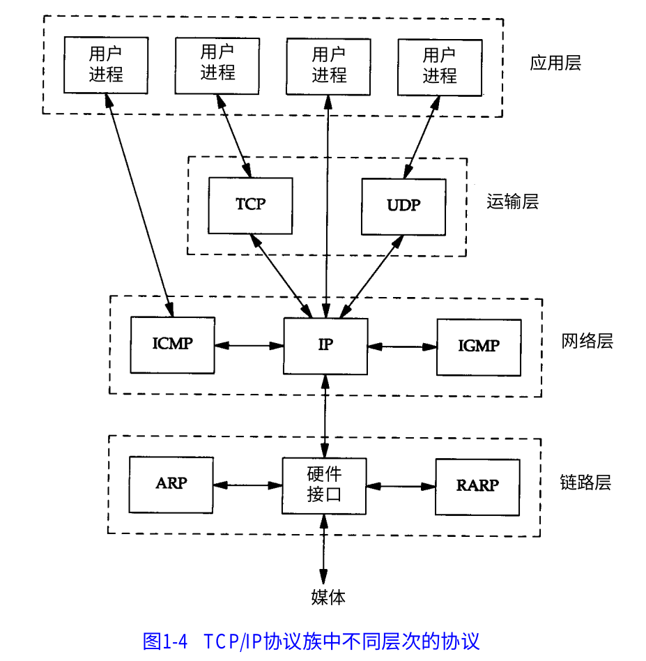
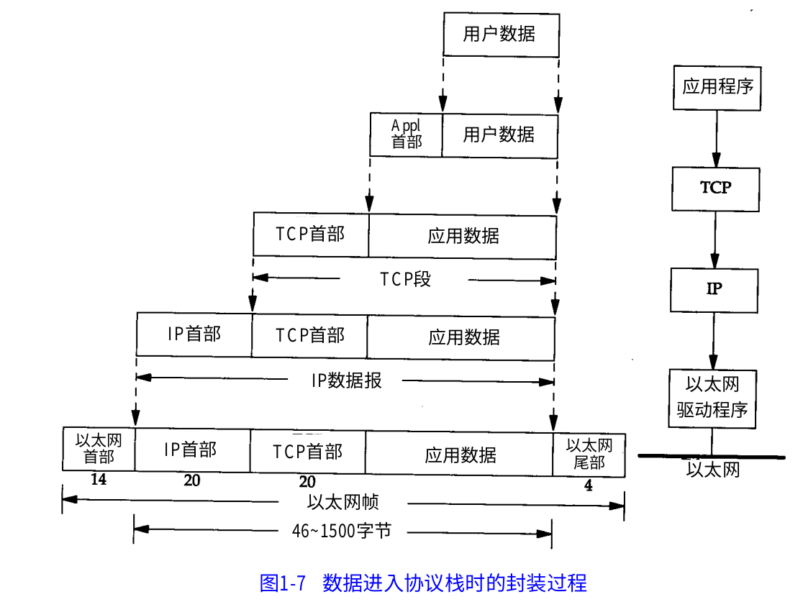
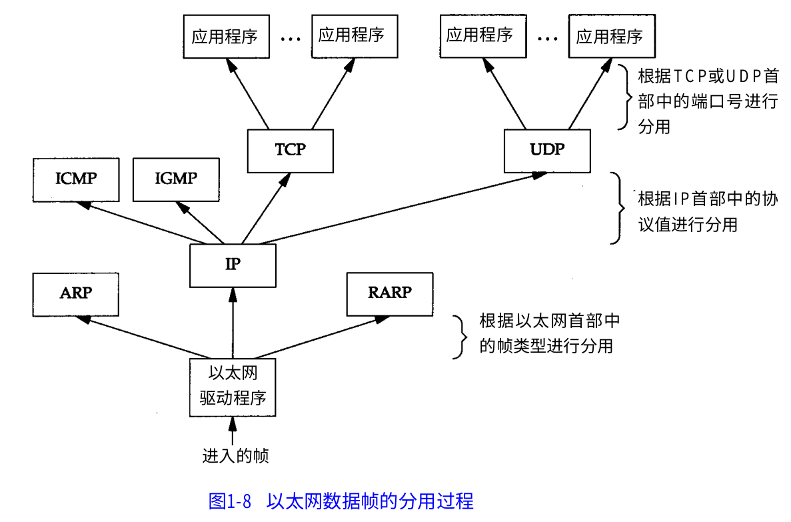

# 分层
ISO给出的经典分层是:应用层、表现层、会话层、传输层、网络层、数据链路层、物理层

但是在工业生产中应用的是四层模型:
1. 链路层:也称为网络接口层，主要是操作系统的驱动和网卡接口，负责和屋里层(插入网线或wifi)交互，做高层软件开发一般不考虑这层
2. 网络层:主要用于每个主机的定位，定位寻找，即处理分组在网络中的活动，提供不可靠数据传输，IP协议族
3. 传输层:用于端到端的数据传输，一般是可靠数据传输TCP，和非可靠数据传输UDP，如果不是一定需要传输层我甚至觉得UDP没有任何作用
4. 应用层:在接受到数据的基础上，实现软件需求的功能，常用的是HTTP（主要用于浏览器），FTP(文件传输)等

计算机中很重要的思想就是抽象和分层，不同层级之间互为黑盒。计算机网络就是这样的分层，每个分层都承担着自己的任务，层级实现可能不同，但是他们对于其它层尽可能保持相同的接口。

## 链路层
链路层主要是从物理层解析出数据并转换为网络层数据，这层的意义是为了兼容不同的网络接入接口，我们可能使用wifi入网，可能用电话线路、光钎等等不同的入网介质。链路层就是去包容这些不同的入网介质，提供数据给网络层。

## 网络层
既然要发送数据给不同的主机，那么每个主机就要有一个独一无二的标志，这就是IP协议族主要实现的事情。无论何时何地接入网络，每台主机都应该有自己的IP，并且该IP应该能被路由器发现。这么简单的一句话就需要几个协议去共同完成，最终实现的是主机有自己的标志并能被发现，其核心是定位，所以IP协议族并不去保证数据在传输中安全不丢失。

## 传输层
有了对方的地点并可以给他发送数据，我们要考虑的就是如何可靠的发送数据，确保发送的信息安全不丢失，同时尽可能提高传输效率，以及实现更复杂的传输功能更。这就是TCP协议族，其核心是传输。当然有些不需要安全可靠传输的，所以就有了UDP,但他也提供了广播的功能。

## 应用层
确保数据可靠接受后，我们就需要对数据定制不同的传输规范以表达不同的信息，这就是应用层各种协议。

## 路由
即使有了协议，全地球上的主机也不可能通过空气相连，他们需要n多路由器作为中继节点去转发数据。路由器主要与网络层的中转路由，很多路由器还承担着流量统计、流量拦截等等其他的附加功能。路由器可能是基站，可能是主机，只要实现了这些功能并被接入网络中都可以看做路由器。

连接网络的另一个途径是使用网桥。网桥是在链路层上对网络进行互连,而路由器则是在网络层上对网络进行互连。网桥使得多个局域网( L A N)组合在一起,这样对上层来说就好像是一个局域网。

# TCP/IP分层

TCP/UDP都使用IP作为网络层协议。虽然TCP使用不可靠的IP服务,但它却提供一种可靠的运输层服务。一个数据报是指从发送方传输到接收方的一个信息单元(例如,发送方指定的一定字节数的信息)。但是与TCP不同的是,UDP是不可靠的,它不能保证数据报能安全无误地到达最终目的

IP是网络层上的主要协议,同时被TCP和UDP使用。TCP和UDP的每组数据都通过端系统和每个中间路由器中的IP层在互联网中进行传输。在图1 - 4中,我们给出了一个直接访问 IP的应用程序。这是很少见的,但也是可能的(一些较老的选路协议就是以这种方式来实现的。当然新的运输层协议也有可能使用这种方式)。

ICMP是IP协议的附属协议。IP层用它来与其他主机或路由器交换错误报文和其他重要信息。尽管ICMP主要被IP使用,但应用程序也有可能访问它。

IGMP是Internet组管理协议。它用来把一个UDP数据报多播到多个主机。

ARP(地址解析协议)和PARP(逆地址解析协议)是某些网络接口(如以太网和令牌环网)使用的特殊协议,用来转换IP层和网络接口层使用的地址

# 封装
数据向下封装

注意:以太网数据帧的物理特性是其长度必须在 4 6~1 5 0 0字节之间，所以我们可能需要对IP报文进行分割。

数据分用

