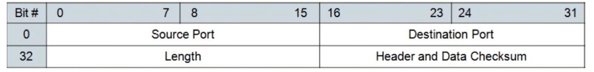

# 特点
upd协议最显著的几个特点

- 面向数据报，无需建立连接，直接发送数据，与tcp相比提升了性能
- 无拥塞控制机制，将数据划分为数据报后，直接全部发送，提升了性能
- 不保证数据传输完整性，不可靠，数据发出后就不保留数据备份了，可能中途丢包，丢包可能性很大，但
- 可以广播，这是tcp不具有的功能

# 报文结构
##　头部

- 第一行是发送和接受方的端口号，计算机网络端口号占用两字节，表示65536中可能，即0~65535
- length表示整个报文长度（包括头部）
- 头部检验用于检验头部信息是否错误

## 报文体
头部长度字段是两字节，可以记录最大的长度是65535，而头部占用了64字节，所以报文体最大长度只能是65507