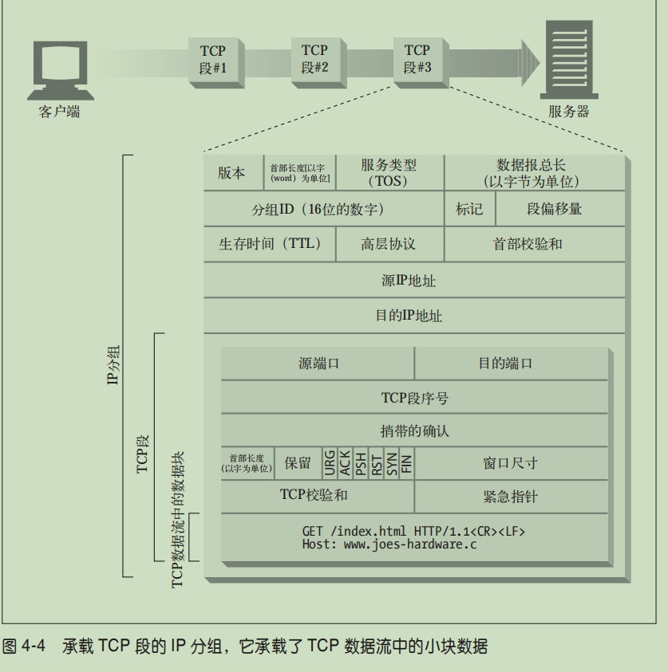

# 连接方式
http底层使用的是TCP/IP协议，应用程序生成HTTP完整报文后，由操作系统Socket编程接口调用TCP/IP，HTTPS就是在生成报文前做一次加密

操作系统再将HTTP文本段包装为TCP报文段，之后进一步变为IP报文组

## 串行连接
例如发出一个请求获取到html，解析完成后，对所有需要再次访问获取的资源，进行排队一个个的请求，如果瓶颈在于客户端的带宽，这样反而更高效

## 并行连接
解析html后，同时发出多个请求，同时对多个连接进行处理，这对于瓶颈在于服务器的请求更有利，但容易出现头部阻塞

## 持久连接
在http1.1中，允许多个http复用一个tcp，即，在一次tcp连接后，如果客户端或服务器任何一方不主动关闭连接，则该tcp连接不会被关闭，则多个http连接可以在一个tcp连接下串行或并行发生（在之前的版本，每个http请求都需要一个tcp连接），当然它的前提是所有请求的资源都在同一台主机下

持久连接是在一个tcp连接下使用对http做串行连接

### keep-alive
在http1.0中，大家为了实现规定中没有的长连接，创造了connection:keep-alive首部，他并不是规定中的，而是一些人为了表示持久连接而自己加上的，如果服务器也支持长连接，则相应中也会有connection:keep-alive，直到双方一方的请求或响应没有这个字段，才会断开tcp连接

注意：如果有代理或分发服务器，应当去除keep-alive后再转发，否则收到转发的服务器还以为代理要和他建立长连接

而在http1.1中，默认使用的是长连接，并在规范中添加connection:close关闭长连接

但是实际浏览器在发出第一个请求时，会加上Connection: keep-alive头部，应该是为了兼容那些不支持http1.1和旧浏览器

### 解除连接
因为双方使用的长连接，所以任意一方都可以主动发起关闭连接，既tcp四次挥手

因为客户端不知道浏览器的请求发送完了没，除了连接超时，一般不会主动关闭连接，通常是浏览器主动关闭连接

### proxy-connection
确认是给代理发送的信息，代理发现此头部字段后应该妥善处理该

## 管道连接
解析html后，同时发出多个请求，即使是多个请求同时发出去了，但是服务器只会一个个的处理，可能会发生头部阻塞，即第一个请求因为某些原因阻塞后，其他的请求也被耽搁