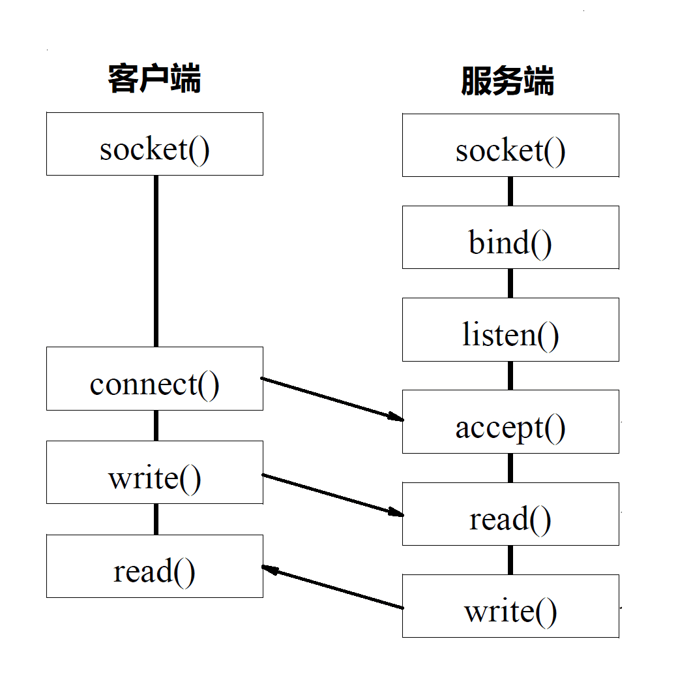
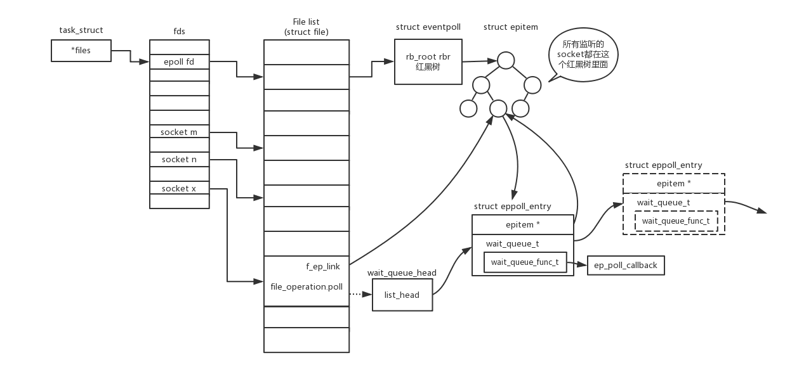

tcp和udp编程都是借助于socket套接字实现的，下面主要介绍tcp套接字原理

这就是一个tcp套接字的流程，每当accept就创建一个文件给这个连接，然后对连接的处理就是对文件的操作

如果是对文件的操作，就有很大的想象空间了，最简单的可以为每个文件创建一个线程，监听读写，但是太耗费内存了，所以就有了select、epoll这样的函数，同时监听多个文件做读写操作

    int select(int n, fd_set *readfds, fd_set *writefds, fs_set *expectfds, struct timeval *timeout)

    int epoll_create(int size) //size要监控文件数量
    
    int epoll_ctl(int epfd, int op, int fd, struct epoll_event *event)
    //epfd是epoll的描述符，op代表操作，fd文件描述符，epoll_event要监听的事件

    int epoll_wait(int epdfd, struct epoll_event *events, int maxevents, int timeout)
    //epoll_event 得到事件的集合、maxevents事件数量

常用的应该是epoll，用的红黑树性能很好

