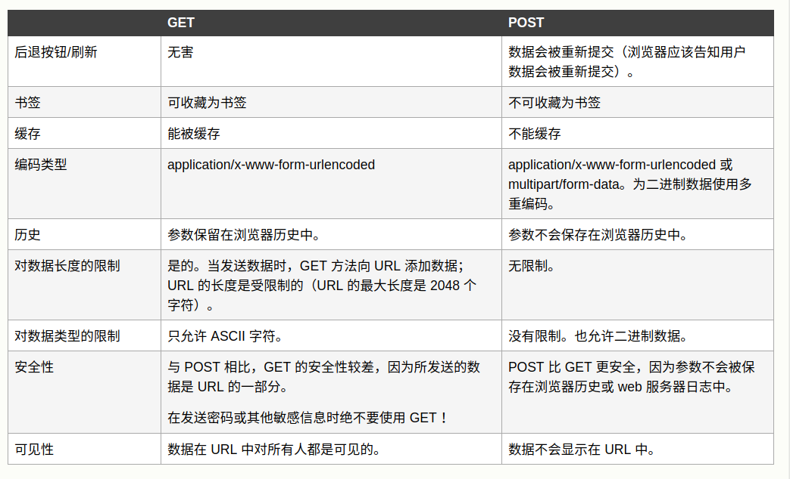
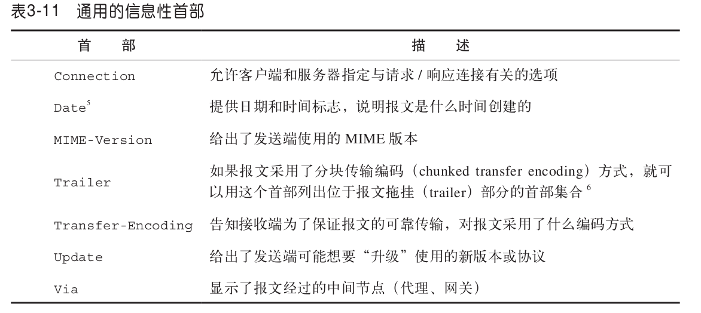
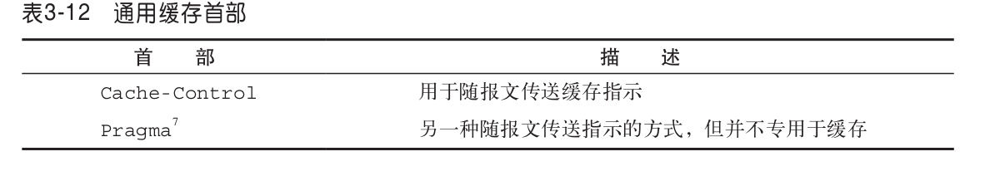
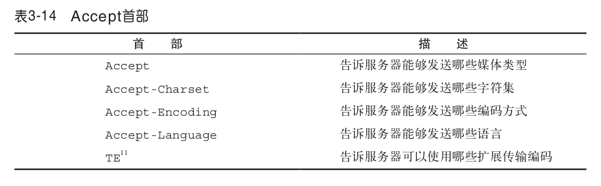
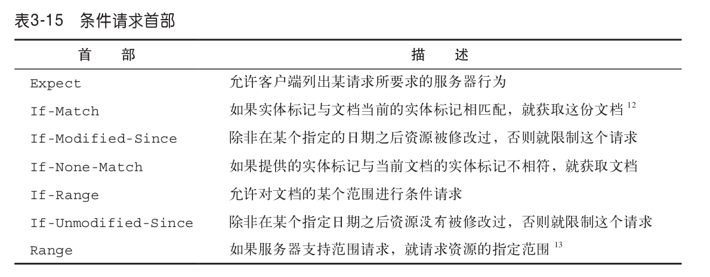
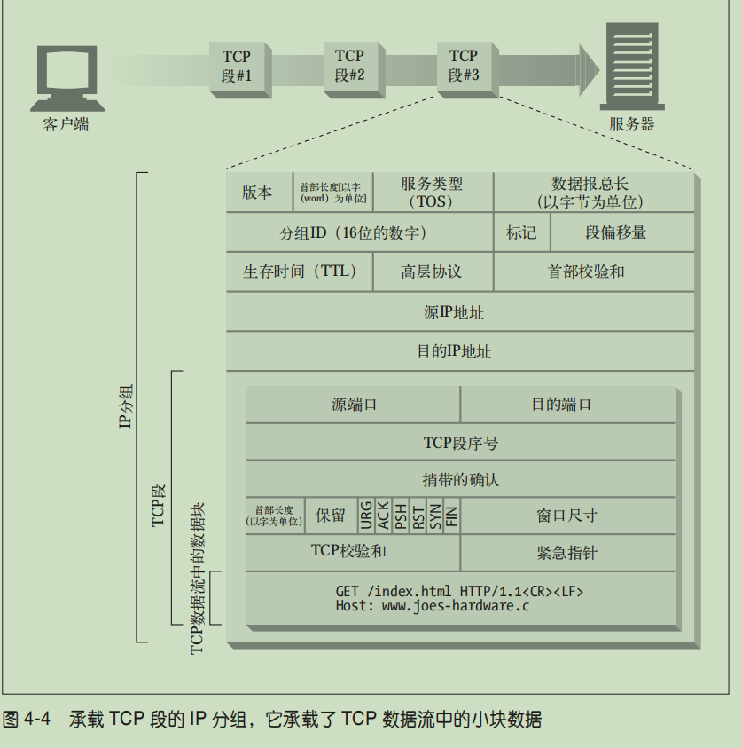

本部分主要概述 HTTP 协议。接下来介绍了 Web 的基础构件以及 HTTP 的核心技术。

# URL与资源
- 资源：web服务器中的任何文件或数据
- MIME：媒体类型，HTTP传输数据时，为每种类型的数据都打上MIME类型标签，便于客户端解析,MIME最早用于邮件协议，HTTP协议也借用了，通常表示为**对象类型/子类型**
    - HTML 格式的文本文档由 text/html 类型来标记。
    - 普通的 ASCII 文本文档由 text/plain 类型来标记。
    - JPEG 格式的图片为 image/jpeg 类型。
    - GIF 格式的图片为 image/gif 类型
- URI/URL/URN
    - URI：统一资源标识符，每个资源都有自己唯一的标识符，例如 http://www.joes-hardware.com/specials/saw-blade.gif，它包含URL和URN
    - URL：统一资源定位符，包含三个部分，方案(http://)、服务器地址(www.kanggege.top)、资源位置(/static/page/index.html)
    - URI：URI 的第二种形式就是统一资源名(URN)。URN 是作为特定内容的唯一名称使用的,与目前的资源所在地无关。使用这些与位置无关的 URN,就可以将资源四处搬移。通过 URN,还可以用同一个名字通过多种网络访问协议来访问资源，未大规范使用

## URL
这里不对URL和URI做过多的区分，本文里将他们混用

URL代表资源的定位，不仅是HTTP请求，在任何类型的请求中，他都代表资源的定位，且格式一样，用在HTTP中它通常是如下格式

    scheme://host:post/path?query1=val1&query2=val2

虽然很多协议都用到了URL，且语法不太相同，但总的来说他们都遵守了以下的语法，且没有协议全部用到每一部分语法

    <scheme>://<user>:<password>@<host>:<port>/<path>;<params>?<query>#<frag>

- scheme：方案名是大小写无关的 http:// 和 HTTP:// 是等价的
- host、post：他们两个定位了某个电脑的某一进程，host可以是主机名(www.xxx.com)，会被DNS解析为IP，或是直接使用IP，post是用于TCP协议，用来定位某个进程，它的长度是四字节，所以范围是 0~65535，通常HTTP服务使用80端口,我们直接输入主机名，浏览器解析时会在后面加上:80
-　user、password：很多服务器会要求加上账号密码才能访问，例如ftp服务
- query：HTTP协议不支持;key=val形式的参数，支持持query参数，按照HTTP协议的规定，你可以放置无限的参数，但是各个浏览器和Web服务器上实现有所不同，例如IE浏览器限制URL的长度不能超过2k，所以可以携带的query参数不能超过2k，如果要携带大量参数，应该使用post
- frag：片段，有些资源类型,比如 HTML,除了资源级之外,还可以做进一步的划分。比如,对一个带有章节的大型文本文档来说,资源的 URL 会指向整个文本文档,但理想的情
况是,能够指定资源中的那些章节

### 编码
url格式中有些字符作为语法字符，例如& ?，但是值里面也可能包含这些字符，所以需要对和语法字符冲突的值做转义并编码

根据2005年发布的RFC3986“%编码”规范：对URL中属于ASCII字符集的非保留字不做编码；对URL中的保留字需要取其ASCII内码，然后加上“%”前缀将该字符进行替换（编码）；对于URL中的非ASCII字符需要取其Unicode内码，然后加上“%”前缀将该字符进行替换（编码）。由于这种编码是采用“%”加上字符内码的方式，所以，有些地方也称其为“百分号编码”

对于url中非ASCII参数，一般浏览器会采用页面当前编码

[更详细的解释](https://www.cnblogs.com/zhao1949/p/5545064.html)

# 请求报文
报文是HTTP请求中真正要传输的东西，其实就是一个按照一定语法的文本，我们要学习的就是它的语法格式，以及其中内容代表的意义

报文分为请求报文和响应报文，他们的总体格式相同，但是语法又不同

## 方法

### GET

**通常用于请求服务器发送某个资源**

get方法没有请求体，所以我们写入的参数都会被程序重写到URL中，不同的浏览器对URL的长度会有不同的限制

在浏览器中会对get方法有些特殊的处理
- GET 请求可被缓存
- GET 请求保留在浏览器历史记录中
- GET 请求可被收藏为书签
- GET 请求不应在处理敏感数据时使用
- GET 请求有长度限制
- GET 请求只应当用于取回数据

### POST

**向服务器输入数据**
post方法的参数会被写在请求体中，即使你写到URL中，程序一般都会把他重写在请求体中

### HEAD

HEAD 方法与 GET 方法的行为很类似,但服务器在响应中只返回首部。不会返回实体的主体部分。这就允许客户端在未获取实际资源的情况下,对资源的首部进行检查

### PUT

**向服务器写入文档，如果文档已经存在，更新文档**

### TRACE

**追踪中间代理对请求的更改**

客户端发起一个请求时,这个请求可能要穿过防火墙、代理、网关或其他一些应用程序。每个中间节点都可能会修改原始的 HTTP 请求。TRACE 方法允许客户端在最终将请求发送给服务器时,看看它变成了什么样子。

### DELETE
从服务器中删除命名资源

### HEAD
HEAD 方法与 GET 方法的行为很类似,但服务器在响应中只返回首部。不会返回实体的主体部分。这就允许客户端在未获取实际资源的情况下,对资源的首部进行检查

# 响应报文

## 状态码
### 1xx
请求正在处理

### 2xx　请求成功
- 200 OK：请求没问题,实体的主体部分包含了所请求的资源
- 201 Created：已经被创建
- 202 Accepted：接受了请求，但是可能还没有做任何处理

### 3xx　请求重定向
- 300 Multiple choices：当请求指向的URL有多个资源时返回，如一个服务器上HTML有中文和英文版，返回这个代码时一般带着一个选项列表，以供用户选择，服务器可以在Location首部中包含首选URL
- 301 Moved permanent：资源被永久性转移了，相应的Location首部应该包含新的URL，这意味这浏览器应该改变书签的指向，将他们指到新的URL
- 302 Found：临时性重定向，将该请求指向新的URL，但是只是临时的，浏览器不应该改变书签等

# 首部
首部是报文的重要组成，配合请求方法或状态码实现了很多附加功能

首部大致分为三类，通用首部，请求首部，响应首部（这不是废话么）

## 通用首部

### 通用信息首部

### 通用缓存首部

## 请求首部 

### Accept
表示请求想要获取的内容，服务器应该根据该头部字段发送给客户端合适的内容

### 条件请求首部

### 安全请求首部

# 连接方式
http下面使用的是TCP/IP协议，应用程序生成HTTP完整报文后，由操作系统Socket编程接口调用TCP/IP，HTTPS就是在生成报文前做一次加密

操作系统再将HTTP文本段包装为TCP报文段，之后进一步变为IP报文组

## 串行连接
例如发出一个请求获取到html，解析完成后，对所有需要再次访问获取的资源，进行排队一个个的请求，如果瓶颈在于客户端的带宽，这样反而更高效

## 并行连接
解析html后，同时发出多个请求，同时对多个连接进行处理，这对于瓶颈在于服务器的请求更有利

## 持久连接
在http1.1中，允许多个http复用一个tcp，即，在一次tcp连接后，如果客户端或服务器任何一方不主动关闭连接，则该tcp连接不会被关闭，则多个http连接可以在一个tcp连接下串行或并行发生（在之前的版本，每个http请求都需要一个tcp连接），当然它的前提是所有请求的资源都在同一台主机下

持久连接是在一个tcp连接下使用对http做串行连接

### keep-alive
在http1.0中，大家为了实现规定中没有的长连接，创造了connection:keep-alive首部，他并不是规定中的，而是一些人为了表示持久连接而自己加上的，如果服务器也支持长连接，则相应中也会有connection:keep-alive，直到双方一方的请求或响应没有这个字段，才会断开tcp连接

注意：如果有代理或分发服务器，应当去除keep-alive后再转发，否则收到转发的服务器还以为代理要和他建立长连接

而在http1.1中，默认使用的是长连接，并在规范中添加connection:close关闭长连接

但是实际浏览器在发出第一个请求时，会加上Connection: keep-alive头部，应该是为了兼容那些不支持http1.1和旧浏览器

### 解除连接
因为双方使用的长连接，所以任意一方都可以主动发起关闭连接，既tcp四次挥手

因为客户端不知道浏览器的请求发送完了没，除了连接超时，一般不会主动关闭连接，通常是浏览器主动关闭连接

### proxy-connection
确认是给代理发送的信息，代理发现此头部字段后应该妥善处理该

## 管道连接
在持久连接的基础上，对http做并行连接，但是由于实现麻烦且容易出bug，现代浏览器大多不会开启管道连接

ps：这是12年出版的书，可能具体实现已经有所不同了，在chrome中，可以明显看到第一个文件请求解析后，并发请求了多个文件，所以现在的浏览器已经实现管道连接了

