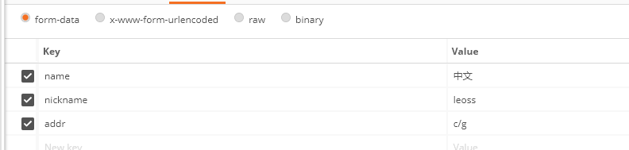
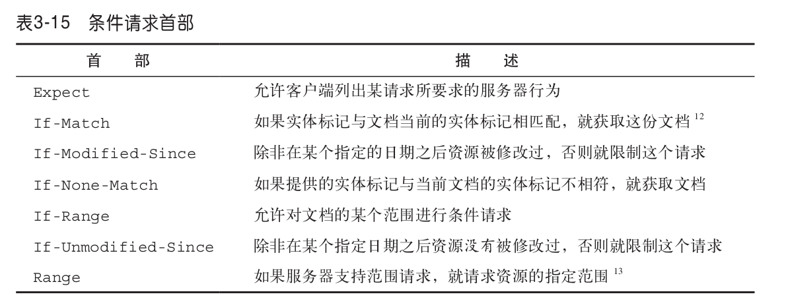

# 首部
首部是报文的重要组成，配合请求方法或状态码实现了很多附加功能

首部大致分为三类，通用首部，请求首部，响应首部（这不是废话么）

# 通用首部

## 通用信息首部

## 通用缓存首部

# 请求首部 

## Accept
表示请求想要获取的内容，服务器应该根据该头部字段发送给客户端合适的内容

## content-type
content-type是发送表单请求中常见的字段，它有很多值，一般在表单中enctype设置有三种

这三个值，表示不同的编码含义

- application/x-www-form-urlencoded

当使用form表单且没有文件上传时，这是默认的编码方式，一般用于纯键值对的上传。数据被编码成键值对，如果是get请求，会编码在url中，如果是post/put/patch等这些方法，则编码在body中，都是以 n1=v1&n2=v2&n3=v3 的形式上传的

- multipart/form-data

这是一个多媒体类型，首先生成一个boundary用于分割不同字段，在请求实体中每个参数会以------boundary开始，然后是附加信息和参数名，然后是空行，最后是参数内容。多个参数会有多个------boundary块。如果参数是文件，会有特别的文件域，最后以------boundary–结尾，一般文件上传表单则用该类型

- text/plain
一般向服务器发送json会使用这种格式

## 条件请求首部

## 安全请求首部
 