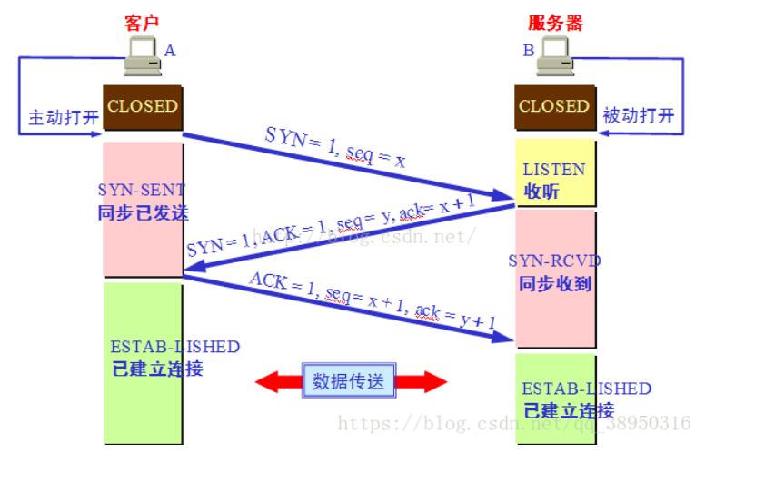

# 三次握手

## 概述

1. 客户端发送SYN报文（SYN=1，一般叫做SYN报文，表示向服务端请求建立发送数据的连接）和起始序列号seq(A)给服务端
2. 服务端发送SYNACK报文（ACK=1，确认号=seq(A)+1），表示接收到了客户端的SYN报文，同意建立连接，并附带自己的SYN（SYN=1，表示请求向客户端请求建立发送数据的连接）和自己的起始序列号seq(B)。将ACK和SYN放在一起，减少了一次握手
3. 客户端发送ACK报文表示收到了服务器的SYN报文，并同意建立连接。这时的ACK报文是可以携带报文体的，已经可以发送数据了（ACK报文只是ACK=1，是可以携带报文体，所以两端同时发送信息时，就可能一直是ACK报文交互）。

## 握手1
序号和确认号是确保数据可靠传输的基础。序号是用于对发送的报文段进行编号，确保数据被有序接收，确认号是对以接受到的数据进行确认，他们都是为了保证可靠数据传输

客户端在发送SYN报文时会随机产生一个序号，作为自己发送数据编号的基础

发送完SYN报文后，客户端进入SYN_SENT状态

## 握手2
服务器接受到SYN报文，并不急着去相信它，可能它是一个恶意程序伪造的IP和端口号发送的报文，如果服务器一接收到SYN报文就分配内存和处理程序，可能会被无数伪造的SYN报文淹死，这就是SYN洪泛滥攻击。

linux会将双方的IP和端口用散列函数(这个散列函数每五分钟变一次)和计时器计算出一个随机的序号ISN

    ISN = M + F(localhost, localport, remotehost, remoteport). F是散列函数

这个使用ISN作为序列号的SYNACK报文会被发送给真正的源IP主机，如果客户主机没有发送SYN报文，则会返回RST报文，如果发送了SYN报文，就会回复ACK报文，且确认号是ISN+1

如果是伪造IP的主机，就无法猜测出ISN，从而无法确定确认号，无法伪造ACK

这样随机产生的序号在一定程度上也能避免上次连接的旧报文混淆进这次的新连接中

## 握手3
客户端接收到了服务器返回的SYNACK报文，就会返回ACK确认报文，此时已经可以默认握手成功了，所以报文段可以放置数据。

服务器接收到客户端的ACK报文，校验确认号之后，才会认为这次握手不是恶意攻击，会为其分配内存和处理程序

假设我们要发送一个10000字节的文件，MSS(最大报文段长度)是100，要发送的文件（已经在缓存总）将来会被分为100个报文发送。先随机生成初始序号，作为SYN的初始序号

## 为什么不是两次握手
两次握手容易遭受到SYN泛滥攻击