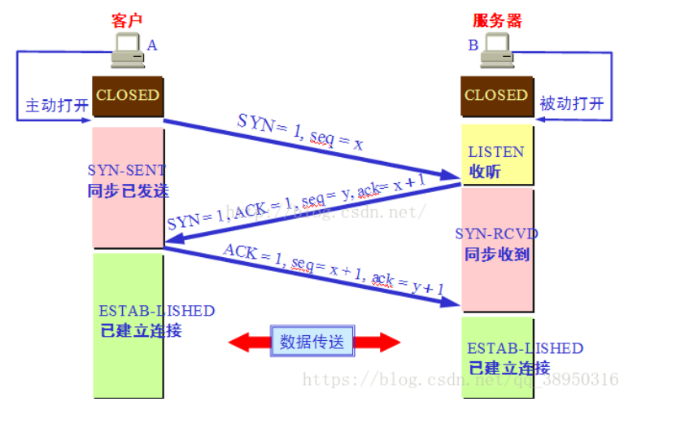

# 特点
相较于UDP，TCP提供的是可靠的数据传输，并且有其他额外的功能
1. 可靠数据传输：保证端到端的数据传输是完整可靠的
2. 双向传输：先建立连接，然后端和端之间是双向通讯的
3. 流量控制和拥塞控制：不会一次性将所有包发送出去，而是根据网络堵塞情况和接收方缓存空间大小选择一次发送包的数量，避免网络堵塞和缓存溢出

# 简述
当我们使用socket套接字进行tcp通讯时，通常会分为客户端和服务端，服务端循环被动接受来自不同主机的请求，并给予处理，一般不会主动发起连接。而客户端则发起一次连接，完整数据传输或接受后关闭连接。

当我们创建socket并传入要传输的数据，这些数据并不是一次性被全部发送出去，它会先被缓存起来，接下来tcp就会时不时的从缓存中取出一段数据封装为报文段并发送。

报文段的长度首先于最大报文段长度（MSS），MSS通常根据最初确定的最大链路层帧长度来设置。MSS是报文段里应用层数据的最大长度，不包括头部。

另一端接受到这个报文段后，就会被放入该TCP连接的连接缓存中。TCP连接的每一端都有发送缓存和接受缓存。

# 报文结构

1. 16字节的源端口和目的端口，用来多路分解和复用，确定进程和进程间的通讯
2. 32比特的序号和确认号，用来实现可靠数据传输
3. 16bit的窗口，用于流量控制，该字段表示接收方愿意接受的字节数量
4. 4bit的数据偏移，用来表述首部长度，通常选项字段都是空的，所以首部长度是20字节
5. 6bit的标志字段，用来实现连接的建立SYN和断开FIN、数据段的确认ACK等功能，默认值为0

# 连接的建立和拆除
序号和确认号是确保数据可靠传输的基础。序号是用于对发送的报文段进行编号，确保数据被有序接收

假设我们要发送一个10000字节的文件，MSS是100，要发送的文件（已经在缓存总）将来会被分为100个报文发送。先随机生成初始序号，作为SYN的初始序号

确认号用于确认接收到了报文段，并请求下一个报文段。SYN的确认号是接收到的序列号+1(SYN一般未携带报文体)，表示收到SYN报文。如果发送方的报文序号是100，报文体中携带20个字节，则该报文的确认报文(ACK报文)确认号是120。

随机产生初始序列号可以尽可能避免上一次通讯中已失效的报文段（可能只是堵在路上了）被作为下一次通讯的报文段接受

## 建立连接

1. 客户端发送SYN报文（SYN=1，一般叫做SYN报文，表示向服务端请求建立发送数据的连接）和起始序列号seq(A)给服务端
2. 服务端发送ACK报文（ACK=1，确认号=seq(A)+1），表示接收到了客户端的SYN报文，同意建立连接，并附带自己的SYN（SYN=1，表示请求向客户端请求建立发送数据的连接）和自己的起始序列号seq(B)。将ACK和SYN放在一起，减少了一次握手
3. 客户端发送ACK报文表示收到了服务器的SYN报文，并同意建立连接。这时的ACK报文是可以携带报文体的，已经可以发送数据了（ACK报文只是ACK=1，是可以携带报文体，所以两端同时发送信息时，就可能一直是ACK报文交互）。
4. 服务器收到客户端的ACK报文才会为客户端连接初始化数据结构和处理程序，推迟到最后是为了避免SYN洪泛滥攻击

双方愉快的传输数据

## 拆除连接

请求的拆除可以由通讯双方任意一方提出，这里以客户端先提出拆除为例

1. 客户端发送FIN报文(SYN=1,seq=x，可能会带有ACK和确认序号，表示对上一个接受报文的确认)，表示关闭连接，即客户端不再发送数据，但还能接受数据
2. 服务器发送ACK报文表示收到了客户端的FIN报文
3. 服务器发送FIN报文关闭连接
4. 客户端回复ACK报文表示收到

为什么建立连接时的2、3次可以合并，但是这里必须是4次放手呢？因为客户端发送FIN报文只表示客户端不再发送信息，但可以接受信息，即服务器还可以发送信息，所以接下来服务器可能再发送一些信息后再关闭，但是通常一方拆除后双方就都关闭连接了

# 可靠数据传输
我们之前说过TCP协议相较于UDP最大特点是可靠数据传输，它采取一系列手段保证了可靠数据传输

## 超时与重传
当TCP发送一个报文段后不知道接收方是否收到，所以需要接收方发送ACK报文确认收到（ACK报文可以有报文体，双方可以同时发送数据）

在理想情况下，这样就足以保证可靠数据传输了，但是无论是发送的报文段还是ACK报文段，在路由器拥挤或链路层损坏数据的情况下都可能丢包。
如果发送方丢包，而接收方没有收到包而不能发送ACK，发送方未收到ACK也不接着发送，双方就陷入长久的僵持中，所以我们需要一个定时机制，发送一个包出去后启动定时器，如果超出时间未接收到ACK则再次发送包，直到接收到ACK为止。接收方也是如此，如果发送的ACK在一定时间内未接收到新的报文，则ACK包可能丢失，则需要重新发送。

用定时器解决丢包问题，也引入了下面的新问题：

1. 定时器该设置多长时间

如果设置时间太短则会产生多余的包，如果太长TCP性能就不行了。通常定时器的时间是根据路由器拥塞和端系统负载而动态变化的，当第一次超时后会将定时器的时间设置为双倍，再次发送。

2. 接收到多余的包

设置了定时重传后，就可能接收到多余的包，一般会丢弃这些包

# 流量控制
一条TCP连接的通讯双方都有发送缓存和接受缓存，从发送缓存中读取数据封装为TCP报文段发送，将收到的数据放在接受缓存先放在中，再转换为TCP报文段。

理论上发送数据在连接建立后就已经是固定的了，而接受数据却不知道多大，所以可能存在接受缓存的处理速度（将缓存中的数据由IP层数据变为TCP报文段）跟不上接受数据的速度，从而造成缓存溢出丢失数据

TCP为程序提供了流量控制服务，以消除发送方使接受方缓存溢出的可能性
会在每次发送报文时设置窗口大小字段（widnows size value）为缓冲区还没被使用的字节大小，代表自己还能接受多少字节

有个小问题，如果缓存满了，发送的窗口大小就是0，则发送方不再发送数据，发送方也不知道啥时候缓存数据会被处理完，就陷入无限阻塞中了。所以当窗口为0时，发送方会发送只有一个字节的报文段。

# 拥塞控制
我们这里说的拥塞控制是控制发送速率避免路由器负担太重，而流量控制是为了避免接收方缓存溢出

## 滑动窗口
我们上面的讨论都是在发送方发送一个报文段，接收方回复一个ACK的基础上，但是这样效率就太低了，所以双方都会维护一个发送窗口，且采取累计确认

同时发送多个报文，如果31号报文被ACK，则窗口向前移动，发送新的报文，定时器也只会对31号报文进行定时，并向前滑动。

虽然发送方一次性发送多个报文，但是接受是要有序的，如果接收到了31号报文，则发送对应的ACK，在没收到31号报文情况下直接接收到34、36或其他报文，可以丢弃或者缓存

由于接收方是有序发送ACK的，那么发送方对于确认就没那么严格，只要确认号是37，则代表之前的都已经被接受，即累计确认

