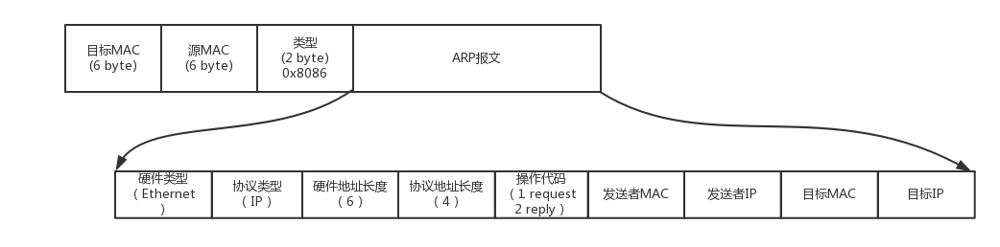

早期的路由器是非常贵的，很多人用不起路由器，只好用网线将两个电脑连在一起，就算做局域网LAN，配置过IP一系列数据后就可以打魔兽了

如果有三个及以上的人就没法这样了，总需要个办法让大家都连在一起

# 集线器Hub
这个东西有多个口，将不同的机器连接起来，但它属于第一层，并不能识别MAC，所以每个主机发送的包都会被他广播出去

一个MAC层的包如下

主机接受到之后会检测MAC号是否相同，再检测IP号，逐步向上层拆包。如果MAC都不符合，就直接丢了

等等！还有个问题，还没有获取到目的主机的MAC。这就需要ARP协议，就是已知IP，查询MAC的协议

如果已知目的主机的IP，想要发包，在第二层还需要目的主机的MAC地址。主机A会先查自己的MAC缓存，如果查不到，会广播一个ARP包，即在局域网内大吼一声，局域网内所有主机都能接收到，他们都会拆包，如果发现要查的IP和自己网卡IP相同，就回复自己的MAC地址。主机A接收到会把IP-MAC缓存起来，由于IP是动态的，一段时间后还会失效重查。

问题在于局域网内主机接收到了太多无用的包，这些包处理还是较为耗时的

# 交换机
交换机可以记忆每个端口的MAC地址，这样就可以精确转发。他怎么能知道所有端口的MAC地址呢

刚开始的交换机是什么都不知道的，各个主机还需要ARP查询目的主机MAC地址。但交换机会在中间拿出小本本默默记下来，某个端口对应的MAC地址，这样下次有包过来，交换机看了他的目的MAC，就知道该发往哪个地址了，这就是交换学习，小本本就是转发表

当然每个机器的IP会时不时的变化，所在口也会变，所以转发表也有过期时间，会在一定时间后更新

但交换机的功能十分简陋，只能做交换学习记忆，并不支持其他功能，只适用于局域网内

