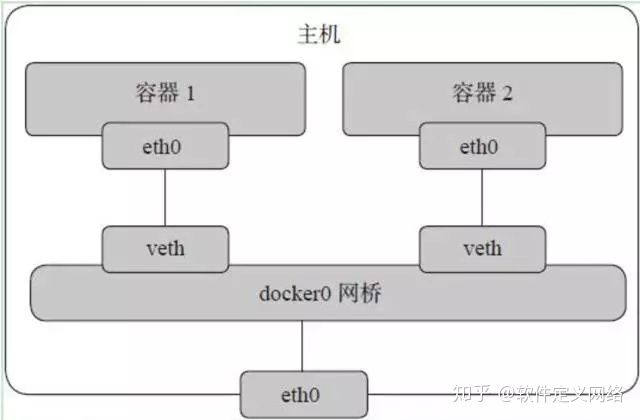

# 桥接
把物理网卡当做交换机使用，物理网卡可以记录同一主机下使用的多个mac地址，当数据帧到达后，网卡判断交给哪个mac网卡(一般是模拟的虚拟网卡)

网桥就是连接通讯设备的桥，相当于网线的升级版

# docker网络
docker下支持三种网络，可以使用docker network ls查看

## bridge
即linux的桥接模式，docker安装完成后默认创建一个linux网桥docker0，并为其分配一个子网，docker0可以作为该子网的路由器使用，所有发给该子网的请求会被主机发给docker0

针对有docker创建的每一个容器，均为其创建一个虚拟的以太网设备(veth peer)。其中一端关联到网桥上，另一端映射到容器类的网络空间中。然后从这个虚拟网段中分配一个IP地址给这个接口。 其网络模型如下:

## host
Host模式，即共用主机的网络，它的网络命名空间和主机是同一个，不隔离UTS、NET、IPC，使用宿主机Namespace、IP和端口。

同样可以使用此类方式，将多个容器放在一个NET namespace下，就实现了多个容器的局部通讯

## None
在容器创建时，不指定任何网络模式。由用户自己在适当的时候去指定。

# 容器连接外部
即使每个容器都有自己的网络栈，由于他们是本机的私有地址，外部仍不能访问，所以要使用主机的端口做映射，即本机充当一个NAT身份帮助容器和外部互联

可以通过 -P 或 -p 参数来指定端口映射。

当使用 -P 标记时，Docker 会随机映射一个 49000~49900 的端口到内部容器开放的网络端口。

使用 docker container ls 可以看到，本地主机的 49155 被映射到了容器的 5000 端口。此时访问本机的 49155 端口即可访问容器内 web 应用提供的界面。

$ docker run -d -P training/webapp python app.py

$ docker container ls -l
CONTAINER ID  IMAGE                   COMMAND       CREATED        STATUS        PORTS                    NAMES
bc533791f3f5  training/webapp:latest  python app.py 5 seconds ago  Up 2 seconds  0.0.0.0:49155->5000/tcp  nostalgic_morse

同样的，可以通过 docker logs 命令来查看应用的信息。

$ docker logs -f nostalgic_morse
* Running on http://0.0.0.0:5000/
10.0.2.2 - - [23/May/2014 20:16:31] "GET / HTTP/1.1" 200 -
10.0.2.2 - - [23/May/2014 20:16:31] "GET /favicon.ico HTTP/1.1" 404 -

-p 则可以指定要映射的端口，并且，在一个指定端口上只可以绑定一个容器。支持的格式有 ip:hostPort:containerPort | ip::containerPort | hostPort:containerPort。

## 映射所有接口地址
使用 hostPort:containerPort 格式本地的 5000 端口映射到容器的 5000 端口，可以执行

$ docker run -d -p 5000:5000 training/webapp python app.py
此时默认会绑定本地所有接口上的所有地址。

## 映射到指定地址的指定端口
可以使用 ip:hostPort:containerPort 格式指定映射使用一个特定地址，比如 localhost 地址 127.0.0.1

$ docker run -d -p 127.0.0.1:5000:5000 training/webapp python app.py

## 映射到指定地址的任意端口
使用 ip::containerPort 绑定 localhost 的任意端口到容器的 5000 端口，本地主机会自动分配一个端口。

$ docker run -d -p 127.0.0.1::5000 training/webapp python app.py
还可以使用 udp 标记来指定 udp 端口

$ docker run -d -p 127.0.0.1:5000:5000/udp training/webapp python app.py

## 查看映射端口配置
使用 docker port 来查看当前映射的端口配置，也可以查看到绑定的地址

$ docker port nostalgic_morse 5000
127.0.0.1:49155.
注意：

容器有自己的内部网络和 ip 地址（使用 docker inspect 可以获取所有的变量，Docker 还可以有一个可变的网络配置。）

-p 标记可以多次使用来绑定多个端口

例如

$ docker run -d \
    -p 5000:5000 \
    -p 3000:80 \
    training/webapp \
    python app.py
