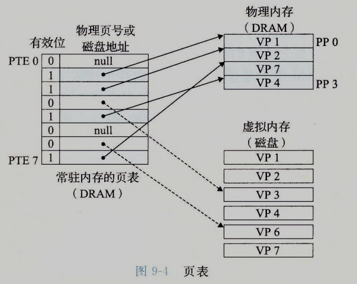

在一个操作系统中，我们默认所有的进程都是相互竞争的，他们想独占cpu和内存，甚至意图破坏其他进程的内存空间，同时随着进程数的增加，内存永远时不够用的，这就是虚拟你内存的意义。

# 物理和虚拟寻址
早期的系统中，程序直接使用物理地址，这种方式有多糟糕我就不说了。。

现代系统中，程序的寻址先由操作系统进行地址翻译，再找到一个物理地址，也就是说，所有的程序使用的是从0开始的虚拟地址

# 地址空间
如果地址空间是连续的，我们称他为线性地址空间。在一个带虚拟内存的系统中，CPU从一个有 N=2^n (n是操作系统位数) 个地址的空间中生成虚拟空间，一个系统还有物理地址空间，对应物理内存中的M个字节，{0,1,2,3...M-1}，M不要求是2的幂，我们假设M=2^m

# 虚拟内存作为缓存工具

## 页表
同任何缓存一样，虚拟内存必须有某种方法来判定虚拟页是否缓存在DRAM的某个地方，如果是，系统还必须确定这个虚拟内存页存放在哪个物理页中。如果不命中，系统必须判定这个虚拟页在磁盘的哪个位置，在物理内存中选择一个牺牲页，并将虚拟页从磁盘复制到DRAM中，替换牺牲的页。

内存中常驻一个页表用来做虚拟内存和物理内存的转换

