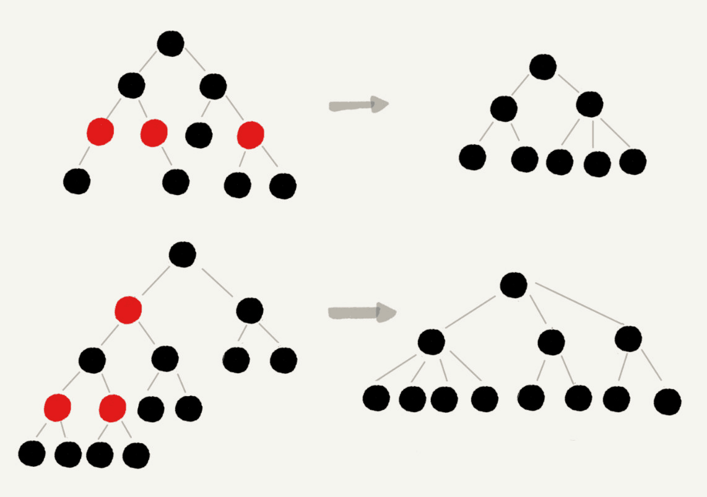
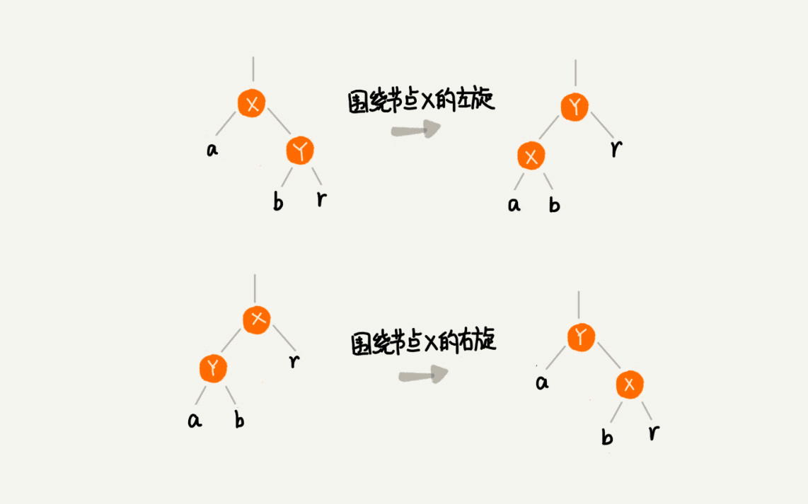
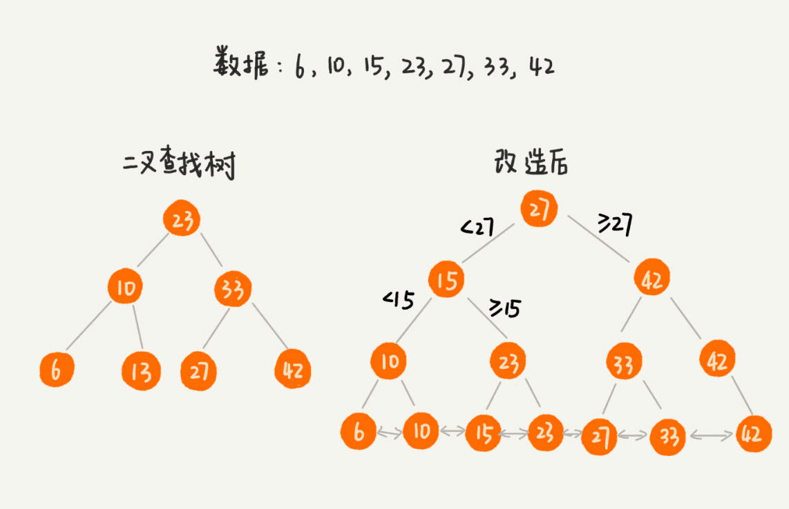
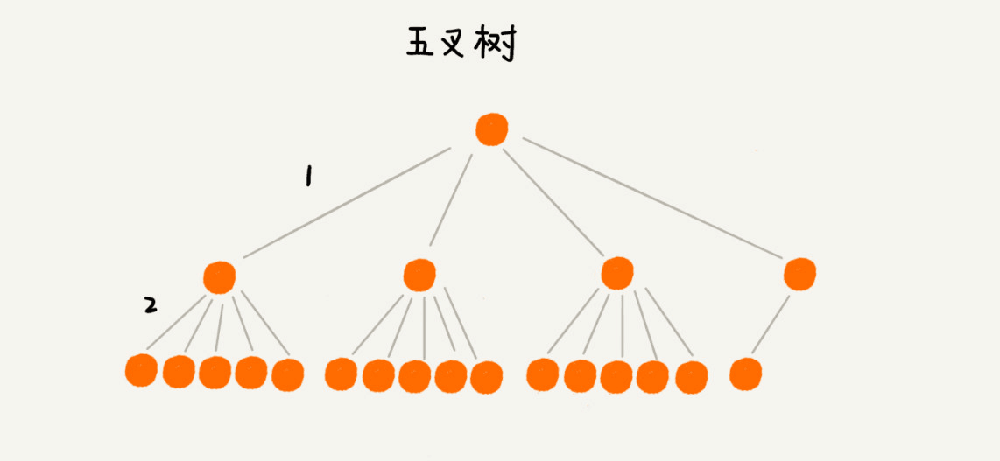
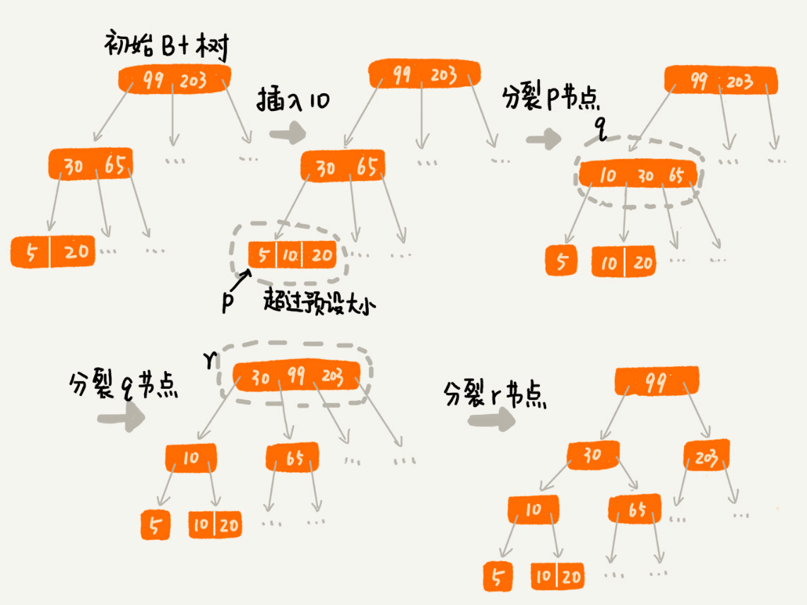
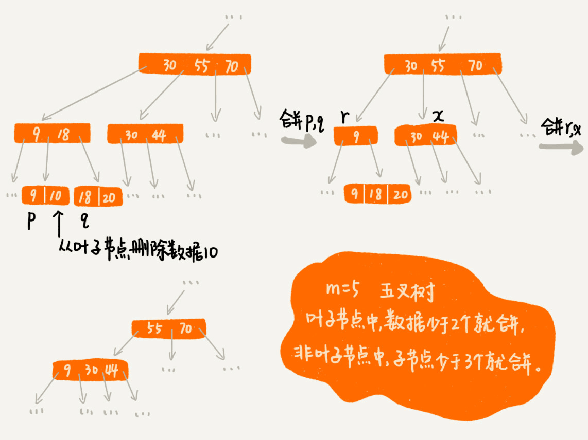

# 二叉树
二叉树是最基本的树结构，在一个节点中维护这左右节点，左节点小值都小于该节点，右节点大于，这种情况下就构成了一个二叉树

插入和查找的最好情况是 logn，最坏情况是一边倒的 n

# 红黑树
## 性质
由于可能存在每个插入节点都小于上一个插入的节点，这种一边倒情况，所以引入了平衡树，平衡树严格的标准是左右子树深度差不能超过1，这里先介绍一个并不严格的平衡树

红黑树有以下性质

- 节点有红黑两种颜色，根节点是黑节点，所有叶子节点是不存储数据的黑节点
- 红节点的子节点一定是黑节点，即没有两个连续的红节点
- 所有的叶子节点到根节点中的黑节点个数相同

如果将红节点去掉，或者说和父节点整合变为一个 3- 或 4- 节点

根据红黑树的性质，一定会变成一个左右子树深度一致的树，其查找性能一定小于 log2n

如果加上红节点，由于不会有连续的红节点，所以一条路径上的红节点最多是黑节点数量-1，那么红黑树的最坏情况小于 2log2n

2^32就四十多亿了，如果是在内存中，32次查找和64次查找性能差距并不大，是完全可以接收的

## 构造
那么如何去构造才能满足红黑树的性质呢？

红黑树的插入、删除都会影响数据，所以要通过左旋、右旋变色、等操作来调整保持平衡

红黑树规定，插入的节点必须是红色的，而且，二叉查找树中新插入的节点都是放在叶子节点上，之后向上调整

# B+树
老实说，B+树和跳表很像

B+树一般用于数据库索引存储，主要满足两点，快速插入和查找、范围查找

如果使用散列表重分配毫无疑问是让人崩溃的，红黑树不支持范围查找，所以就有人想把二叉树改成支持范围查找的新结构

可以说改造之后几乎可跳表一样了，为了实现范围查找，必须要继承每个父节点直到叶子节点，同时叶子节点左右关联，这样就实现了范围查找

如果数据库很大，索引也会很大，难以放在内存中，就只能在磁盘中用时间换空间，而磁盘的查找效率是很低的，如果访问每个节点都需要进行一次磁盘IO，那就太可怕了，所以我们要将二叉树改成 N- 树，让每次IO尽可能多读入节点

n是有限制的，操作系统是按页读取磁盘中的数据(可以通过getconfig PAGE_SIZE查询页大小)，如果要读取的数据超过一页的大小，就会发生多次IO，所以节点的大小会限制在一页之内

## 页分裂

在增加数据时，可能会导致某个节点的数据量大于一页，读取还是要进行两次IO，所以要做页分裂，将一个节点的数据平均分裂为两个节点，以后再插入时不会频繁页分裂

同时删除导致节点都比较稀疏，比较小，就要做页整合，可以设置一个阀值，当节点数据小于某值，就跟他相邻的兄弟节点合并

## B树
B+树是B树的改进，具体体现在两个方面

- B+树非叶子节点不保存数据，叶子节点会继承所有的祖先节点
- B树叶子节点不需要链表串联